مخطط سياق النظام — System Context Diagram

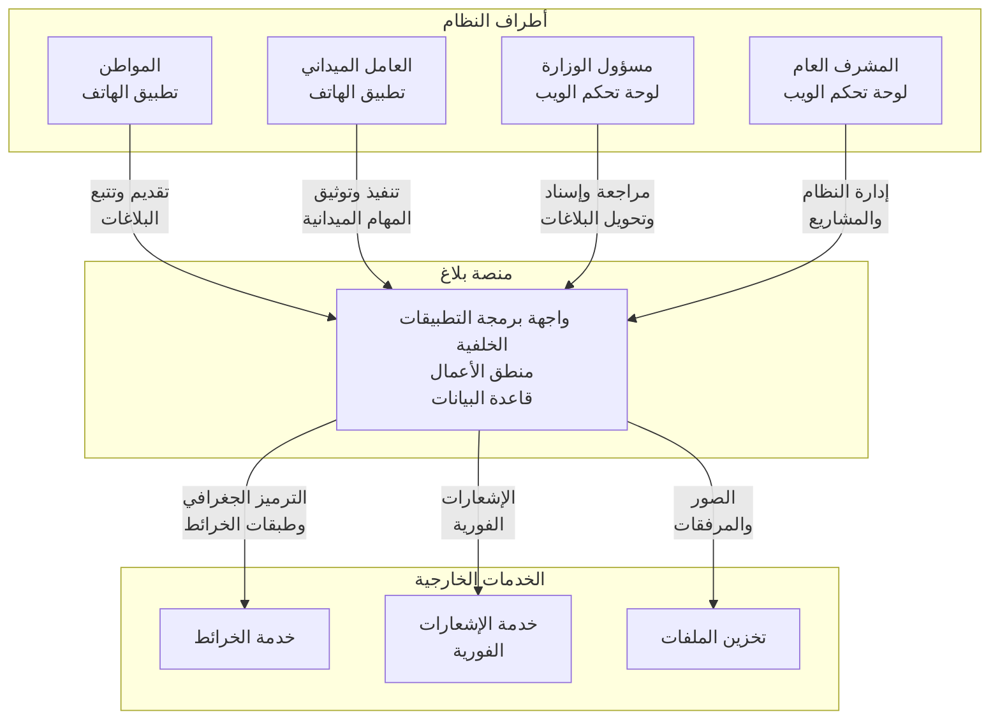
```mermaid
flowchart TB
    subgraph actors ["أطراف النظام"]
        C["المواطن\nتطبيق الهاتف"]
        FW["العامل الميداني\nتطبيق الهاتف"]
        MA["مسؤول الوزارة\nلوحة تحكم الويب"]
        SA["المشرف العام\nلوحة تحكم الويب"]
    end

    subgraph platform ["منصة بلاغ"]
        CORE["واجهة برمجة التطبيقات الخلفية\nمنطق الأعمال\nقاعدة البيانات"]
    end

    subgraph external ["الخدمات الخارجية"]
        MAP["خدمة الخرائط"]
        PUSH["خدمة الإشعارات\nالفورية"]
        STORE["تخزين الملفات"]
    end

    C -->|"تقديم وتتبع\nالبلاغات"| CORE
    FW -->|"تنفيذ وتوثيق\nالمهام الميدانية"| CORE
    MA -->|"مراجعة وإسناد\nوتحويل البلاغات"| CORE
    SA -->|"إدارة النظام\nوالمشاريع"| CORE

    CORE -->|"الترميز الجغرافي\nوطبقات الخرائط"| MAP
    CORE -->|"الإشعارات\nالفورية"| PUSH
    CORE -->|"الصور\nوالمرفقات"| STORE

```

---

مخطط الوظائف الرئيسية — Business Function Diagram

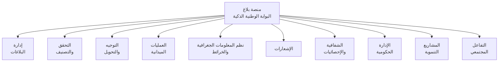
```mermaid
flowchart TD
    ROOT["منصة بلاغ\nالبوابة الوطنية الذكية"]

    ROOT --> BF1["إدارة\nالبلاغات"]
    ROOT --> BF2["التحقق\nوالتصنيف"]
    ROOT --> BF3["التوجيه\nوالتحويل"]
    ROOT --> BF4["العمليات\nالميدانية"]
    ROOT --> BF5["نظم المعلومات الجغرافية\nوالخرائط"]
    ROOT --> BF6["الإشعارات"]
    ROOT --> BF7["الشفافية\nوالإحصائيات"]
    ROOT --> BF8["الإدارة\nالحكومية"]
    ROOT --> BF9["المشاريع\nالتنموية"]
    ROOT --> BF10["التفاعل\nالمجتمعي"]

```

---

نموذج حالات الاستخدام — Use Case Model

5.1 مخطط حالات الاستخدام الرئيسي

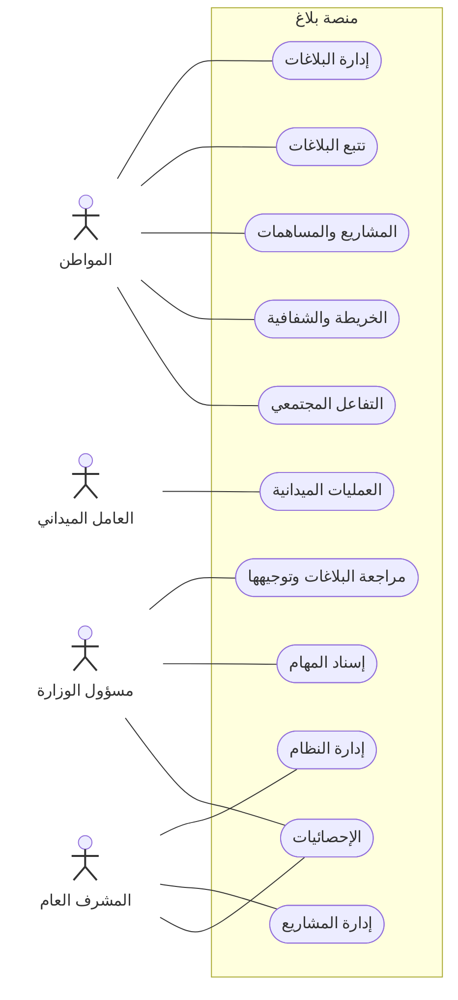
```mermaid
flowchart LR
    C["<svg width='36' height='50' viewBox='0 0 36 50'><circle cx='18' cy='9' r='7' fill='none' stroke='currentColor' stroke-width='2'/><line x1='18' y1='16' x2='18' y2='34' stroke='currentColor' stroke-width='2'/><line x1='4' y1='23' x2='32' y2='23' stroke='currentColor' stroke-width='2'/><line x1='18' y1='34' x2='6' y2='48' stroke='currentColor' stroke-width='2'/><line x1='18' y1='34' x2='30' y2='48' stroke='currentColor' stroke-width='2'/></svg><br/>المواطن"]
    FW["<svg width='36' height='50' viewBox='0 0 36 50'><circle cx='18' cy='9' r='7' fill='none' stroke='currentColor' stroke-width='2'/><line x1='18' y1='16' x2='18' y2='34' stroke='currentColor' stroke-width='2'/><line x1='4' y1='23' x2='32' y2='23' stroke='currentColor' stroke-width='2'/><line x1='18' y1='34' x2='6' y2='48' stroke='currentColor' stroke-width='2'/><line x1='18' y1='34' x2='30' y2='48' stroke='currentColor' stroke-width='2'/></svg><br/>العامل الميداني"]
    MA["<svg width='36' height='50' viewBox='0 0 36 50'><circle cx='18' cy='9' r='7' fill='none' stroke='currentColor' stroke-width='2'/><line x1='18' y1='16' x2='18' y2='34' stroke='currentColor' stroke-width='2'/><line x1='4' y1='23' x2='32' y2='23' stroke='currentColor' stroke-width='2'/><line x1='18' y1='34' x2='6' y2='48' stroke='currentColor' stroke-width='2'/><line x1='18' y1='34' x2='30' y2='48' stroke='currentColor' stroke-width='2'/></svg><br/>مسؤول الوزارة"]
    SA["<svg width='36' height='50' viewBox='0 0 36 50'><circle cx='18' cy='9' r='7' fill='none' stroke='currentColor' stroke-width='2'/><line x1='18' y1='16' x2='18' y2='34' stroke='currentColor' stroke-width='2'/><line x1='4' y1='23' x2='32' y2='23' stroke='currentColor' stroke-width='2'/><line x1='18' y1='34' x2='6' y2='48' stroke='currentColor' stroke-width='2'/><line x1='18' y1='34' x2='30' y2='48' stroke='currentColor' stroke-width='2'/></svg><br/>المشرف العام"]

    subgraph system ["منصة بلاغ"]
        direction TB
        PKG1(["إدارة البلاغات"])
        PKG2(["تتبع البلاغات"])
        PKG3(["المشاريع والمساهمات"])
        PKG4(["الخريطة والشفافية"])
        PKG5(["العمليات الميدانية"])
        PKG6(["مراجعة البلاغات وتوجيهها"])
        PKG7(["إسناد المهام"])
        PKG8(["الإحصائيات"])
        PKG9(["إدارة النظام"])
        PKG10(["إدارة المشاريع"])
        PKG11(["التفاعل المجتمعي"])
    end

    C --- PKG1
    C --- PKG2
    C --- PKG3
    C --- PKG4
    C --- PKG11
    FW --- PKG5
    MA --- PKG6
    MA --- PKG7
    MA --- PKG8
    SA --- PKG9
    SA --- PKG10
    SA --- PKG8

    classDef actor fill:none,stroke:none;
    class C,FW,MA,SA actor;

```

5.2 مجموعة حالات الاستخدام 1: الحساب والمصادقة

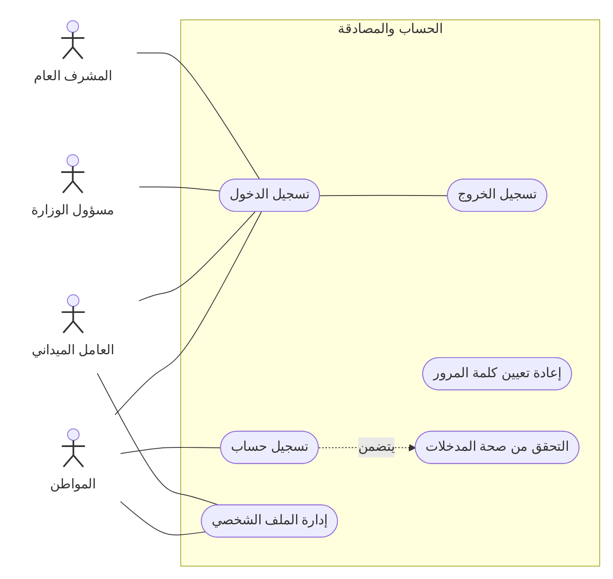
```mermaid
flowchart LR
    C["<svg width='36' height='50' viewBox='0 0 36 50'><circle cx='18' cy='9' r='7' fill='none' stroke='currentColor' stroke-width='2'/><line x1='18' y1='16' x2='18' y2='34' stroke='currentColor' stroke-width='2'/><line x1='4' y1='23' x2='32' y2='23' stroke='currentColor' stroke-width='2'/><line x1='18' y1='34' x2='6' y2='48' stroke='currentColor' stroke-width='2'/><line x1='18' y1='34' x2='30' y2='48' stroke='currentColor' stroke-width='2'/></svg><br/>المواطن"]
    FW["<svg width='36' height='50' viewBox='0 0 36 50'><circle cx='18' cy='9' r='7' fill='none' stroke='currentColor' stroke-width='2'/><line x1='18' y1='16' x2='18' y2='34' stroke='currentColor' stroke-width='2'/><line x1='4' y1='23' x2='32' y2='23' stroke='currentColor' stroke-width='2'/><line x1='18' y1='34' x2='6' y2='48' stroke='currentColor' stroke-width='2'/><line x1='18' y1='34' x2='30' y2='48' stroke='currentColor' stroke-width='2'/></svg><br/>العامل الميداني"]
    MA["<svg width='36' height='50' viewBox='0 0 36 50'><circle cx='18' cy='9' r='7' fill='none' stroke='currentColor' stroke-width='2'/><line x1='18' y1='16' x2='18' y2='34' stroke='currentColor' stroke-width='2'/><line x1='4' y1='23' x2='32' y2='23' stroke='currentColor' stroke-width='2'/><line x1='18' y1='34' x2='6' y2='48' stroke='currentColor' stroke-width='2'/><line x1='18' y1='34' x2='30' y2='48' stroke='currentColor' stroke-width='2'/></svg><br/>مسؤول الوزارة"]
    SA["<svg width='36' height='50' viewBox='0 0 36 50'><circle cx='18' cy='9' r='7' fill='none' stroke='currentColor' stroke-width='2'/><line x1='18' y1='16' x2='18' y2='34' stroke='currentColor' stroke-width='2'/><line x1='4' y1='23' x2='32' y2='23' stroke='currentColor' stroke-width='2'/><line x1='18' y1='34' x2='6' y2='48' stroke='currentColor' stroke-width='2'/><line x1='18' y1='34' x2='30' y2='48' stroke='currentColor' stroke-width='2'/></svg><br/>المشرف العام"]

    subgraph system ["الحساب والمصادقة"]
        UC1(["تسجيل حساب"])
        UC2(["تسجيل الدخول"])
        UC3(["تسجيل الخروج"])
        UC4(["إدارة الملف الشخصي"])
        UC5(["إعادة تعيين كلمة المرور"])
        UCV(["التحقق من صحة المدخلات"])
    end

    C --- UC1
    C --- UC2
    C --- UC4
    FW --- UC2
    FW --- UC4
    MA --- UC2
    SA --- UC2

    UC2 --- UC3
    UC1 -.->|"يتضمن"| UCV

    classDef actor fill:none,stroke:none;
    class C,FW,MA,SA actor;

```

5.3 مجموعة حالات الاستخدام 2: تقديم البلاغات

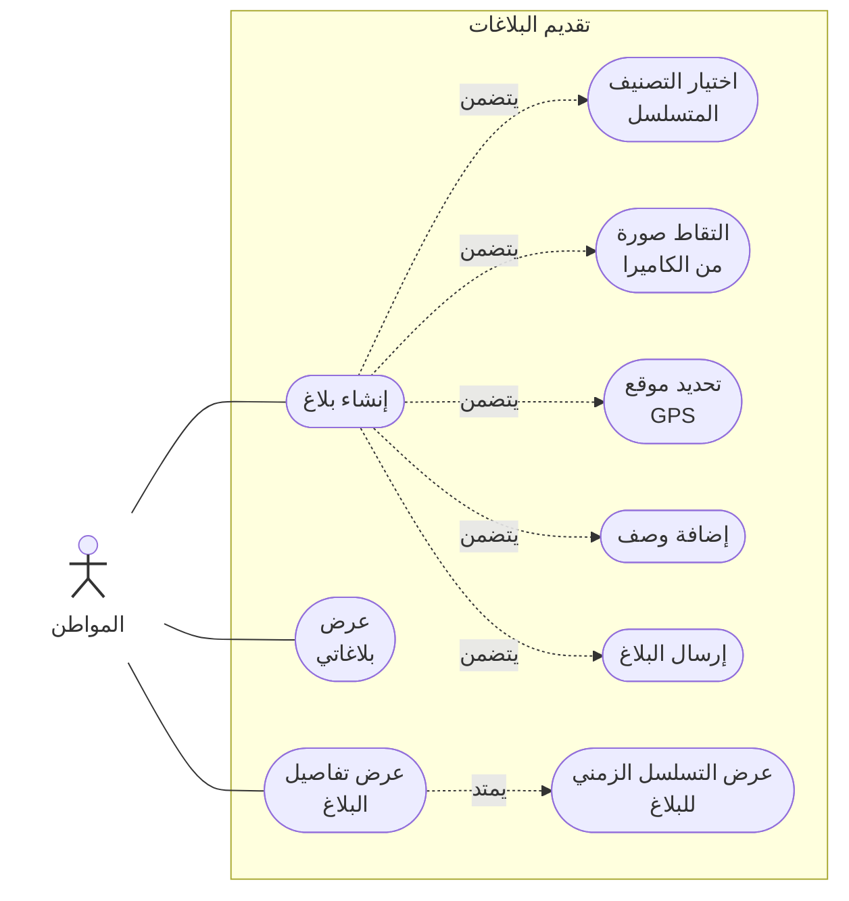
```mermaid
flowchart LR
    C["<svg width='36' height='50' viewBox='0 0 36 50'><circle cx='18' cy='9' r='7' fill='none' stroke='currentColor' stroke-width='2'/><line x1='18' y1='16' x2='18' y2='34' stroke='currentColor' stroke-width='2'/><line x1='4' y1='23' x2='32' y2='23' stroke='currentColor' stroke-width='2'/><line x1='18' y1='34' x2='6' y2='48' stroke='currentColor' stroke-width='2'/><line x1='18' y1='34' x2='30' y2='48' stroke='currentColor' stroke-width='2'/></svg><br/>المواطن"]

    subgraph system ["تقديم البلاغات"]
        UC1(["إنشاء بلاغ"])
        UC2(["اختيار التصنيف\nالمتسلسل"])
        UC3(["التقاط صورة\nمن الكاميرا"])
        UC4(["تحديد موقع\nGPS"])
        UC5(["إضافة وصف"])
        UC6(["إرسال البلاغ"])
        UC7(["عرض\nبلاغاتي"])
        UC8(["عرض تفاصيل\nالبلاغ"])
        UC9(["عرض التسلسل الزمني\nللبلاغ"])
    end

    C --- UC1
    C --- UC7
    C --- UC8

    UC1 -.->|"يتضمن"| UC2
    UC1 -.->|"يتضمن"| UC3
    UC1 -.->|"يتضمن"| UC4
    UC1 -.->|"يتضمن"| UC5
    UC1 -.->|"يتضمن"| UC6
    UC8 -.->|"يمتد"| UC9

    classDef actor fill:none,stroke:none;
    class C actor;

```

5.4 مجموعة حالات الاستخدام 3: التحقق الذكي

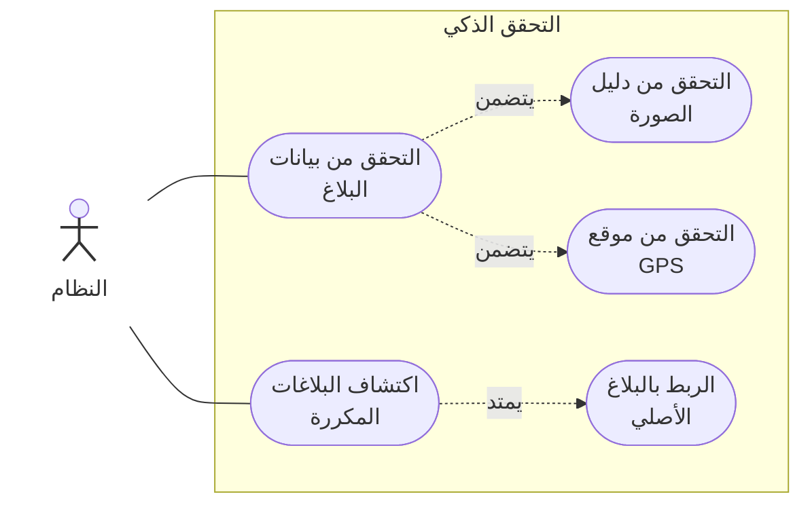
```mermaid
flowchart LR
    SYS["<svg width='36' height='50' viewBox='0 0 36 50'><circle cx='18' cy='9' r='7' fill='none' stroke='currentColor' stroke-width='2'/><line x1='18' y1='16' x2='18' y2='34' stroke='currentColor' stroke-width='2'/><line x1='4' y1='23' x2='32' y2='23' stroke='currentColor' stroke-width='2'/><line x1='18' y1='34' x2='6' y2='48' stroke='currentColor' stroke-width='2'/><line x1='18' y1='34' x2='30' y2='48' stroke='currentColor' stroke-width='2'/></svg><br/>النظام"]

    subgraph system ["التحقق الذكي"]
        UC1(["التحقق من بيانات\nالبلاغ"])
        UC2(["التحقق من دليل\nالصورة"])
        UC3(["التحقق من موقع\nGPS"])
        UC4(["اكتشاف البلاغات\nالمكررة"])
        UC5(["الربط بالبلاغ\nالأصلي"])
    end

    SYS --- UC1
    SYS --- UC4

    UC1 -.->|"يتضمن"| UC2
    UC1 -.->|"يتضمن"| UC3
    UC4 -.->|"يمتد"| UC5

    classDef actor fill:none,stroke:none;
    class SYS actor;

```

5.5 مجموعة حالات الاستخدام 4: التوجيه والتحويل

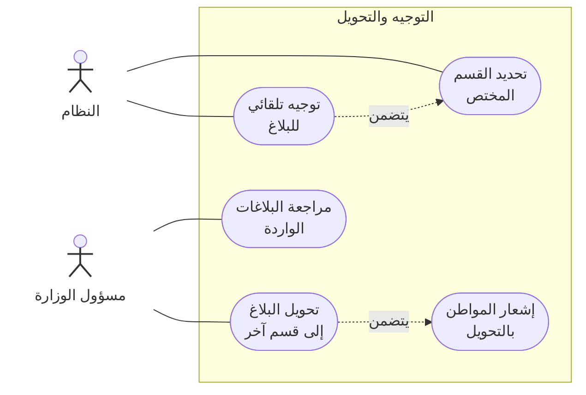
```mermaid
flowchart LR
    SYS["<svg width='36' height='50' viewBox='0 0 36 50'><circle cx='18' cy='9' r='7' fill='none' stroke='currentColor' stroke-width='2'/><line x1='18' y1='16' x2='18' y2='34' stroke='currentColor' stroke-width='2'/><line x1='4' y1='23' x2='32' y2='23' stroke='currentColor' stroke-width='2'/><line x1='18' y1='34' x2='6' y2='48' stroke='currentColor' stroke-width='2'/><line x1='18' y1='34' x2='30' y2='48' stroke='currentColor' stroke-width='2'/></svg><br/>النظام"]
    MA["<svg width='36' height='50' viewBox='0 0 36 50'><circle cx='18' cy='9' r='7' fill='none' stroke='currentColor' stroke-width='2'/><line x1='18' y1='16' x2='18' y2='34' stroke='currentColor' stroke-width='2'/><line x1='4' y1='23' x2='32' y2='23' stroke='currentColor' stroke-width='2'/><line x1='18' y1='34' x2='6' y2='48' stroke='currentColor' stroke-width='2'/><line x1='18' y1='34' x2='30' y2='48' stroke='currentColor' stroke-width='2'/></svg><br/>مسؤول الوزارة"]

    subgraph system ["التوجيه والتحويل"]
        UC1(["تحديد القسم\nالمختص"])
        UC2(["توجيه تلقائي\nللبلاغ"])
        UC3(["مراجعة البلاغات\nالواردة"])
        UC4(["تحويل البلاغ\nإلى قسم آخر"])
        UC5(["إشعار المواطن\nبالتحويل"])
    end

    SYS --- UC1
    SYS --- UC2
    MA --- UC3
    MA --- UC4

    UC2 -.->|"يتضمن"| UC1
    UC4 -.->|"يتضمن"| UC5

    classDef actor fill:none,stroke:none;
    class SYS,MA actor;

```

5.6 مجموعة حالات الاستخدام 5: العمليات الميدانية

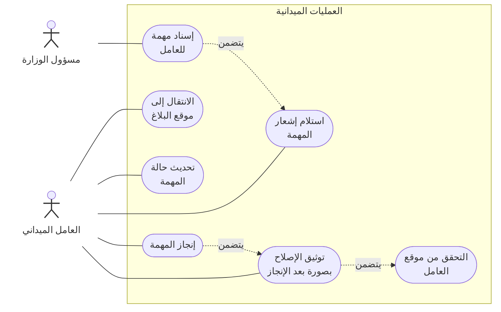
```mermaid
flowchart LR
    FW["<svg width='36' height='50' viewBox='0 0 36 50'><circle cx='18' cy='9' r='7' fill='none' stroke='currentColor' stroke-width='2'/><line x1='18' y1='16' x2='18' y2='34' stroke='currentColor' stroke-width='2'/><line x1='4' y1='23' x2='32' y2='23' stroke='currentColor' stroke-width='2'/><line x1='18' y1='34' x2='6' y2='48' stroke='currentColor' stroke-width='2'/><line x1='18' y1='34' x2='30' y2='48' stroke='currentColor' stroke-width='2'/></svg><br/>العامل الميداني"]
    MA["<svg width='36' height='50' viewBox='0 0 36 50'><circle cx='18' cy='9' r='7' fill='none' stroke='currentColor' stroke-width='2'/><line x1='18' y1='16' x2='18' y2='34' stroke='currentColor' stroke-width='2'/><line x1='4' y1='23' x2='32' y2='23' stroke='currentColor' stroke-width='2'/><line x1='18' y1='34' x2='6' y2='48' stroke='currentColor' stroke-width='2'/><line x1='18' y1='34' x2='30' y2='48' stroke='currentColor' stroke-width='2'/></svg><br/>مسؤول الوزارة"]

    subgraph system ["العمليات الميدانية"]
        UC1(["إسناد مهمة\nللعامل"])
        UC2(["استلام إشعار\nالمهمة"])
        UC3(["الانتقال إلى\nموقع البلاغ"])
        UC4(["التحقق من موقع\nالعامل"])
        UC5(["توثيق الإصلاح\nبصورة بعد الإنجاز"])
        UC6(["تحديث حالة\nالمهمة"])
        UC7(["إنجاز المهمة"])
    end

    MA --- UC1
    FW --- UC2
    FW --- UC3
    FW --- UC5
    FW --- UC6
    FW --- UC7

    UC1 -.->|"يتضمن"| UC2
    UC5 -.->|"يتضمن"| UC4
    UC7 -.->|"يتضمن"| UC5

    classDef actor fill:none,stroke:none;
    class FW,MA actor;

```

5.7 مجموعة حالات الاستخدام 6: الإشعارات

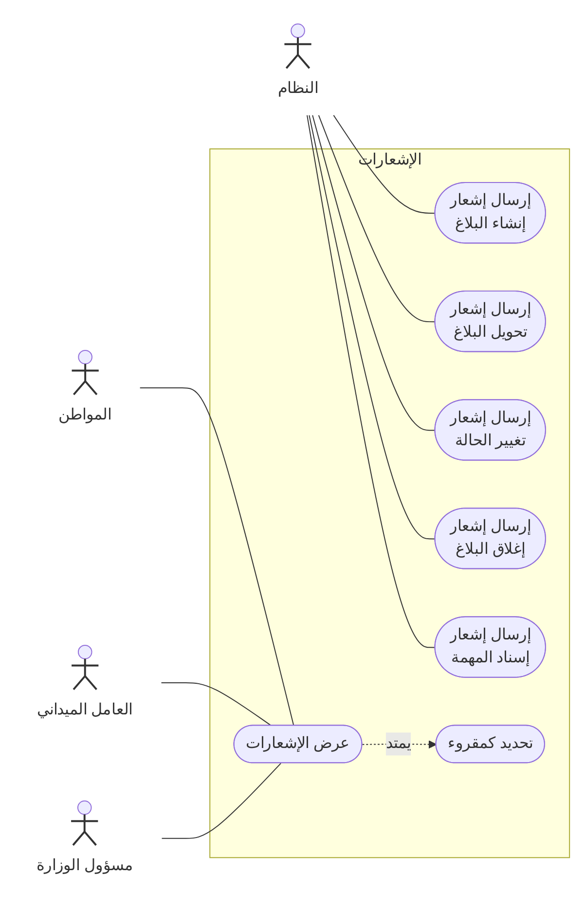
```mermaid
flowchart LR
    SYS["<svg width='36' height='50' viewBox='0 0 36 50'><circle cx='18' cy='9' r='7' fill='none' stroke='currentColor' stroke-width='2'/><line x1='18' y1='16' x2='18' y2='34' stroke='currentColor' stroke-width='2'/><line x1='4' y1='23' x2='32' y2='23' stroke='currentColor' stroke-width='2'/><line x1='18' y1='34' x2='6' y2='48' stroke='currentColor' stroke-width='2'/><line x1='18' y1='34' x2='30' y2='48' stroke='currentColor' stroke-width='2'/></svg><br/>النظام"]
    C["<svg width='36' height='50' viewBox='0 0 36 50'><circle cx='18' cy='9' r='7' fill='none' stroke='currentColor' stroke-width='2'/><line x1='18' y1='16' x2='18' y2='34' stroke='currentColor' stroke-width='2'/><line x1='4' y1='23' x2='32' y2='23' stroke='currentColor' stroke-width='2'/><line x1='18' y1='34' x2='6' y2='48' stroke='currentColor' stroke-width='2'/><line x1='18' y1='34' x2='30' y2='48' stroke='currentColor' stroke-width='2'/></svg><br/>المواطن"]
    FW["<svg width='36' height='50' viewBox='0 0 36 50'><circle cx='18' cy='9' r='7' fill='none' stroke='currentColor' stroke-width='2'/><line x1='18' y1='16' x2='18' y2='34' stroke='currentColor' stroke-width='2'/><line x1='4' y1='23' x2='32' y2='23' stroke='currentColor' stroke-width='2'/><line x1='18' y1='34' x2='6' y2='48' stroke='currentColor' stroke-width='2'/><line x1='18' y1='34' x2='30' y2='48' stroke='currentColor' stroke-width='2'/></svg><br/>العامل الميداني"]
    MA["<svg width='36' height='50' viewBox='0 0 36 50'><circle cx='18' cy='9' r='7' fill='none' stroke='currentColor' stroke-width='2'/><line x1='18' y1='16' x2='18' y2='34' stroke='currentColor' stroke-width='2'/><line x1='4' y1='23' x2='32' y2='23' stroke='currentColor' stroke-width='2'/><line x1='18' y1='34' x2='6' y2='48' stroke='currentColor' stroke-width='2'/><line x1='18' y1='34' x2='30' y2='48' stroke='currentColor' stroke-width='2'/></svg><br/>مسؤول الوزارة"]

    subgraph system ["الإشعارات"]
        UC1(["إرسال إشعار\nإنشاء البلاغ"])
        UC2(["إرسال إشعار\nتحويل البلاغ"])
        UC3(["إرسال إشعار\nتغيير الحالة"])
        UC4(["إرسال إشعار\nإغلاق البلاغ"])
        UC5(["إرسال إشعار\nإسناد المهمة"])
        UC6(["عرض الإشعارات"])
        UC7(["تحديد كمقروء"])
    end

    SYS --- UC1
    SYS --- UC2
    SYS --- UC3
    SYS --- UC4
    SYS --- UC5
    C --- UC6
    FW --- UC6
    MA --- UC6
    UC6 -.->|"يمتد"| UC7

    classDef actor fill:none,stroke:none;
    class SYS,C,FW,MA actor;

```

5.8 مجموعة حالات الاستخدام 7: الخريطة والشفافية

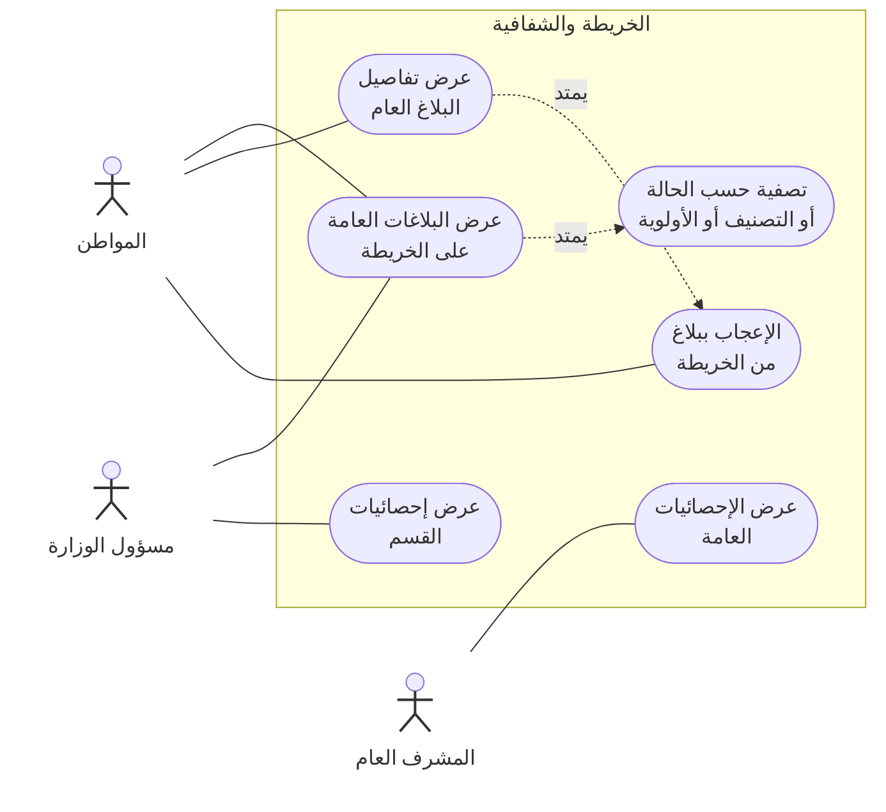
```mermaid
flowchart LR
    C["<svg width='36' height='50' viewBox='0 0 36 50'><circle cx='18' cy='9' r='7' fill='none' stroke='currentColor' stroke-width='2'/><line x1='18' y1='16' x2='18' y2='34' stroke='currentColor' stroke-width='2'/><line x1='4' y1='23' x2='32' y2='23' stroke='currentColor' stroke-width='2'/><line x1='18' y1='34' x2='6' y2='48' stroke='currentColor' stroke-width='2'/><line x1='18' y1='34' x2='30' y2='48' stroke='currentColor' stroke-width='2'/></svg><br/>المواطن"]
    MA["<svg width='36' height='50' viewBox='0 0 36 50'><circle cx='18' cy='9' r='7' fill='none' stroke='currentColor' stroke-width='2'/><line x1='18' y1='16' x2='18' y2='34' stroke='currentColor' stroke-width='2'/><line x1='4' y1='23' x2='32' y2='23' stroke='currentColor' stroke-width='2'/><line x1='18' y1='34' x2='6' y2='48' stroke='currentColor' stroke-width='2'/><line x1='18' y1='34' x2='30' y2='48' stroke='currentColor' stroke-width='2'/></svg><br/>مسؤول الوزارة"]
    SA["<svg width='36' height='50' viewBox='0 0 36 50'><circle cx='18' cy='9' r='7' fill='none' stroke='currentColor' stroke-width='2'/><line x1='18' y1='16' x2='18' y2='34' stroke='currentColor' stroke-width='2'/><line x1='4' y1='23' x2='32' y2='23' stroke='currentColor' stroke-width='2'/><line x1='18' y1='34' x2='6' y2='48' stroke='currentColor' stroke-width='2'/><line x1='18' y1='34' x2='30' y2='48' stroke='currentColor' stroke-width='2'/></svg><br/>المشرف العام"]

    subgraph system ["الخريطة والشفافية"]
        UC1(["عرض البلاغات العامة\nعلى الخريطة"])
        UC2(["تصفية حسب الحالة\nأو التصنيف أو الأولوية"])
        UC3(["عرض تفاصيل\nالبلاغ العام"])
        UC4(["عرض إحصائيات\nالقسم"])
        UC5(["عرض الإحصائيات\nالعامة"])
        UC6(["الإعجاب ببلاغ\nمن الخريطة"])
    end

    C --- UC1
    C --- UC3
    C --- UC6
    MA --- UC1
    MA --- UC4
    SA --- UC5

    UC1 -.->|"يمتد"| UC2
    UC3 -.->|"يمتد"| UC6

    classDef actor fill:none,stroke:none;
    class C,MA,SA actor;

```

5.9 مجموعة حالات الاستخدام 8: المشاريع التنموية

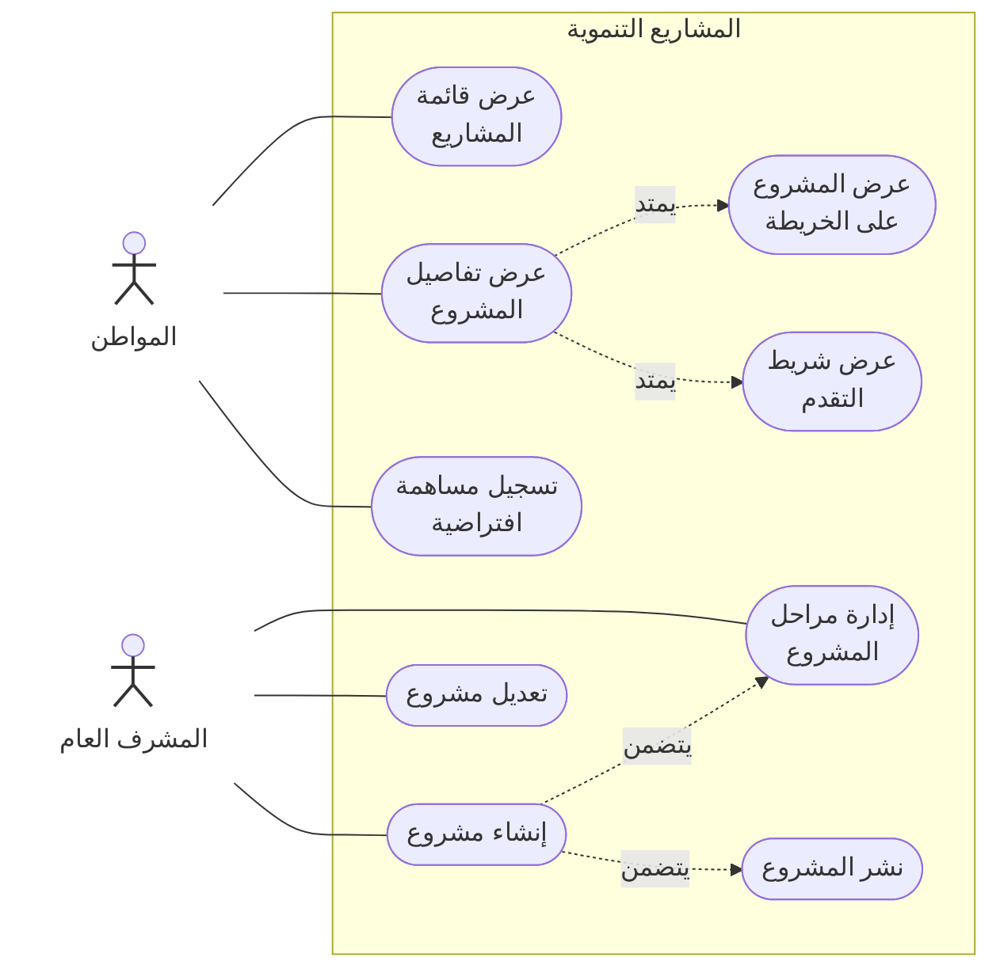
```mermaid
flowchart LR
    C["<svg width='36' height='50' viewBox='0 0 36 50'><circle cx='18' cy='9' r='7' fill='none' stroke='currentColor' stroke-width='2'/><line x1='18' y1='16' x2='18' y2='34' stroke='currentColor' stroke-width='2'/><line x1='4' y1='23' x2='32' y2='23' stroke='currentColor' stroke-width='2'/><line x1='18' y1='34' x2='6' y2='48' stroke='currentColor' stroke-width='2'/><line x1='18' y1='34' x2='30' y2='48' stroke='currentColor' stroke-width='2'/></svg><br/>المواطن"]
    SA["<svg width='36' height='50' viewBox='0 0 36 50'><circle cx='18' cy='9' r='7' fill='none' stroke='currentColor' stroke-width='2'/><line x1='18' y1='16' x2='18' y2='34' stroke='currentColor' stroke-width='2'/><line x1='4' y1='23' x2='32' y2='23' stroke='currentColor' stroke-width='2'/><line x1='18' y1='34' x2='6' y2='48' stroke='currentColor' stroke-width='2'/><line x1='18' y1='34' x2='30' y2='48' stroke='currentColor' stroke-width='2'/></svg><br/>المشرف العام"]

    subgraph system ["المشاريع التنموية"]
        UC1(["عرض قائمة\nالمشاريع"])
        UC2(["عرض تفاصيل\nالمشروع"])
        UC3(["عرض المشروع\nعلى الخريطة"])
        UC4(["عرض شريط\nالتقدم"])
        UC5(["تسجيل مساهمة\nافتراضية"])
        UC6(["إنشاء مشروع"])
        UC7(["تعديل مشروع"])
        UC8(["إدارة مراحل\nالمشروع"])
        UC9(["نشر المشروع"])
    end

    C --- UC1
    C --- UC2
    C --- UC5
    SA --- UC6
    SA --- UC7
    SA --- UC8

    UC2 -.->|"يمتد"| UC3
    UC2 -.->|"يمتد"| UC4
    UC6 -.->|"يتضمن"| UC8
    UC6 -.->|"يتضمن"| UC9

    classDef actor fill:none,stroke:none;
    class C,SA actor;

```

5.10 مجموعة حالات الاستخدام 9: الإدارة المركزية

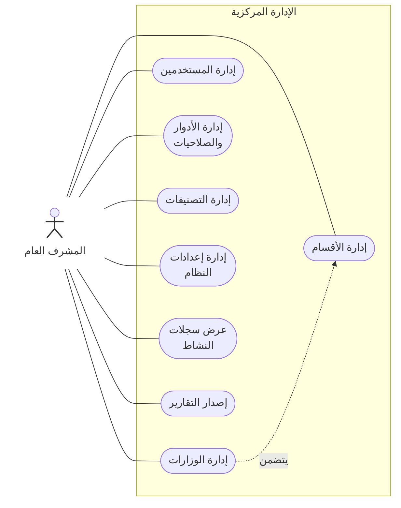
```mermaid
flowchart LR
    SA["<svg width='36' height='50' viewBox='0 0 36 50'><circle cx='18' cy='9' r='7' fill='none' stroke='currentColor' stroke-width='2'/><line x1='18' y1='16' x2='18' y2='34' stroke='currentColor' stroke-width='2'/><line x1='4' y1='23' x2='32' y2='23' stroke='currentColor' stroke-width='2'/><line x1='18' y1='34' x2='6' y2='48' stroke='currentColor' stroke-width='2'/><line x1='18' y1='34' x2='30' y2='48' stroke='currentColor' stroke-width='2'/></svg><br/>المشرف العام"]

    subgraph system ["الإدارة المركزية"]
        UC1(["إدارة الوزارات"])
        UC2(["إدارة الأقسام"])
        UC3(["إدارة المستخدمين"])
        UC4(["إدارة الأدوار\nوالصلاحيات"])
        UC5(["إدارة التصنيفات"])
        UC6(["إدارة إعدادات\nالنظام"])
        UC7(["عرض سجلات\nالنشاط"])
        UC8(["إصدار التقارير"])
    end

    SA --- UC1
    SA --- UC2
    SA --- UC3
    SA --- UC4
    SA --- UC5
    SA --- UC6
    SA --- UC7
    SA --- UC8

    UC1 -.->|"يتضمن"| UC2

    classDef actor fill:none,stroke:none;
    class SA actor;

```

5.11 مجموعة حالات الاستخدام 10: التفاعل المجتمعي

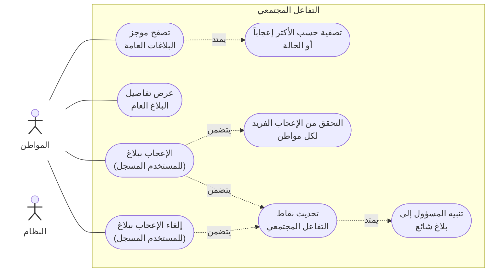
```mermaid
flowchart LR
    C["<svg width='36' height='50' viewBox='0 0 36 50'><circle cx='18' cy='9' r='7' fill='none' stroke='currentColor' stroke-width='2'/><line x1='18' y1='16' x2='18' y2='34' stroke='currentColor' stroke-width='2'/><line x1='4' y1='23' x2='32' y2='23' stroke='currentColor' stroke-width='2'/><line x1='18' y1='34' x2='6' y2='48' stroke='currentColor' stroke-width='2'/><line x1='18' y1='34' x2='30' y2='48' stroke='currentColor' stroke-width='2'/></svg><br/>المواطن"]
    SYS["<svg width='36' height='50' viewBox='0 0 36 50'><circle cx='18' cy='9' r='7' fill='none' stroke='currentColor' stroke-width='2'/><line x1='18' y1='16' x2='18' y2='34' stroke='currentColor' stroke-width='2'/><line x1='4' y1='23' x2='32' y2='23' stroke='currentColor' stroke-width='2'/><line x1='18' y1='34' x2='6' y2='48' stroke='currentColor' stroke-width='2'/><line x1='18' y1='34' x2='30' y2='48' stroke='currentColor' stroke-width='2'/></svg><br/>النظام"]

    subgraph system ["التفاعل المجتمعي"]
        UC1(["تصفح موجز\nالبلاغات العامة"])
        UC2(["تصفية حسب الأكثر إعجاباً\nأو الحالة"])
        UC3(["عرض تفاصيل\nالبلاغ العام"])
        UC4(["الإعجاب ببلاغ\n(للمستخدم المسجل)"])
        UC5(["إلغاء الإعجاب ببلاغ\n(للمستخدم المسجل)"])
        UC6(["التحقق من الإعجاب الفريد\nلكل مواطن"])
        UC7(["تحديث نقاط\nالتفاعل المجتمعي"])
        UC8(["تنبيه المسؤول إلى\nبلاغ شائع"])
    end

    C --- UC1
    C --- UC3
    C --- UC4
    C --- UC5

    UC1 -.->|"يمتد"| UC2
    UC4 -.->|"يتضمن"| UC6
    UC4 -.->|"يتضمن"| UC7
    UC5 -.->|"يتضمن"| UC7
    UC7 -.->|"يمتد"| UC8

    classDef actor fill:none,stroke:none;
    class C,SYS actor;

```

## 6.1 مخطط العلاقات والكيانات — Entity Relationship Diagram

```mermaid
%%{init: {
  'theme': 'dark',
  'themeVariables': {
    'darkMode': true,
    'background': '#0a0d12',
    'primaryColor': '#161b22',
    'primaryTextColor': '#f0f6fc',
    'primaryBorderColor': '#30363d',
    'lineColor': '#58a6ff',
    'secondaryColor': '#21262d',
    'tertiaryColor': '#0d1117',
    'mainBkg': '#161b22',
    'nodeBorder': '#30363d',
    'edgeLabelBackground': '#161b22',
    'attributeBackgroundColorOdd': '#161b22',
    'attributeBackgroundColorEven': '#0d1117'
  }
}}%%
erDiagram
    MINISTRIES["الوزارات - MINISTRIES"] {
        bigint id PK
        string name
        string code UK
        string logo
        string contact_email
        boolean is_active
        timestamp created_at
        timestamp updated_at
    }

    DEPARTMENTS["الأقسام - DEPARTMENTS"] {
        bigint id PK
        bigint ministry_id FK
        string name
        string description
        boolean is_active
        timestamp created_at
        timestamp updated_at
    }

    CATEGORIES["التصنيفات - CATEGORIES"] {
        bigint id PK
        bigint parent_id FK "مرجع ذاتي يقبل الفراغ"
        bigint department_id FK
        string name
        string description
        int level
        timestamp created_at
        timestamp updated_at
    }

    USERS["المستخدمون - USERS"] {
        bigint id PK
        string name
        string email UK
        string phone
        string password
        string national_id UK
        bigint department_id FK "يقبل الفراغ"
        boolean is_active
        timestamp created_at
        timestamp updated_at
    }

    ROLES["الأدوار - ROLES"] {
        bigint id PK
        string name UK
        string guard_name
    }

    PERMISSIONS["الصلاحيات - PERMISSIONS"] {
        bigint id PK
        string name UK
        string guard_name
    }

    ROLE_USER["ربط المستخدم بالدور - ROLE_USER"] {
        bigint user_id FK
        bigint role_id FK
    }

    COMPLAINTS["البلاغات - COMPLAINTS"] {
        bigint id PK
        bigint citizen_id FK
        bigint category_id FK
        bigint current_department_id FK
        bigint duplicate_of_id FK "مرجع ذاتي يقبل الفراغ"
        string title
        text description
        string status "تعداد - انظر 6.3"
        string priority
        decimal latitude
        decimal longitude
        boolean is_public "الافتراضي خطأ"
        int likes_count "غير سالب افتراضي 0 مفهرس"
        timestamp created_at
        timestamp updated_at
    }

    COMPLAINT_LIKES["إعجابات البلاغات - COMPLAINT_LIKES"] {
        bigint id PK
        bigint complaint_id FK
        bigint user_id FK
        timestamp created_at
    }

    COMPLAINT_ATTACHMENTS["مرفقات البلاغات - COMPLAINT_ATTACHMENTS"] {
        bigint id PK
        bigint complaint_id FK
        string file_path
        string file_type
        decimal captured_latitude
        decimal captured_longitude
        bigint uploaded_by FK
        string type "قبل أو بعد"
        timestamp created_at
    }

    COMPLAINT_TIMELINE["السجل الزمني للبلاغات - COMPLAINT_TIMELINE"] {
        bigint id PK
        bigint complaint_id FK
        string event_type "تعداد - انظر 6.4"
        text description
        string old_value "يقبل الفراغ"
        string new_value "يقبل الفراغ"
        bigint performed_by FK
        timestamp created_at
    }

    COMPLAINT_TRANSFERS["تحويلات البلاغات - COMPLAINT_TRANSFERS"] {
        bigint id PK
        bigint complaint_id FK
        bigint from_department_id FK
        bigint to_department_id FK
        text reason
        bigint transferred_by FK
        timestamp created_at
    }

    FIELD_ASSIGNMENTS["المهام الميدانية - FIELD_ASSIGNMENTS"] {
        bigint id PK
        bigint complaint_id FK
        bigint worker_id FK
        bigint assigned_by FK
        string status "تعداد - انظر 6.5"
        timestamp started_at "يقبل الفراغ"
        timestamp completed_at "يقبل الفراغ"
        text notes "يقبل الفراغ"
        timestamp created_at
        timestamp updated_at
    }

    NOTIFICATIONS["الإشعارات - NOTIFICATIONS"] {
        bigint id PK
        bigint user_id FK
        string title
        text body
        string type
        json data "يقبل الفراغ"
        boolean is_read
        timestamp created_at
    }

    PROJECTS["المشاريع - PROJECTS"] {
        bigint id PK
        string title
        text description
        bigint department_id FK
        decimal target_amount
        decimal current_amount
        string status "تعداد"
        decimal latitude
        decimal longitude
        bigint created_by FK
        timestamp created_at
        timestamp updated_at
    }

    PROJECT_PHASES["مراحل المشاريع - PROJECT_PHASES"] {
        bigint id PK
        bigint project_id FK
        string name
        text description
        int completion_percentage
        date start_date
        date end_date
        string status
        timestamp created_at
        timestamp updated_at
    }

    PROJECT_CONTRIBUTIONS["مساهمات المشاريع - PROJECT_CONTRIBUTIONS"] {
        bigint id PK
        bigint project_id FK
        bigint contributor_id FK
        decimal amount
        timestamp created_at
    }

    ACTIVITY_LOGS["سجلات النشاط - ACTIVITY_LOGS"] {
        bigint id PK
        bigint user_id FK "يقبل الفراغ"
        string action
        string model_type
        bigint model_id
        json changes "يقبل الفراغ"
        string ip_address
        timestamp created_at
    }

    SETTINGS["الإعدادات - SETTINGS"] {
        bigint id PK
        string key UK
        text value
        string group
    }

    MINISTRIES ||--o{ DEPARTMENTS : "تمتلك"
    DEPARTMENTS ||--o{ CATEGORIES : "تملك"
    CATEGORIES ||--o{ CATEGORIES : "أب لـ"
    DEPARTMENTS ||--o{ USERS : "توظف"
    DEPARTMENTS ||--o{ COMPLAINTS : "مسؤولة عن"
    USERS ||--o{ COMPLAINTS : "يرفع"
    CATEGORIES ||--o{ COMPLAINTS : "تصنف"
    COMPLAINTS ||--o{ COMPLAINT_ATTACHMENTS : "يحتوي على"
    COMPLAINTS ||--o{ COMPLAINT_TIMELINE : "يسجل"
    COMPLAINTS ||--o{ COMPLAINT_TRANSFERS : "يحول عبر"
    COMPLAINTS ||--o{ FIELD_ASSIGNMENTS : "يسند عبر"
    COMPLAINTS ||--o{ COMPLAINTS : "مكرر من"
    COMPLAINTS ||--o{ COMPLAINT_LIKES : "يتلقى إعجابات"
    USERS ||--o{ COMPLAINT_LIKES : "يسجل إعجابات"
    USERS ||--o{ FIELD_ASSIGNMENTS : "يعمل على"
    USERS ||--o{ NOTIFICATIONS : "يستلم"
    USERS }o--o{ ROLES : "له دور"
    ROLES }o--o{ PERMISSIONS : "له صلاحية"
    DEPARTMENTS ||--o{ PROJECTS : "تملك"
    PROJECTS ||--o{ PROJECT_PHASES : "يتكون من"
    PROJECTS ||--o{ PROJECT_CONTRIBUTIONS : "يتلقى"
    USERS ||--o{ PROJECT_CONTRIBUTIONS : "يساهم في"

```

---

## 7.1 مخطط الفئات الكامل — Complete Class Diagram

```mermaid
%%{init: {
  'theme': 'dark',
  'themeVariables': {
    'darkMode': true,
    'background': '#0a0d12',
    'primaryColor': '#161b22',
    'primaryTextColor': '#f0f6fc',
    'primaryBorderColor': '#30363d',
    'lineColor': '#58a6ff',
    'secondaryColor': '#21262d',
    'tertiaryColor': '#0d1117',
    'mainBkg': '#161b22',
    'nodeBorder': '#30363d',
    'edgeLabelBackground': '#161b22',
    'classText': '#f0f6fc'
  }
}}%%
classDiagram
    direction TB

    class User["المستخدم - User"] {
        -int id
        -String name
        -String email
        -String phone
        -String password
        -String nationalId
        -int departmentId
        -boolean isActive
        +authenticate(credentials) bool
        +updateProfile(data) void
        +hasRole(roleName) bool
        +getNotifications() List
    }

    class Role["الدور - Role"] {
        -int id
        -String name
        -String guardName
        +getPermissions() List
    }

    class Permission["الصلاحية - Permission"] {
        -int id
        -String name
        -String guardName
    }

    class Ministry["الوزارة - Ministry"] {
        -int id
        -String name
        -String code
        -String logo
        -String contactEmail
        -boolean isActive
        +getDepartments() List
        +getStatistics() Object
    }

    class Department["القسم - Department"] {
        -int id
        -int ministryId
        -String name
        -String description
        -boolean isActive
        +getComplaints() List
        +getWorkers() List
        +getCategories() List
    }

    class Category["التصنيف - Category"] {
        -int id
        -int parentId
        -int departmentId
        -String name
        -int level
        +getSubCategories() List
        +getParent() Category
    }

    class Complaint["البلاغ - Complaint"] {
        -int id
        -int citizenId
        -int categoryId
        -int currentDepartmentId
        -int duplicateOfId
        -String title
        -String description
        -String status
        -String priority
        -float latitude
        -float longitude
        -boolean isPublic
        -int likesCount
        +submit() void
        +updateStatus(status) void
        +markAsDuplicate(originalId) void
        +isLikedBy(userId) bool
        +close() void
        +reopen() void
        +getTimeline() List
        +getAttachments() List
        +getLikes() List
    }

    class ComplaintLike["إعجاب البلاغ - ComplaintLike"] {
        -int id
        -int complaintId
        -int userId
        -DateTime createdAt
    }

    class Attachment["المرفق - Attachment"] {
        -int id
        -int complaintId
        -String filePath
        -String fileType
        -float capturedLatitude
        -float capturedLongitude
        -int uploadedBy
        -String type
        +upload(file) void
        +validateType() bool
    }

    class Transfer["التحويل - Transfer"] {
        -int id
        -int complaintId
        -int fromDepartmentId
        -int toDepartmentId
        -String reason
        -int transferredBy
        +execute() void
        +getHistory() List
    }

    class FieldAssignment["المهمة الميدانية - FieldAssignment"] {
        -int id
        -int complaintId
        -int workerId
        -int assignedBy
        -String status
        -DateTime startedAt
        -DateTime completedAt
        -String notes
        +assign() void
        +accept() void
        +start() void
        +complete() void
        +fail(reason) void
    }

    class Notification["الإشعار - Notification"] {
        -int id
        -int userId
        -String title
        -String body
        -String type
        -Object data
        -boolean isRead
        +markRead() void
        +markAllRead() void
    }

    class Project["المشروع - Project"] {
        -int id
        -String title
        -String description
        -int departmentId
        -float targetAmount
        -float currentAmount
        -String status
        -float latitude
        -float longitude
        +publish() void
        +updateProgress() void
        +getPhases() List
        +getTotalContributions() float
    }

    class ProjectPhase["مرحلة المشروع - ProjectPhase"] {
        -int id
        -int projectId
        -String name
        -int completionPercentage
        -Date startDate
        -Date endDate
        +updateCompletion(pct) void
    }

    class Contribution["المساهمة - Contribution"] {
        -int id
        -int projectId
        -int contributorId
        -float amount
        +record() void
    }

    class AuthService["خدمة المصادقة - AuthService"] {
        <<خدمة>>
        +register(data) User
        +login(credentials) Token
        +logout(token) void
        +validateToken(token) bool
    }

    class ComplaintService["خدمة البلاغات - ComplaintService"] {
        <<خدمة>>
        +createComplaint(data) Complaint
        +updateStatus(id status) void
        +closeComplaint(id) void
        +reopenComplaint(id) void
    }

    class ValidationService["خدمة التحقق - ValidationService"] {
        <<خدمة>>
        +validateData(complaint) Result
        +validateEvidence(attachment) Result
        +validateLocation(lat lng) Result
    }

    class DuplicateDetectionService["خدمة كشف التكرار - DuplicateDetectionService"] {
        <<خدمة>>
        +checkDuplicate(complaint) Result
        +findSimilar(location category timeWindow) List
        +linkDuplicate(complaintId originalId) void
    }

    class RoutingService["خدمة التوجيه - RoutingService"] {
        <<خدمة>>
        +determineResponsibleDept(complaint) Department
        +autoRoute(complaint) void
    }

    class TransferService["خدمة التحويل - TransferService"] {
        <<خدمة>>
        +transferComplaint(complaintId toDeptId reason) void
        +validateTransfer(from to) bool
    }

    class GeoLocationService["خدمة الموقع الجغرافي - GeoLocationService"] {
        <<خدمة>>
        +verifyWorkerLocation(workerLat workerLng complaintLat complaintLng) bool
        +calculateDistance(lat1 lng1 lat2 lng2) float
        +isWithinRange(distance maxRange) bool
    }

    class NotificationService["خدمة الإشعارات - NotificationService"] {
        <<خدمة>>
        +sendPush(userId title body data) void
        +notifyComplaintUpdate(complaint eventType) void
        +notifyTaskAssignment(assignment) void
    }

    class FileUploadService["خدمة رفع الملفات - FileUploadService"] {
        <<خدمة>>
        +upload(file path) String
        +validateFileType(file allowedTypes) bool
        +validateFileSize(file maxSize) bool
    }

    class ReportingService["خدمة التقارير - ReportingService"] {
        <<خدمة>>
        +getDepartmentStats(deptId) Object
        +getGlobalStats() Object
        +generateReport(filters) Report
    }

    class FieldWorkService["خدمة العمل الميداني - FieldWorkService"] {
        <<خدمة>>
        +assignTask(complaintId workerId) FieldAssignment
        +verifyWorkerAtLocation(assignmentId) bool
        +completeTask(assignmentId evidence) void
    }

    class ProjectService["خدمة المشاريع - ProjectService"] {
        <<خدمة>>
        +createProject(data) Project
        +publishProject(id) void
        +updatePhase(phaseId completion) void
        +recordContribution(projectId userId amount) Contribution
    }

    class CommunityInteractionService["خدمة التفاعل المجتمعي - CommunityInteractionService"] {
        <<خدمة>>
        +like(complaintId userId) Object
        +unlike(complaintId userId) Object
        +getPublicComplaints(filters) Paginator
        +getMapComplaints(filters bbox) List
    }

    class CommunityEngagementService["خدمة المشاركة المجتمعية - CommunityEngagementService"] {
        <<خدمة>>
        +checkEngagementThresholds(complaint) void
        +alertAdminsIfTrending(complaint) void
        +reconcileLikesCount(complaintId) int
    }

    class ComplaintPriorityService["خدمة أولوية البلاغات - ComplaintPriorityService"]

    User "M" -- "M" Role : يمتلك
    Role "M" -- "M" Permission : يمنح
    Ministry "1" *-- "M" Department : تضم
    Department "1" o-- "M" Category : ينظم
    Department "1" o-- "M" User : يوظف
    Category "1" o-- "M" Category : أب لـ
    User "1" -- "M" Complaint : يرفع
    Category "1" -- "M" Complaint : يصنف
    Department "1" -- "M" Complaint : مسؤول عن
    Complaint "1" *-- "M" Attachment : يحتوي على
    Complaint "1" *-- "M" Transfer : يحول عبر
    Complaint "1" -- "M" FieldAssignment : يسند عبر
    Complaint "1" *-- "M" ComplaintLike : يتلقى إعجابات
    User "1" -- "M" ComplaintLike : يعجب بـ
    User "1" -- "M" Notification : يستلم
    User "1" -- "M" FieldAssignment : يعمل على
    Department "1" -- "M" Project : يملك
    Project "1" *-- "M" ProjectPhase : يتكون من مراحل
    Project "1" -- "M" Contribution : يتلقى
    User "1" -- "M" Contribution : يساهم في
    ComplaintService ..> ValidationService : يستخدم
    ComplaintService ..> DuplicateDetectionService : يستخدم
    ComplaintService ..> RoutingService : يستخدم
    ComplaintService ..> NotificationService : يستخدم
    TransferService ..> NotificationService : يستخدم
    FieldWorkService ..> GeoLocationService : يستخدم
    FieldWorkService ..> NotificationService : يستخدم
    ProjectService ..> NotificationService : يستخدم
    ComplaintService ..> FileUploadService : يستخدم
    CommunityInteractionService ..> ComplaintPriorityService : يستخدم
    CommunityInteractionService ..> NotificationService : يستخدم

```

---

## 8. مخططات النشاط — Activity Diagrams

### ACT-01: إنشاء شكوى — Create Complaint

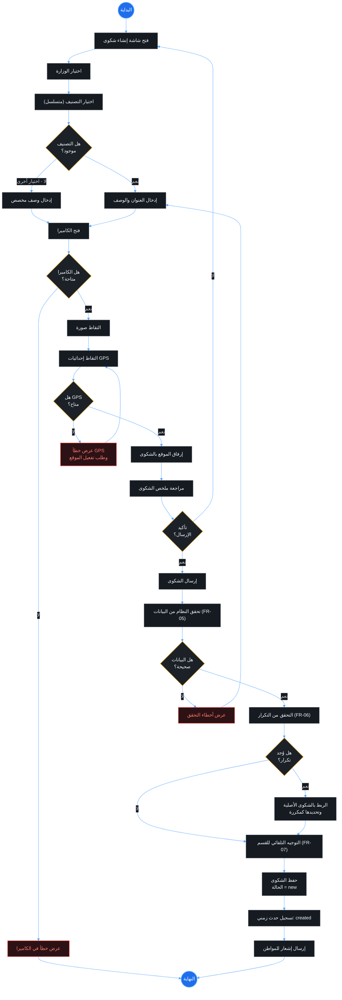
```mermaid
%%{init: {'theme': 'dark', 'themeVariables': {'darkMode': true, 'background': '#0a0d12', 'primaryColor': '#161b22', 'primaryTextColor': '#f0f6fc', 'primaryBorderColor': '#30363d', 'lineColor': '#58a6ff', 'edgeLabelBackground': '#161b22'}}}%%
flowchart TD
    S((البداية)) --> A1["فتح شاشة إنشاء شكوى"]
    A1 --> A2["اختيار الوزارة"]
    A2 --> A3["اختيار التصنيف (متسلسل)"]
    A3 --> D1{"هل التصنيف\nموجود؟"}
    D1 -->|"نعم"| A4["إدخال العنوان والوصف"]
    D1 -->|"لا - اختيار أخرى"| A4B["إدخال وصف مخصص"]
    A4B --> A5
    A4 --> A5["فتح الكاميرا"]
    A5 --> D2{"هل الكاميرا\nمتاحة؟"}
    D2 -->|"نعم"| A6["التقاط صورة"]
    D2 -->|"لا"| ERR1["عرض خطأ في الكاميرا"]
    ERR1 --> E((النهاية))
    A6 --> A7["التقاط إحداثيات GPS"]
    A7 --> D3{"هل GPS\nمتاح؟"}
    D3 -->|"نعم"| A8["إرفاق الموقع بالشكوى"]
    D3 -->|"لا"| ERR2["عرض خطأ GPS\nوطلب تفعيل الموقع"]
    ERR2 --> A7
    A8 --> A9["مراجعة ملخص الشكوى"]
    A9 --> D4{"تأكيد\nالإرسال؟"}
    D4 -->|"نعم"| A10["إرسال الشكوى"]
    D4 -->|"لا"| A1
    A10 --> A11["تحقق النظام من البيانات (FR-05)"]
    A11 --> D5{"هل البيانات\nصحيحة؟"}
    D5 -->|"نعم"| A12["التحقق من التكرار (FR-06)"]
    D5 -->|"لا"| ERR3["عرض أخطاء التحقق"]
    ERR3 --> A4
    A12 --> D6{"هل وُجد\nتكرار؟"}
    D6 -->|"نعم"| A13["الربط بالشكوى الأصلية\nوتحديدها كمكررة"]
    D6 -->|"لا"| A14["التوجيه التلقائي للقسم (FR-07)"]
    A13 --> A14
    A14 --> A15["حفظ الشكوى\nالحالة = new"]
    A15 --> A16["تسجيل حدث زمني: created"]
    A16 --> A17["إرسال إشعار للمواطن"]
    A17 --> E

    classDef startEnd fill:#1f6feb,stroke:#58a6ff,color:#ffffff,stroke-width:2px;
    classDef action fill:#161b22,stroke:#30363d,color:#f0f6fc,stroke-width:1.5px;
    classDef decision fill:#1c2128,stroke:#d29922,color:#f0f6fc,stroke-width:1.5px;
    classDef error fill:#2d1215,stroke:#f85149,color:#ff7b72,stroke-width:1.5px;
    class S,E startEnd;
    class A1,A2,A3,A4,A4B,A5,A6,A7,A8,A9,A10,A11,A12,A13,A14,A15,A16,A17 action;
    class D1,D2,D3,D4,D5,D6 decision;
    class ERR1,ERR2,ERR3 error;

```

---

### ACT-02: التحقق من الشكوى — Validate Complaint

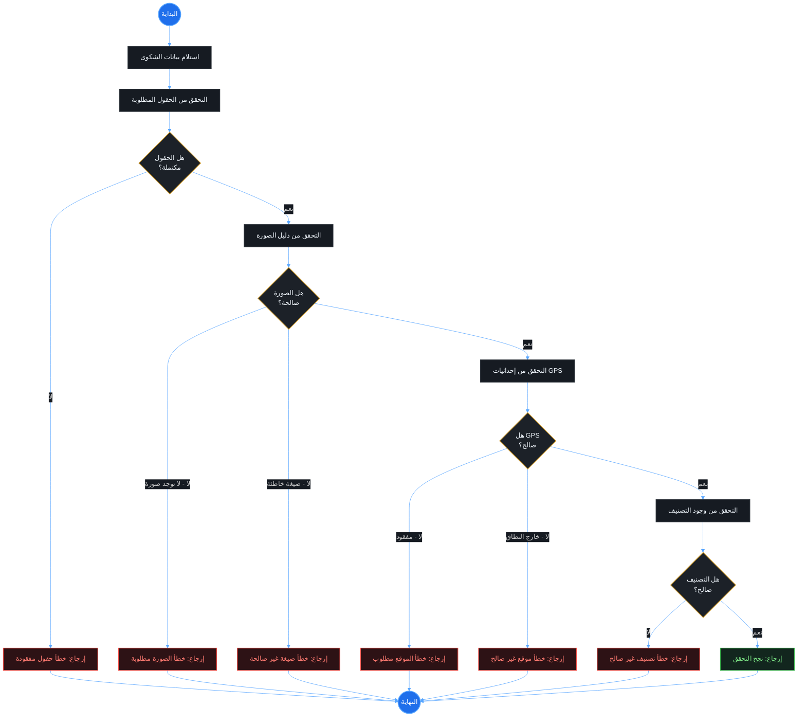
```mermaid
%%{init: {'theme': 'dark', 'themeVariables': {'darkMode': true, 'background': '#0a0d12', 'primaryColor': '#161b22', 'primaryTextColor': '#f0f6fc', 'primaryBorderColor': '#30363d', 'lineColor': '#58a6ff', 'edgeLabelBackground': '#161b22'}}}%%
flowchart TD
    S((البداية)) --> A1["استلام بيانات الشكوى"]
    A1 --> A2["التحقق من الحقول المطلوبة"]
    A2 --> D1{"هل الحقول\nمكتملة؟"}
    D1 -->|"لا"| R1["إرجاع: خطأ حقول مفقودة"]
    R1 --> E((النهاية))
    D1 -->|"نعم"| A3["التحقق من دليل الصورة"]
    A3 --> D2{"هل الصورة\nصالحة؟"}
    D2 -->|"لا - لا توجد صورة"| R2["إرجاع: خطأ الصورة مطلوبة"]
    R2 --> E
    D2 -->|"لا - صيغة خاطئة"| R3["إرجاع: خطأ صيغة غير صالحة"]
    R3 --> E
    D2 -->|"نعم"| A4["التحقق من إحداثيات GPS"]
    A4 --> D3{"هل GPS\nصالح؟"}
    D3 -->|"لا - مفقود"| R4["إرجاع: خطأ الموقع مطلوب"]
    R4 --> E
    D3 -->|"لا - خارج النطاق"| R5["إرجاع: خطأ موقع غير صالح"]
    R5 --> E
    D3 -->|"نعم"| A5["التحقق من وجود التصنيف"]
    A5 --> D4{"هل التصنيف\nصالح؟"}
    D4 -->|"لا"| R6["إرجاع: خطأ تصنيف غير صالح"]
    R6 --> E
    D4 -->|"نعم"| R7["إرجاع: نجح التحقق"]
    R7 --> E

    classDef startEnd fill:#1f6feb,stroke:#58a6ff,color:#ffffff,stroke-width:2px;
    classDef action fill:#161b22,stroke:#30363d,color:#f0f6fc,stroke-width:1.5px;
    classDef decision fill:#1c2128,stroke:#d29922,color:#f0f6fc,stroke-width:1.5px;
    classDef error fill:#2d1215,stroke:#f85149,color:#ff7b72,stroke-width:1.5px;
    classDef success fill:#12261e,stroke:#3fb950,color:#7ee787,stroke-width:1.5px;
    class S,E startEnd;
    class A1,A2,A3,A4,A5 action;
    class D1,D2,D3,D4 decision;
    class R1,R2,R3,R4,R5,R6 error;
    class R7 success;

```

---

### ACT-03: كشف التكرار — Detect Duplicate Complaint

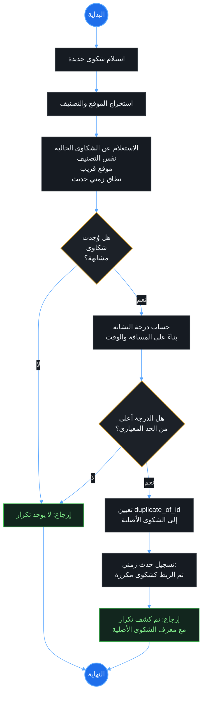
```mermaid
%%{init: {'theme': 'dark', 'themeVariables': {'darkMode': true, 'background': '#0a0d12', 'primaryColor': '#161b22', 'primaryTextColor': '#f0f6fc', 'primaryBorderColor': '#30363d', 'lineColor': '#58a6ff', 'edgeLabelBackground': '#161b22'}}}%%
flowchart TD
    S((البداية)) --> A1["استلام شكوى جديدة"]
    A1 --> A2["استخراج الموقع والتصنيف"]
    A2 --> A3["الاستعلام عن الشكاوى الحالية\nنفس التصنيف\nموقع قريب\nنطاق زمني حديث"]
    A3 --> D1{"هل وُجدت\nشكاوى\nمشابهة؟"}
    D1 -->|"لا"| R1["إرجاع: لا يوجد تكرار"]
    R1 --> E((النهاية))
    D1 -->|"نعم"| A4["حساب درجة التشابه\nبناءً على المسافة والوقت"]
    A4 --> D2{"هل الدرجة أعلى\nمن الحد المعياري؟"}
    D2 -->|"لا"| R1
    D2 -->|"نعم"| A5["تعيين duplicate_of_id\nإلى الشكوى الأصلية"]
    A5 --> A6["تسجيل حدث زمني:\nتم الربط كشكوى مكررة"]
    A6 --> R2["إرجاع: تم كشف تكرار\nمع معرف الشكوى الأصلية"]
    R2 --> E

    classDef startEnd fill:#1f6feb,stroke:#58a6ff,color:#ffffff,stroke-width:2px;
    classDef action fill:#161b22,stroke:#30363d,color:#f0f6fc,stroke-width:1.5px;
    classDef decision fill:#1c2128,stroke:#d29922,color:#f0f6fc,stroke-width:1.5px;
    classDef result fill:#12261e,stroke:#3fb950,color:#7ee787,stroke-width:1.5px;
    class S,E startEnd;
    class A1,A2,A3,A4,A5,A6 action;
    class D1,D2 decision;
    class R1,R2 result;

```

---

### ACT-04: التوجيه التلقائي — Auto-Route Complaint

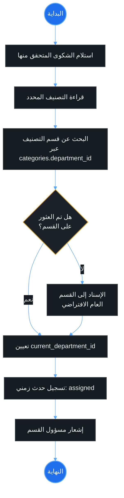
```mermaid
%%{init: {'theme': 'dark', 'themeVariables': {'darkMode': true, 'background': '#0a0d12', 'primaryColor': '#161b22', 'primaryTextColor': '#f0f6fc', 'primaryBorderColor': '#30363d', 'lineColor': '#58a6ff', 'edgeLabelBackground': '#161b22'}}}%%
flowchart TD
    S((البداية)) --> A1["استلام الشكوى المتحقق منها"]
    A1 --> A2["قراءة التصنيف المحدد"]
    A2 --> A3["البحث عن قسم التصنيف\nعبر categories.department_id"]
    A3 --> D1{"هل تم العثور\nعلى القسم؟"}
    D1 -->|"نعم"| A4["تعيين current_department_id"]
    D1 -->|"لا"| A5["الإسناد إلى القسم\nالعام الافتراضي"]
    A5 --> A4
    A4 --> A6["تسجيل حدث زمني: assigned"]
    A6 --> A7["إشعار مسؤول القسم"]
    A7 --> E((النهاية))

    classDef startEnd fill:#1f6feb,stroke:#58a6ff,color:#ffffff,stroke-width:2px;
    classDef action fill:#161b22,stroke:#30363d,color:#f0f6fc,stroke-width:1.5px;
    classDef decision fill:#1c2128,stroke:#d29922,color:#f0f6fc,stroke-width:1.5px;
    class S,E startEnd;
    class A1,A2,A3,A4,A5,A6,A7 action;
    class D1 decision;

```

---

### ACT-05: مراجعة وتحويل الشكوى — Review and Transfer Complaint

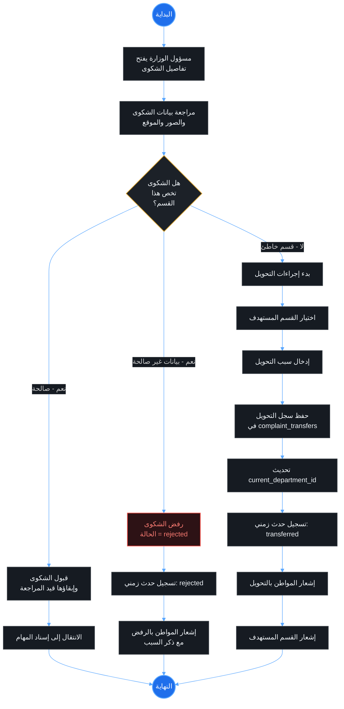
```mermaid
%%{init: {'theme': 'dark', 'themeVariables': {'darkMode': true, 'background': '#0a0d12', 'primaryColor': '#161b22', 'primaryTextColor': '#f0f6fc', 'primaryBorderColor': '#30363d', 'lineColor': '#58a6ff', 'edgeLabelBackground': '#161b22'}}}%%
flowchart TD
    S((البداية)) --> A1["مسؤول الوزارة يفتح\nتفاصيل الشكوى"]
    A1 --> A2["مراجعة بيانات الشكوى\nوالصور والموقع"]
    A2 --> D1{"هل الشكوى\nتخص هذا\nالقسم؟"}
    D1 -->|"نعم - صالحة"| A3["قبول الشكوى\nوإبقاؤها قيد المراجعة"]
    D1 -->|"نعم - بيانات غير صالحة"| A4["رفض الشكوى\nالحالة = rejected"]
    D1 -->|"لا - قسم خاطئ"| A5["بدء إجراءات التحويل"]
    A3 --> A6["الانتقال إلى إسناد المهام"]
    A6 --> E((النهاية))
    A4 --> A7["تسجيل حدث زمني: rejected"]
    A7 --> A8["إشعار المواطن بالرفض\nمع ذكر السبب"]
    A8 --> E
    A5 --> A9["اختيار القسم المستهدف"]
    A9 --> A10["إدخال سبب التحويل"]
    A10 --> A11["حفظ سجل التحويل\nفي complaint_transfers"]
    A11 --> A12["تحديث current_department_id"]
    A12 --> A13["تسجيل حدث زمني: transferred"]
    A13 --> A14["إشعار المواطن بالتحويل"]
    A14 --> A15["إشعار القسم المستهدف"]
    A15 --> E

    classDef startEnd fill:#1f6feb,stroke:#58a6ff,color:#ffffff,stroke-width:2px;
    classDef action fill:#161b22,stroke:#30363d,color:#f0f6fc,stroke-width:1.5px;
    classDef decision fill:#1c2128,stroke:#d29922,color:#f0f6fc,stroke-width:1.5px;
    classDef reject fill:#2d1215,stroke:#f85149,color:#ff7b72,stroke-width:1.5px;
    class S,E startEnd;
    class A1,A2,A3,A5,A6,A7,A8,A9,A10,A11,A12,A13,A14,A15 action;
    class D1 decision;
    class A4 reject;

```

---

### ACT-06: إسناد المهمة الميدانية — Assign Field Task

```mermaid
%%{init: {'theme': 'dark', 'themeVariables': {'darkMode': true, 'background': '#0a0d12', 'primaryColor': '#161b22', 'primaryTextColor': '#f0f6fc', 'primaryBorderColor': '#30363d', 'lineColor': '#58a6ff', 'edgeLabelBackground': '#161b22'}}}%%
flowchart TD
    S((البداية)) --> A1["مسؤول الوزارة يفتح\nالشكوى المقبولة"]
    A1 --> A2["عرض العاملين الميدانيين المتاحين\nفي القسم"]
    A2 --> D1{"هل يتوفر\nعاملون؟"}
    D1 -->|"لا"| A3["عرض رسالة عدم توفر عاملين"]
    A3 --> E((النهاية))
    D1 -->|"نعم"| A4["اختيار العامل الميداني"]
    A4 --> A5["إنشاء مهمة ميدانية\nالحالة = pending"]
    A5 --> A6["تحديث الشكوى\nالحالة = assigned"]
    A6 --> A7["تسجيل حدث زمني: assigned"]
    A7 --> A8["إرسال إشعار بالمهمة\nللعامل الميداني"]
    A8 --> E

    classDef startEnd fill:#1f6feb,stroke:#58a6ff,color:#ffffff,stroke-width:2px;
    classDef action fill:#161b22,stroke:#30363d,color:#f0f6fc,stroke-width:1.5px;
    classDef decision fill:#1c2128,stroke:#d29922,color:#f0f6fc,stroke-width:1.5px;
    classDef error fill:#2d1215,stroke:#f85149,color:#ff7b72,stroke-width:1.5px;
    class S,E startEnd;
    class A1,A2,A4,A5,A6,A7,A8 action;
    class D1 decision;
    class A3 error;

```

---

### ACT-07: تنفيذ المهمة الميدانية — Execute Field Task

```mermaid
%%{init: {'theme': 'dark', 'themeVariables': {'darkMode': true, 'background': '#0a0d12', 'primaryColor': '#161b22', 'primaryTextColor': '#f0f6fc', 'primaryBorderColor': '#30363d', 'lineColor': '#58a6ff', 'edgeLabelBackground': '#161b22'}}}%%
flowchart TD
    S((البداية)) --> A1["العامل الميداني يستلم\nإشعار المهمة"]
    A1 --> A2["قبول المهمة\nحالة المهمة = accepted"]
    A2 --> A3["الانتقال إلى\nموقع الشكوى"]
    A3 --> A4["الوصول إلى الموقع"]
    A4 --> A5["النظام يلتقط\nموقع GPS للعامل"]
    A5 --> A6["خدمة GeoLocationService\nتحسب المسافة"]
    A6 --> D1{"هل العامل ضمن\nالنطاق المقبول؟"}
    D1 -->|"لا"| ERR1["عرض خطأ عدم\nتطابق الموقع"]
    ERR1 --> A3
    D1 -->|"نعم"| A7["تحديث المهمة\nالحالة = in_progress"]
    A7 --> A8["تنفيذ أعمال الإصلاح"]
    A8 --> A9["فتح الكاميرا لالتقاط\nصورة بعد الإصلاح"]
    A9 --> A10["التقاط صورة بعد الإصلاح\nمع بيانات GPS الوصفية"]
    A10 --> A11["رفع الدليل\nالنوع = after"]
    A11 --> A12["تسجيل حدث زمني:\nevidence_uploaded"]
    A12 --> A13["إضافة ملاحظات الإنجاز"]
    A13 --> A14["إكمال المهمة\nحالة المهمة = completed"]
    A14 --> A15["تحديث الشكوى\nالحالة = resolved"]
    A15 --> A16["تسجيل حدث زمني: resolved"]
    A16 --> A17["إشعار المواطن\nبحل الشكوى"]
    A17 --> E((النهاية))

    classDef startEnd fill:#1f6feb,stroke:#58a6ff,color:#ffffff,stroke-width:2px;
    classDef action fill:#161b22,stroke:#30363d,color:#f0f6fc,stroke-width:1.5px;
    classDef decision fill:#1c2128,stroke:#d29922,color:#f0f6fc,stroke-width:1.5px;
    classDef error fill:#2d1215,stroke:#f85149,color:#ff7b72,stroke-width:1.5px;
    class S,E startEnd;
    class A1,A2,A3,A4,A5,A6,A7,A8,A9,A10,A11,A12,A13,A14,A15,A16,A17 action;
    class D1 decision;
    class ERR1 error;

```

---

### ACT-08: إغلاق الشكوى — Close Complaint

```mermaid
%%{init: {'theme': 'dark', 'themeVariables': {'darkMode': true, 'background': '#0a0d12', 'primaryColor': '#161b22', 'primaryTextColor': '#f0f6fc', 'primaryBorderColor': '#30363d', 'lineColor': '#58a6ff', 'edgeLabelBackground': '#161b22'}}}%%
flowchart TD
    S((البداية)) --> A1["حالة الشكوى = resolved"]
    A1 --> A2["مسؤول الوزارة يراجع\nأدلة الإصلاح"]
    A2 --> D1{"هل الأدلة\nكافية ومرضية؟"}
    D1 -->|"نعم"| A3["تحديث الشكوى\nالحالة = closed"]
    D1 -->|"لا"| A4["إعادة فتح - إنشاء\nمهمة ميدانية جديدة"]
    A4 --> E((النهاية))
    A3 --> A5["تسجيل حدث زمني: closed"]
    A5 --> A6["إشعار المواطن\nبإغلاق الشكوى"]
    A6 --> E

    classDef startEnd fill:#1f6feb,stroke:#58a6ff,color:#ffffff,stroke-width:2px;
    classDef action fill:#161b22,stroke:#30363d,color:#f0f6fc,stroke-width:1.5px;
    classDef decision fill:#1c2128,stroke:#d29922,color:#f0f6fc,stroke-width:1.5px;
    class S,E startEnd;
    class A1,A2,A3,A4,A5,A6 action;
    class D1 decision;

```

---

### ACT-09: إنشاء مشروع تنموي — Create Development Project

```mermaid
%%{init: {'theme': 'dark', 'themeVariables': {'darkMode': true, 'background': '#0a0d12', 'primaryColor': '#161b22', 'primaryTextColor': '#f0f6fc', 'primaryBorderColor': '#30363d', 'lineColor': '#58a6ff', 'edgeLabelBackground': '#161b22'}}}%%
flowchart TD
    S((البداية)) --> A1["المشرف العام يفتح\nنموذج إنشاء مشروع"]
    A1 --> A2["إدخال تفاصيل المشروع\nالعنوان والوصف والميزانية"]
    A2 --> A3["اختيار القسم المسؤول"]
    A3 --> A4["تحديد موقع المشروع\nخط العرض وخط الطول"]
    A4 --> A5["تحديد مراحل المشروع\nمع المعالم الرئيسية"]
    A5 --> D1{"هل جميع البيانات\nمكتملة؟"}
    D1 -->|"لا"| ERR["عرض أخطاء التحقق"]
    ERR --> A2
    D1 -->|"نعم"| A6["حفظ المشروع\nالحالة = draft"]
    A6 --> A7["المراجعة والنشر\nالحالة = published"]
    A7 --> E((النهاية))

    classDef startEnd fill:#1f6feb,stroke:#58a6ff,color:#ffffff,stroke-width:2px;
    classDef action fill:#161b22,stroke:#30363d,color:#f0f6fc,stroke-width:1.5px;
    classDef decision fill:#1c2128,stroke:#d29922,color:#f0f6fc,stroke-width:1.5px;
    classDef error fill:#2d1215,stroke:#f85149,color:#ff7b72,stroke-width:1.5px;
    class S,E startEnd;
    class A1,A2,A3,A4,A5,A6,A7 action;
    class D1 decision;
    class ERR error;

```

---

### ACT-10: تحديث مراحل المشروع — Update Project Progress

```mermaid
%%{init: {'theme': 'dark', 'themeVariables': {'darkMode': true, 'background': '#0a0d12', 'primaryColor': '#161b22', 'primaryTextColor': '#f0f6fc', 'primaryBorderColor': '#30363d', 'lineColor': '#58a6ff', 'edgeLabelBackground': '#161b22'}}}%%
flowchart TD
    S((البداية)) --> A1["المشرف العام يفتح\nتفاصيل المشروع"]
    A1 --> A2["اختيار المرحلة المراد تحديثها"]
    A2 --> A3["تحديث نسبة\nالإنجاز"]
    A3 --> D1{"هل اكتملت المرحلة\nبنسبة 100%؟"}
    D1 -->|"نعم"| A4["تحديد المرحلة كمكتملة\nوالانتقال للمرحلة التالية"]
    D1 -->|"لا"| A5["حفظ التقدم"]
    A4 --> A5
    A5 --> A6["إعادة حساب التقدم\nالإجمالي للمشروع"]
    A6 --> D2{"هل اكتملت\nجميع المراحل؟"}
    D2 -->|"نعم"| A7["تحديث المشروع\nالحالة = completed"]
    D2 -->|"لا"| A8["إبقاء المشروع نشطاً"]
    A7 --> E((النهاية))
    A8 --> E

    classDef startEnd fill:#1f6feb,stroke:#58a6ff,color:#ffffff,stroke-width:2px;
    classDef action fill:#161b22,stroke:#30363d,color:#f0f6fc,stroke-width:1.5px;
    classDef decision fill:#1c2128,stroke:#d29922,color:#f0f6fc,stroke-width:1.5px;
    class S,E startEnd;
    class A1,A2,A3,A4,A5,A6,A7,A8 action;
    class D1,D2 decision;

```

---

### ACT-11: تسجيل مساهمة محاكاة — Record Simulated Contribution

```mermaid
%%{init: {'theme': 'dark', 'themeVariables': {'darkMode': true, 'background': '#0a0d12', 'primaryColor': '#161b22', 'primaryTextColor': '#f0f6fc', 'primaryBorderColor': '#30363d', 'lineColor': '#58a6ff', 'edgeLabelBackground': '#161b22'}}}%%
flowchart TD
    S((البداية)) --> A1["المواطن يعرض\nتفاصيل المشروع"]
    A1 --> A2["النقر على دعم المشروع"]
    A2 --> A3["إدخال مبلغ المساهمة\nالافتراضية"]
    A3 --> D1{"هل المبلغ\nصالح؟"}
    D1 -->|"لا"| ERR["عرض رسالة مبلغ غير صالح"]
    ERR --> A3
    D1 -->|"نعم"| A4["حفظ سجل المساهمة"]
    A4 --> A5["تحديث المبلغ الحالي للمشروع\ncurrent_amount"]
    A5 --> A6["إعادة حساب شريط التقدم"]
    A6 --> D2{"هل تم الوصول\nللمبلغ المستهدف؟"}
    D2 -->|"نعم"| A7["تحديث المشروع\nالحالة = completed"]
    D2 -->|"لا"| A8["إبقاء المشروع نشطاً"]
    A7 --> A9["عرض رسالة شكر"]
    A8 --> A9
    A9 --> E((النهاية))

    classDef startEnd fill:#1f6feb,stroke:#58a6ff,color:#ffffff,stroke-width:2px;
    classDef action fill:#161b22,stroke:#30363d,color:#f0f6fc,stroke-width:1.5px;
    classDef decision fill:#1c2128,stroke:#d29922,color:#f0f6fc,stroke-width:1.5px;
    classDef error fill:#2d1215,stroke:#f85149,color:#ff7b72,stroke-width:1.5px;
    class S,E startEnd;
    class A1,A2,A3,A4,A5,A6,A7,A8,A9 action;
    class D1,D2 decision;
    class ERR error;

```

---

### ACT-12: التفاعل المجتمعي وإدارة العداد — Like Complaint and Community Engagement

```mermaid
%%{init: {'theme': 'dark', 'themeVariables': {'darkMode': true, 'background': '#0a0d12', 'primaryColor': '#161b22', 'primaryTextColor': '#f0f6fc', 'primaryBorderColor': '#30363d', 'lineColor': '#58a6ff', 'edgeLabelBackground': '#161b22'}}}%%
flowchart TD
    S((البداية)) --> A1["المواطن يعرض شكوى عامة\n(الموجز أو الخريطة التفاعلية)"]
    A1 --> A2["النقر على زر الإعجاب"]
    A2 --> D1{"هل المستخدم\nمسجل الدخول؟"}
    D1 -->|"لا"| R1["مطالبة المواطن بتسجيل الدخول"]
    R1 --> E((النهاية))
    D1 -->|"نعم"| A3["فتح معاملة قاعدة البيانات\nوقفل صف الشكوى (lockForUpdate)"]
    A3 --> A4["الاستعلام في جدول complaint_likes\nبواسطة complaint_id و user_id"]
    A4 --> D2{"الحالة الحالية\nمقابل الإجراء المطلوب"}
    D2 -->|"معجب مسبقاً (إلغاء الإعجاب)"| A5["حذف السجل DELETE FROM complaint_likes"]
    A5 --> A6["تحديث جدول complaints\nSET likes_count = GREATEST(likes_count - 1, 0)"]
    D2 -->|"غير معجب (إعجاب)"| A7["إدراج سجل INSERT INTO complaint_likes\nUNIQUE(complaint_id, user_id)"]
    A7 --> A8["تحديث جدول complaints\nSET likes_count = likes_count + 1"]
    A6 --> A9["خدمة CommunityEngagementService\nتتحقق من حد الرواج"]
    A8 --> A9
    A9 --> D3{"هل تم بلوغ حد الرواج\nولم يتم التنبيه مسبقاً؟"}
    D3 -->|"نعم"| A10["إرسال إشعار شكوى رائجة لمسؤول القسم\nوتسجيل حدث زمني: community_trending_alert"]
    D3 -->|"لا"| A11["اعتماد المعاملة (Commit Transaction)"]
    A10 --> A11
    A11 --> A12["إرجاع JSON بحالة الإعجاب و likes_count"]
    A12 --> A13["تحديث واجهة الهاتف فورياً\n(أيقونة القلب وشارة الإعجابات)"]
    A13 --> E

    classDef startEnd fill:#1f6feb,stroke:#58a6ff,color:#ffffff,stroke-width:2px;
    classDef action fill:#161b22,stroke:#30363d,color:#f0f6fc,stroke-width:1.5px;
    classDef decision fill:#1c2128,stroke:#d29922,color:#f0f6fc,stroke-width:1.5px;
    classDef error fill:#2d1215,stroke:#f85149,color:#ff7b72,stroke-width:1.5px;
    class S,E startEnd;
    class A1,A2,A3,A4,A5,A6,A7,A8,A9,A10,A11,A12,A13 action;
    class D1,D2,D3 decision;
    class R1 error;

```

## SEQ-01: إنشاء شكوى — Create Complaint

```mermaid
sequenceDiagram
    actor C as المواطن
    participant App as تطبيق الهاتف
    participant Cam as الكاميرا / GPS
    participant API as متحكم API
    participant CS as خدمة البلاغات (ComplaintService)
    participant VS as خدمة التحقق (ValidationService)
    participant DDS as خدمة كشف التكرار (DuplicateDetectionService)
    participant RS as خدمة التوجيه (RoutingService)
    participant FS as خدمة رفع الملفات (FileUploadService)
    participant NS as خدمة الإشعارات (NotificationService)
    participant DB as قاعدة البيانات

    C->>App: فتح شاشة إنشاء شكوى
    App->>App: تحميل التصنيفات (متسلسل)
    C->>App: اختيار التصنيف
    C->>App: إدخال العنوان والوصف
    C->>App: النقر على التقاط صورة
    App->>Cam: فتح الكاميرا
    Cam-->>App: الصورة + إحداثيات GPS
    C->>App: إرسال الشكوى

    App->>API: POST /api/complaints (البيانات + الصورة)
    API->>FS: upload(photo)
    FS-->>API: مسار الملف (file_path)
    API->>CS: createComplaint(data)
    CS->>VS: validateData(complaint)
    VS-->>CS: نتيجة التحقق

    alt فشل التحقق
        CS-->>API: 422 أخطاء في التحقق
        API-->>App: عرض الأخطاء
    else نجح التحقق
        CS->>DDS: checkDuplicate(complaint)
        alt تم العثور على تكرار
            DDS-->>CS: معرف الشكوى الأصلية (original_complaint_id)
            CS->>DB: تعيين duplicate_of_id
        else لا يوجد تكرار
            DDS-->>CS: لا يوجد تكرار
        end
        CS->>RS: autoRoute(complaint)
        RS->>DB: البحث عن قسم التصنيف
        RS-->>CS: معرف القسم (department_id)
        CS->>DB: إدراج الشكوى (INSERT complaint)
        CS->>DB: إدراج السجل الزمني (created)
        CS->>DB: إدراج مرفق الشكوى (INSERT complaint_attachment)
        CS->>NS: notifyComplaintUpdate(complaint, created)
        NS->>DB: إدراج إشعار (INSERT notification)
        CS-->>API: كائن الشكوى (complaint object)
        API-->>App: 201 تم الإنشاء (Created)
        App-->>C: عرض رسالة النجاح
    end

```

---

## SEQ-02: التحقق من الشكوى — Validate Complaint

```mermaid
sequenceDiagram
    participant CS as خدمة البلاغات (ComplaintService)
    participant VS as خدمة التحقق (ValidationService)
    participant GLS as خدمة الموقع الجغرافي (GeoLocationService)
    participant DB as قاعدة البيانات

    CS->>VS: validateData(complaint)
    VS->>VS: التحقق من الحقول المطلوبة
    alt حقول مفقودة
        VS-->>CS: خطأ: حقول مفقودة
    else الحقول مكتملة
        VS->>VS: التحقق من صيغة وحجم الصورة
        alt الصورة غير صالحة
            VS-->>CS: خطأ: صورة غير صالحة
        else الصورة صالحة
            VS->>GLS: validateLocation(lat, lng)
            GLS->>GLS: فحص نطاق الإحداثيات
            alt الموقع غير صالح
                GLS-->>VS: خطأ: موقع غير صالح
                VS-->>CS: خطأ: موقع غير صالح
            else الموقع صالح
                VS->>DB: التحقق من وجود التصنيف
                DB-->>VS: تم العثور على التصنيف
                VS-->>CS: نجح التحقق
            end
        end
    end

```

---

## SEQ-03: كشف التكرار — Detect Duplicate

```mermaid
sequenceDiagram
    participant CS as خدمة البلاغات (ComplaintService)
    participant DDS as خدمة كشف التكرار (DuplicateDetectionService)
    participant DB as قاعدة البيانات

    CS->>DDS: checkDuplicate(complaint)
    DDS->>DB: SELECT complaints WHERE\ncategory_id = X\nAND الموقع قريب\nAND تاريخ الإنشاء حديث
    DB-->>DDS: الشكاوى المشابهة similar_complaints[]
    alt لم يتم العثور على شكاوى مشابهة
        DDS-->>CS: النتيجة: لا يوجد تكرار
    else تم العثور على شكاوى مشابهة
        DDS->>DDS: حساب درجة التشابه
        alt الدرجة أقل من الحد المعياري
            DDS-->>CS: النتيجة: لا يوجد تكرار
        else الدرجة أعلى من الحد المعياري
            DDS->>DB: تحديث الشكوى UPDATE complaint\nSET duplicate_of_id
            DDS->>DB: إدراج السجل الزمني INSERT complaint_timeline\nevent = linked_as_duplicate
            DDS-->>CS: النتيجة: مكررة من الشكوى #ID
        end
    end

```

---

## SEQ-04: التوجيه التلقائي — Auto-Route Complaint

```mermaid
sequenceDiagram
    participant CS as خدمة البلاغات (ComplaintService)
    participant RS as خدمة التوجيه (RoutingService)
    participant NS as خدمة الإشعارات (NotificationService)
    participant DB as قاعدة البيانات

    CS->>RS: autoRoute(complaint)
    RS->>DB: SELECT department_id\nFROM categories\nWHERE id = category_id
    DB-->>RS: معرف القسم (department_id)
    alt تم العثور على القسم
        RS->>DB: تحديث الشكوى UPDATE complaint\nSET current_department_id
        RS->>DB: إدراج السجل الزمني INSERT complaint_timeline\nevent = assigned
    else لا يوجد قسم
        RS->>DB: الإسناد إلى القسم الافتراضي
    end
    RS->>NS: notifyComplaintUpdate(complaint, routed)
    NS->>DB: إدراج إشعار\nلمسؤول القسم
    RS-->>CS: اكتمل التوجيه

```

---

## SEQ-05: تحويل الشكوى — Transfer Complaint

```mermaid
sequenceDiagram
    actor MA as مسؤول الوزارة
    participant Dash as لوحة تحكم الويب
    participant API as متحكم API
    participant TS as خدمة التحويل (TransferService)
    participant NS as خدمة الإشعارات (NotificationService)
    participant DB as قاعدة البيانات

    MA->>Dash: اختيار تحويل الشكوى
    MA->>Dash: اختيار القسم المستهدف
    MA->>Dash: إدخال سبب التحويل
    Dash->>API: POST /api/complaints/{id}/transfer

    API->>TS: transferComplaint(id, toDeptId, reason)
    TS->>DB: إدراج سجل تحويل (INSERT complaint_transfer)
    TS->>DB: تحديث الشكوى UPDATE complaint\nSET current_department_id = toDeptId
    TS->>DB: إدراج السجل الزمني INSERT complaint_timeline\nevent = transferred
    TS->>NS: notifyComplaintUpdate(complaint, transferred)
    NS->>DB: إدراج إشعار للمواطن
    NS->>DB: إدراج إشعار للقسم المستهدف
    TS-->>API: اكتمل التحويل
    API-->>Dash: 200 بنجاح (OK)
    Dash-->>MA: عرض رسالة نجاح التحويل

```

---

## SEQ-06: إسناد المهمة — Assign Field Task

```mermaid
sequenceDiagram
    actor MA as مسؤول الوزارة
    participant Dash as لوحة تحكم الويب
    participant API as متحكم API
    participant FWS as خدمة العمل الميداني (FieldWorkService)
    participant NS as خدمة الإشعارات (NotificationService)
    participant DB as قاعدة البيانات

    MA->>Dash: فتح تفاصيل الشكوى
    Dash->>API: GET /api/departments/{id}/workers
    API->>DB: استعلام عن العاملين المتاحين (SELECT available workers)
    DB-->>API: قائمة العاملين
    API-->>Dash: عرض العاملين

    MA->>Dash: اختيار العامل وإسناد المهمة
    Dash->>API: POST /api/field-assignments

    API->>FWS: assignTask(complaintId, workerId)
    FWS->>DB: إدراج مهمة ميدانية INSERT field_assignment\nstatus = pending
    FWS->>DB: تحديث الشكوى UPDATE complaint\nstatus = assigned
    FWS->>DB: إدراج السجل الزمني INSERT complaint_timeline\nevent = assigned
    FWS->>NS: notifyTaskAssignment(assignment)
    NS->>DB: إدراج إشعار للعامل الميداني
    FWS-->>API: تم إنشاء المهمة
    API-->>Dash: 201 تم الإنشاء (Created)
    Dash-->>MA: عرض رسالة نجاح الإسناد

```

---

## SEQ-07: تنفيذ المهمة الميدانية — Execute Field Task

```mermaid
sequenceDiagram
    actor FW as العامل الميداني
    participant App as تطبيق الهاتف
    participant GPS as خدمة GPS
    participant API as متحكم API
    participant FWS as خدمة العمل الميداني (FieldWorkService)
    participant GLS as خدمة الموقع الجغرافي (GeoLocationService)
    participant FS as خدمة رفع الملفات (FileUploadService)
    participant NS as خدمة الإشعارات (NotificationService)
    participant DB as قاعدة البيانات

    FW->>App: عرض تفاصيل المهمة
    FW->>App: قبول المهمة
    App->>API: PATCH /api/field-assignments/{id}\nstatus = accepted
    API->>DB: تحديث المهمة الميدانية (UPDATE field_assignment)

    FW->>App: الانتقال إلى الموقع
    FW->>App: الوصول - بدء المهمة
    App->>GPS: جلب الموقع الحالي
    GPS-->>App: إحداثيات العامل

    App->>API: POST /api/field-assignments/{id}/verify-location
    API->>FWS: verifyWorkerAtLocation(assignmentId)
    FWS->>GLS: verifyWorkerLocation(workerLat, workerLng, complaintLat, complaintLng)
    GLS->>GLS: calculateDistance()
    alt المسافة بعيدة جداً
        GLS-->>FWS: خطأ (false)
        FWS-->>API: عدم تطابق الموقع
        API-->>App: خطأ: لست في موقع الشكوى
    else ضمن النطاق المسموح
        GLS-->>FWS: صحيح (true)
        FWS->>DB: تحديث المهمة UPDATE assignment\nstatus = in_progress
        FWS-->>API: تم التحقق من الموقع
        API-->>App: المتابعة

        FW->>App: التقاط صورة بعد الإصلاح
        App->>API: POST /api/complaints/{id}/attachments
        API->>FS: upload(photo)
        FS-->>API: مسار الملف (file_path)
        API->>DB: إدراج مرفق الشكوى INSERT complaint_attachment\ntype = after
        API->>DB: إدراج السجل الزمني INSERT complaint_timeline\nevent = evidence_uploaded

        FW->>App: إكمال المهمة
        App->>API: PATCH /api/field-assignments/{id}\nstatus = completed
        API->>FWS: completeTask(assignmentId)
        FWS->>DB: تحديث حالة المهمة ووقت الإنجاز (completed_at)
        FWS->>DB: تحديث الشكوى UPDATE complaint\nstatus = resolved
        FWS->>DB: إدراج السجل الزمني INSERT complaint_timeline\nevent = resolved
        FWS->>NS: notifyComplaintUpdate(complaint, resolved)
        NS->>DB: إدراج إشعار للمواطن
        FWS-->>API: اكتملت المهمة
        API-->>App: نجاح العملية
    end

```

---

## SEQ-08: إغلاق الشكوى — Close Complaint

```mermaid
sequenceDiagram
    actor MA as مسؤول الوزارة
    participant Dash as لوحة تحكم الويب
    participant API as متحكم API
    participant CS as خدمة البلاغات (ComplaintService)
    participant NS as خدمة الإشعارات (NotificationService)
    participant DB as قاعدة البيانات

    MA->>Dash: مراجعة الشكوى التي تم حلها
    MA->>Dash: تأكيد الإغلاق
    Dash->>API: PATCH /api/complaints/{id}\nstatus = closed

    API->>CS: closeComplaint(id)
    CS->>DB: تحديث الشكوى UPDATE complaint\nstatus = closed
    CS->>DB: إدراج السجل الزمني INSERT complaint_timeline\nevent = closed
    CS->>NS: notifyComplaintUpdate(complaint, closed)
    NS->>DB: إدراج إشعار للمواطن
    CS-->>API: تم إغلاق الشكوى
    API-->>Dash: 200 بنجاح (OK)
    Dash-->>MA: عرض تأكيد الإغلاق

```

---

## SEQ-09: إنشاء مشروع تنموي — Create Development Project

```mermaid
sequenceDiagram
    actor SA as المشرف العام
    participant Dash as لوحة تحكم الويب
    participant API as متحكم API
    participant PS as خدمة المشاريع (ProjectService)
    participant DB as قاعدة البيانات

    SA->>Dash: فتح نموذج إنشاء مشروع
    SA->>Dash: تعبئة تفاصيل المشروع
    SA->>Dash: تحديد المراحل
    SA->>Dash: إرسال

    Dash->>API: POST /api/projects
    API->>PS: createProject(data)
    PS->>DB: إدراج مشروع INSERT project\nstatus = draft
    loop لكل مرحلة
        PS->>DB: إدراج مرحلة المشروع (INSERT project_phase)
    end
    PS-->>API: تم إنشاء المشروع
    API-->>Dash: 201 تم الإنشاء (Created)

    SA->>Dash: نشر المشروع
    Dash->>API: PATCH /api/projects/{id}\nstatus = published
    API->>PS: publishProject(id)
    PS->>DB: تحديث حالة المشروع (UPDATE project status)
    PS-->>API: تم النشر
    API-->>Dash: 200 بنجاح (OK)

```

---

## SEQ-10: تسجيل مساهمة — Record Simulated Contribution

```mermaid
sequenceDiagram
    actor C as المواطن
    participant App as تطبيق الهاتف
    participant API as متحكم API
    participant PS as خدمة المشاريع (ProjectService)
    participant NS as خدمة الإشعارات (NotificationService)
    participant DB as قاعدة البيانات

    C->>App: عرض تفاصيل المشروع
    C->>App: النقر على دعم المشروع
    C->>App: إدخال المبلغ
    App->>API: POST /api/projects/{id}/contributions

    API->>PS: recordContribution(projectId, userId, amount)
    PS->>DB: إدراج مساهمة المشروع (INSERT project_contribution)
    PS->>DB: تحديث المشروع UPDATE project\ncurrent_amount += amount
    PS->>DB: إعادة حساب نسبة التقدم
    alt تم الوصول للمبلغ المستهدف
        PS->>DB: تحديث المشروع UPDATE project\nstatus = completed
    end
    PS->>NS: sendPush(userId, تم تسجيل المساهمة)
    NS->>DB: إدراج إشعار (INSERT notification)
    PS-->>API: تم تسجيل المساهمة
    API-->>App: 200 بنجاح (OK)
    App-->>C: عرض رسالة الشكر

```

---

## SEQ-11: تسجيل الدخول — Login (Concise)

```mermaid
sequenceDiagram
    actor U as المستخدم
    participant App as التطبيق / لوحة التحكم
    participant API as متحكم API
    participant AS as خدمة المصادقة (AuthService)
    participant DB as قاعدة البيانات

    U->>App: إدخال بيانات الاعتماد
    App->>API: POST /api/login
    API->>AS: login(credentials)
    AS->>DB: SELECT user WHERE email
    DB-->>AS: سجل المستخدم
    alt بيانات اعتماد غير صالحة
        AS-->>API: 401 غير مصرح (Unauthorized)
        API-->>App: عرض رسالة الخطأ
    else بيانات صالحة
        AS->>AS: توليد رمز الدخول (Token)
        AS-->>API: الرمز + بيانات المستخدم
        API-->>App: 200 OK + الرمز (token)
        App-->>U: الانتقال إلى الصفحة الرئيسية
    end

```

---

## SEQ-12: عرض الشكاوى على الخريطة — View Complaints on Map (Concise)

```mermaid
sequenceDiagram
    actor U as المستخدم
    participant App as التطبيق / لوحة التحكم
    participant API as متحكم API
    participant DB as قاعدة البيانات

    U->>App: فتح عرض الخريطة
    App->>API: GET /api/v1/complaints/map?bbox=minLat,minLng,maxLat,maxLng
    API->>DB: SELECT id lat lng status priority likes_count\nFROM complaints\nWHERE is_public = true\nAND status IN ('under_review','assigned','in_progress','resolved','closed')\nAND latitude != 0 AND longitude != 0
    DB-->>API: قائمة الشكاوى العامة الصالحة
    API->>API: تحويل البيانات عبر PublicComplaintMapResource\n(إخفاء البيانات الشخصية للمواطن وتقريب الإحداثيات)
    API-->>App: دبابيس JSON خفيفة مع عدد الإعجابات والحالة
    App->>App: رسم الدبابيس التفاعلية بجانب المشاريع\nاللون = الحالة، الشارة = عدد الإعجابات
    App-->>U: عرض الخريطة التفاعلية بالدبابيس العامة

```

---

## SEQ-13: عرض تفاصيل شكوى — View Complaint Details (Concise)

```mermaid
sequenceDiagram
    actor U as المستخدم
    participant App as التطبيق / لوحة التحكم
    participant API as متحكم API
    participant DB as قاعدة البيانات

    U->>App: اختيار الشكوى
    App->>API: GET /api/v1/complaints/{id}
    API->>DB: استعلام عن الشكوى مع العلاقات (SELECT complaint with relations)
    alt مشاهد عام / مجتمعي
        API->>API: تحويل عبر PublicComplaintResource\n(إخفاء البيانات الشخصية، وإظهار likes_count و is_liked_by_me)
    else صاحب الشكوى / مسؤول الوزارة / العامل الميداني
        API->>API: تحويل عبر ComplaintResource\n(إظهار كامل البيانات الشخصية والتحويلات والملاحظات الداخلية)
    end
    API-->>App: تفاصيل الشكوى حسب الصلاحية
    App-->>U: عرض التفاصيل المحددة + السجل الزمني + الصور + زر الإعجاب + الخريطة

```

---

## SEQ-14: التفاعل بالإعجاب والتنبيه المجتمعي — Like Complaint and Community Engagement

```mermaid
sequenceDiagram
    actor C as المواطن (مسجل الدخول)
    participant App as تطبيق الهاتف
    participant API as متحكم API
    participant CIS as خدمة التفاعل المجتمعي (CommunityInteractionService)
    participant CES as خدمة المشاركة المجتمعية (CommunityEngagementService)
    participant NS as خدمة الإشعارات (NotificationService)
    participant DB as قاعدة البيانات

    C->>App: النقر على زر الإعجاب / التأييد
    App->>App: تحديث فوري للواجهة (تحريك أيقونة القلب وتحديث العداد)
    App->>API: POST /api/v1/complaints/{id}/like (Bearer Token)
    API->>CIS: toggleLike(complaintId, citizenId)
    CIS->>DB: بدء المعاملة BEGIN TRANSACTION & lockForUpdate(complaint)
    CIS->>DB: SELECT FROM complaint_likes WHERE complaint_id AND user_id
    alt معجب مسبقاً (إلغاء الإعجاب)
        CIS->>DB: DELETE FROM complaint_likes
        CIS->>DB: UPDATE complaints SET likes_count = GREATEST(likes_count - 1, 0)
        CIS->>DB: اعتماد المعاملة (COMMIT TRANSACTION)
        CIS-->>API: { liked: false, likes_count: N }
    else إعجاب لأول مرة (إعجاب)
        CIS->>DB: INSERT INTO complaint_likes (complaint_id, user_id) [فهرس فريد]
        CIS->>DB: UPDATE complaints SET likes_count = likes_count + 1
        CIS->>CES: checkEngagementThresholds(complaint)
        alt تم بلوغ حد الرواج العالي (مثلاً >= 15 إعجاباً) ولم يتم التنبيه مسبقاً
            CES->>DB: INSERT complaint_timeline (event = community_trending_alert)
            CES->>NS: notifyDepartmentAdmin(complaint, community_trending)
        end
        CIS->>DB: اعتماد المعاملة (COMMIT TRANSACTION)
        CIS-->>API: { liked: true, likes_count: N }
    end
    API-->>App: 200 OK (مزامنة أحدث حالة)
    App-->>C: تأكيد الحالة وعرض شارة الإعجابات المحدثة

```