# System Analysis and Design Document
# وثيقة تحليل وتصميم النظام

## Balagh Platform — بوابة وطنية ذكية لإدارة الشكاوى العامة ودعم المشاريع التنموية وتتبعها جغرافياً

### A Smart National Portal for Public Complaints Management, Developmental Projects Support, and Geographic Tracking

---

## Table of Contents — فهرس المحتويات

| # | القسم | Section |
|---|---|---|
| 1 | تحليل المشروع | Project Analysis |
| 2 | المتطلبات والمستخدمون | Requirements & Actors |
| 3 | مخطط سياق النظام | System Context Diagram |
| 4 | مخطط الوظائف الرئيسية | Business Function Diagram |
| 5 | نموذج حالات الاستخدام | Use Case Model |
| 6 | تصميم قاعدة البيانات | ERD & Database Design |
| 7 | مخطط الكلاسات | Class Diagram |
| 8 | مخططات النشاط | Activity Diagrams |
| 9 | مخططات التتابع | Sequence Diagrams |
| 10 | مصفوفة التتبع | Traceability Matrix |
| 11 | التحقق من الاتساق | Consistency Validation |
| 12 | القرارات التصميمية والافتراضات | Modeling Decisions & Assumptions |

---
---

# 1. Project Analysis — تحليل المشروع

## 1.1 System Overview — نظرة عامة على النظام

منصة بلاغ هي نظام برمجي متكامل يهدف إلى بناء حلقة وصل رقمية فعالة بين المواطنين والجهات الحكومية. يتكون النظام من تطبيق هواتف ذكية يخدم المواطنين والفرق الميدانية، ولوحات تحكم ويب مخصصة لمشرفي الوزارات والمدير العام.

يتيح النظام للمواطنين تقديم شكاوى موثّقة بصرياً وجغرافياً عبر تصنيفات متسلسلة، مع إمكانية تحويل البلاغات بين الجهات الحكومية بمرونة. كما يتضمن قسماً تفاعلياً لعرض المشاريع التنموية ودعمها ضمن نموذج محاكاة للتمويل الجماعي.

## 1.2 Strategic Objectives — الأهداف الاستراتيجية

| # | الهدف | الوصف |
|---|---|---|
| OBJ-1 | أتمتة وتوحيد قنوات البلاغات | دمج قنوات استقبال الشكاوى لجميع القطاعات الحكومية في منصة واحدة |
| OBJ-2 | رفع موثوقية البلاغات | إلزامية التوثيق المكاني والبصري المباشر لضمان الجدية والمصداقية |
| OBJ-3 | تسريع الاستجابة الميدانية | أتمتة التوجيه مع إتاحة التحويل البيني المرن بين الوزارات |
| OBJ-4 | تعزيز الشفافية والمشاركة المجتمعية | إشراك المجتمع في استعراض ومحاكاة تمويل المشاريع التنموية |

## 1.3 System Scope — نطاق النظام

### In-Scope Features — الوظائف داخل النطاق

| Feature | Description |
|---|---|
| Complaint Management | تقديم، تصنيف، تتبع، إغلاق الشكاوى |
| Complaint Validation | التحقق من صحة البيانات والصور والموقع |
| Duplicate Detection | كشف البلاغات المكررة أو المتشابهة |
| Smart Routing | التوجيه التلقائي للجهة المختصة |
| Inter-Agency Transfer | تحويل الشكاوى بين الوزارات والأقسام |
| Field Operations | إسناد مهام، تنفيذ ميداني، توثيق الإصلاح |
| GIS & Mapping | عرض الشكاوى والمشاريع على خرائط تفاعلية |
| Push Notifications | إشعارات لجميع تحديثات الشكاوى والمشاريع |
| Public Transparency | خريطة عامة، إحصائيات، تتبع شفاف |
| Development Projects | عرض المشاريع التنموية ومراحلها |
| Simulated Contributions | محاكاة الدعم المجتمعي للمشاريع |
| RBAC | أدوار وصلاحيات هرمية (4 أدوار) |
| Admin Dashboards | لوحات تحكم ويب للوزارات وSuper Admin |

### Out-of-Scope Features — الوظائف خارج النطاق

| Feature | Reason |
|---|---|
| Real Payment Processing | مشروع أكاديمي — محاكاة فقط |
| Government Identity Integration | يتطلب تكاملات حكومية رسمية |
| Real SMS Gateway | تكلفة تشغيلية — نعتمد Push Notifications فقط |
| Production AI/ML Training | كشف التكرار يعتمد على قواعد منطقية |
| Multi-language Support | خارج نطاق المرحلة الأولى |
| Real-time Chat | ليس من متطلبات النظام |
| Citizen-to-Citizen Interaction | النظام أحادي الاتجاه (مواطن → حكومة) |

## 1.4 Complaint Lifecycle — دورة حياة الشكوى

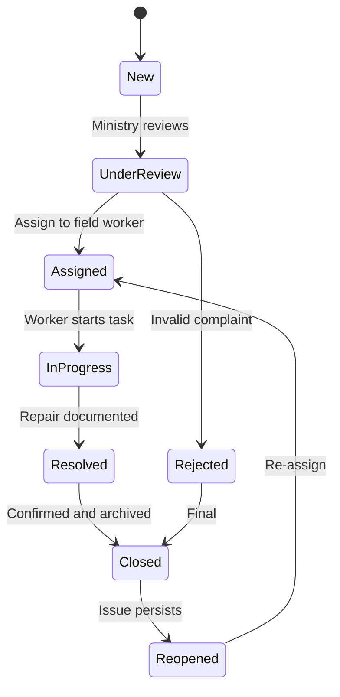
```mermaid
stateDiagram-v2
    [*] --> New
    New --> UnderReview : Ministry reviews
    UnderReview --> Assigned : Assign to field worker
    UnderReview --> Rejected : Invalid complaint
    Assigned --> InProgress : Worker starts task
    InProgress --> Resolved : Repair documented
    Resolved --> Closed : Confirmed and archived
    Rejected --> Closed : Final
    Closed --> Reopened : Issue persists
    Reopened --> Assigned : Re-assign
```

**Figure 1.1 – Complaint Lifecycle State Diagram**

يوضح هذا المخطط جميع الحالات الممكنة للشكوى والانتقالات المسموحة بينها. لاحظ أن التحويل بين الجهات (Transfer) ليس حالة بل حدث يُسجّل في سجل الأحداث.

## 1.5 Development Project Lifecycle — دورة حياة المشروع التنموي

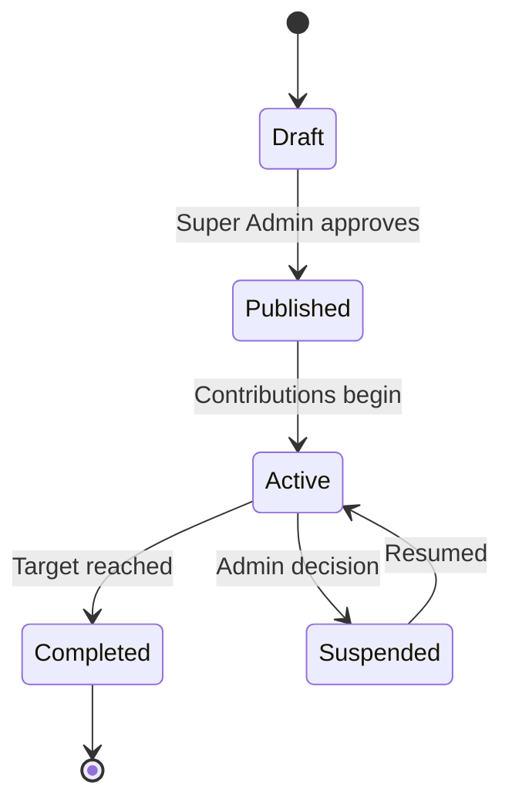
```mermaid
stateDiagram-v2
    [*] --> Draft
    Draft --> Published : Super Admin approves
    Published --> Active : Contributions begin
    Active --> Completed : Target reached
    Active --> Suspended : Admin decision
    Suspended --> Active : Resumed
    Completed --> [*]
```

**Figure 1.2 – Development Project Lifecycle State Diagram**

يمثل هذا المخطط دورة حياة المشروع التنموي من مرحلة الإنشاء وحتى اكتمال المحاكاة أو الإيقاف.

## 1.6 Key Business Processes — العمليات الأساسية

| # | العملية | الوصف |
|---|---|---|
| BP-01 | Complaint Submission | تقديم شكوى مع تصنيف وصورة وموقع |
| BP-02 | Complaint Validation | التحقق من صحة البيانات والصور والموقع |
| BP-03 | Duplicate Detection | فحص البلاغات المكررة |
| BP-04 | Smart Routing | توجيه تلقائي للجهة المختصة |
| BP-05 | Complaint Transfer | تحويل الشكوى بين الجهات |
| BP-06 | Task Assignment | إسناد المهمة لموظف ميداني |
| BP-07 | Field Execution | تنفيذ المهمة وتوثيق الإصلاح |
| BP-08 | Complaint Closure | إغلاق الشكوى |
| BP-09 | Project Creation | إنشاء مشروع تنموي |
| BP-10 | Progress Tracking | تحديث مراحل المشروع |
| BP-11 | Contribution Recording | تسجيل مساهمة محاكاة |

## 1.7 Validation vs. Duplicate Detection — التحقق مقابل كشف التكرار

هاتان وظيفتان مختلفتان تماماً:

| | Validation (FR-05) | Duplicate Detection (FR-06) |
|---|---|---|
| **السؤال** | هل هذه الشكوى صالحة؟ | هل هذه الشكوى مكررة؟ |
| **المدخلات** | بيانات الشكوى، الصورة، الموقع | الشكوى الجديدة + الشكاوى الموجودة |
| **المخرج** | صالحة / غير صالحة | فريدة / مكررة (مع ربط بالأصلية) |
| **التوقيت** | فوري عند الإرسال | بعد التحقق من الصلاحية |

---
---

# 2. Requirements & Actors — المتطلبات والمستخدمون

## 2.1 System Actors — مستخدمو النظام

| Actor | Arabic | Access Channel | Responsibilities |
|---|---|---|---|
| **Citizen** | المواطن | Mobile App | تقديم شكاوى، تتبع الحالة، تصفح المشاريع، تسجيل مساهمة |
| **Field Worker** | الموظف الميداني | Mobile App | استلام مهام، تنفيذ ميداني، توثيق الإصلاح |
| **Ministry Admin** | مشرف الوزارة | Web Dashboard | مراجعة شكاوى، إسناد مهام، تحويل بين جهات |
| **Super Admin** | المدير العام | Web Dashboard | إدارة وزارات، تصنيفات، مشاريع، إحصائيات |

## 2.2 Functional Requirements — المتطلبات الوظيفية

| ID | Requirement | Actor(s) | Source |
|---|---|---|---|
| FR-01 | Register a citizen account | Citizen | RBAC |
| FR-02 | Authenticate and manage user sessions | All | RBAC |
| FR-03 | Create a complaint with cascading category selection | Citizen | Dynamic Complaint Module |
| FR-04 | Capture complaint evidence and associate it with the current geolocation | Citizen | Visual and Spatial Verification |
| FR-05 | Validate complaint data, evidence, and location | System | Mitigation of false reports |
| FR-06 | Detect duplicate or similar complaints | System | Reduce redundant processing |
| FR-07 | Automatically route a complaint to the responsible department | System | Routing Module |
| FR-08 | Transfer a complaint between departments or ministries | Ministry Admin | Inter-ministerial forwarding |
| FR-09 | Track complaint status transparently | Citizen | Transparency |
| FR-10 | Assign a field task to a field worker | Ministry Admin | Field Operations |
| FR-11 | Execute field task and submit post-repair evidence | Field Worker | Field Operations |
| FR-12 | Verify field worker location matches complaint location | System | Data Integrity NFR |
| FR-13 | Close a complaint | System, Ministry Admin | Lifecycle completion |
| FR-14 | Send notifications on key complaint and project events | System | Notification Module |
| FR-15 | Display complaints on an interactive map with color-coded status | All | GIS Module |
| FR-16 | Create and manage development projects | Super Admin | Projects Module |
| FR-17 | Track project phases and completion percentage | All | Progress tracking |
| FR-18 | Record a simulated community contribution to a project | Citizen | Crowdfunding simulation |
| FR-19 | Manage ministries and departments | Super Admin | Administration |
| FR-20 | Manage users, roles, and permissions | Super Admin | RBAC |
| FR-21 | Manage complaint categories | Super Admin | Administration |
| FR-22 | View statistics and reports | Super Admin, Ministry Admin | Reporting |

## 2.3 Non-Functional Requirements — المتطلبات غير الوظيفية

| ID | Requirement | Description |
|---|---|---|
| NFR-01 | Zero-Drop Guarantee | ضمان عدم ضياع أي شكوى — مسار التحويل بدلاً من الرفض |
| NFR-02 | Data Integrity | منع التلاعب الجغرافي بقفل إحداثيات الموقع وقت التصوير |
| NFR-03 | Scalability | إضافة وزارات وأقسام جديدة بدون تعديل الكود الأساسي |
| NFR-04 | Responsiveness | لوحات تحكم سريعة الاستجابة ومناسبة لجميع الشاشات |
| NFR-05 | Security | نظام RBAC هرمي مع عزل بيانات كل وزارة |

---
---

# 3. System Context Diagram — مخطط سياق النظام

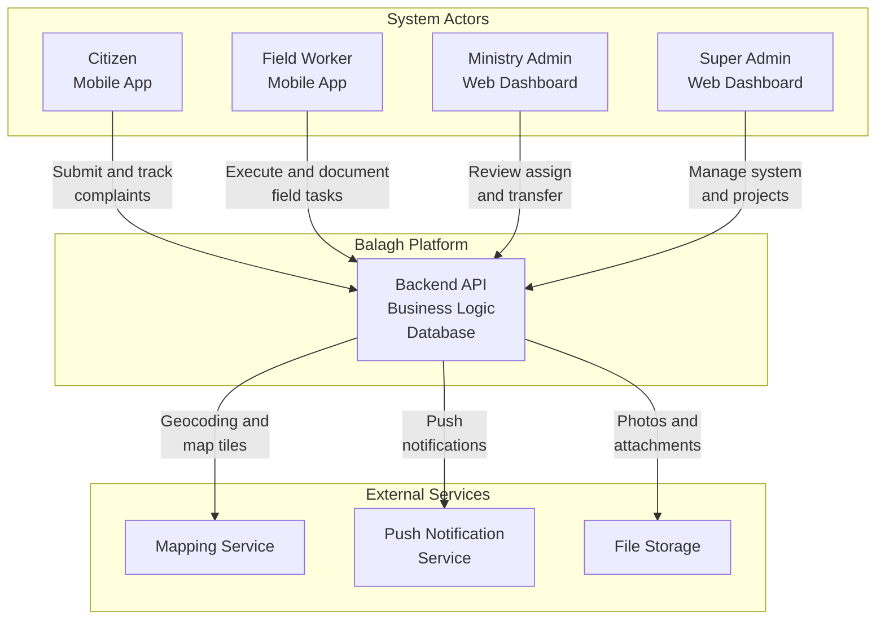
```mermaid
flowchart TB
    subgraph actors ["System Actors"]
        C["Citizen\nMobile App"]
        FW["Field Worker\nMobile App"]
        MA["Ministry Admin\nWeb Dashboard"]
        SA["Super Admin\nWeb Dashboard"]
    end

    subgraph platform ["Balagh Platform"]
        CORE["Backend API\nBusiness Logic\nDatabase"]
    end

    subgraph external ["External Services"]
        MAP["Mapping Service"]
        PUSH["Push Notification\nService"]
        STORE["File Storage"]
    end

    C -->|"Submit and track\ncomplaints"| CORE
    FW -->|"Execute and document\nfield tasks"| CORE
    MA -->|"Review assign\nand transfer"| CORE
    SA -->|"Manage system\nand projects"| CORE

    CORE -->|"Geocoding and\nmap tiles"| MAP
    CORE -->|"Push\nnotifications"| PUSH
    CORE -->|"Photos and\nattachments"| STORE
```

**Figure 3.1 – System Context Diagram**

يعرض هذا المخطط الصورة المعمارية العليا للنظام. المستخدمون الأربعة يتفاعلون مع المنصة عبر قنوات وصول محددة (تطبيق موبايل أو لوحة تحكم ويب)، والمنصة تتكامل مع ثلاث خدمات خارجية. أسماء الخدمات عامة (Mapping Service وليس Google Maps) لعدم ربط التحليل بمورّد تقني محدد.

---
---

# 4. Business Function Diagram — مخطط الوظائف الرئيسية

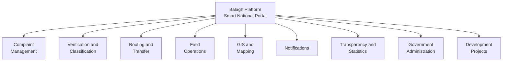
```mermaid
flowchart TD
    ROOT["Balagh Platform\nSmart National Portal"]

    ROOT --> BF1["Complaint\nManagement"]
    ROOT --> BF2["Verification and\nClassification"]
    ROOT --> BF3["Routing and\nTransfer"]
    ROOT --> BF4["Field\nOperations"]
    ROOT --> BF5["GIS and\nMapping"]
    ROOT --> BF6["Notifications"]
    ROOT --> BF7["Transparency and\nStatistics"]
    ROOT --> BF8["Government\nAdministration"]
    ROOT --> BF9["Development\nProjects"]
```

**Figure 4.1 – Business Function Diagram (BFD)**

يعرض هذا المخطط الوظائف الرئيسية التسع للنظام على مستوى الأعمال. التفصيل يأتي في مخططات حالات الاستخدام.

---
---

# 5. Use Case Model — نموذج حالات الاستخدام

## 5.1 Main Use Case Diagram

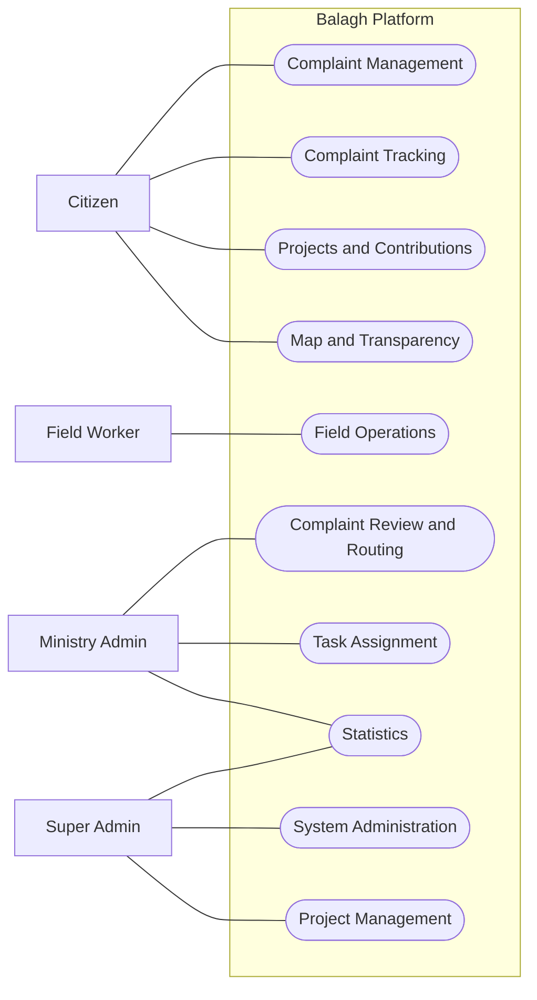
```mermaid
flowchart LR
    C["Citizen"]
    FW["Field Worker"]
    MA["Ministry Admin"]
    SA["Super Admin"]

    subgraph system ["Balagh Platform"]
        direction TB
        PKG1(["Complaint Management"])
        PKG2(["Complaint Tracking"])
        PKG3(["Projects and Contributions"])
        PKG4(["Map and Transparency"])
        PKG5(["Field Operations"])
        PKG6(["Complaint Review and Routing"])
        PKG7(["Task Assignment"])
        PKG8(["Statistics"])
        PKG9(["System Administration"])
        PKG10(["Project Management"])
    end

    C --- PKG1
    C --- PKG2
    C --- PKG3
    C --- PKG4
    FW --- PKG5
    MA --- PKG6
    MA --- PKG7
    MA --- PKG8
    SA --- PKG9
    SA --- PKG10
    SA --- PKG8
```

**Figure 5.1 – Main Use Case Diagram (Functional Packages)**

يعرض العلاقة بين المستخدمين الأربعة والمجموعات الوظيفية الرئيسية. التفاصيل في المخططات الفرعية التالية.

---

## 5.2 UC Group 1: Account and Authentication

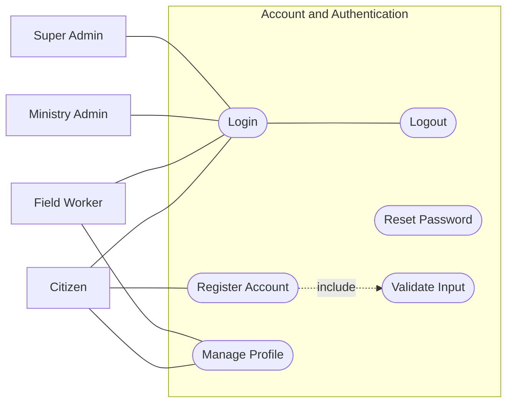
```mermaid
flowchart LR
    C["Citizen"]
    FW["Field Worker"]
    MA["Ministry Admin"]
    SA["Super Admin"]

    subgraph system ["Account and Authentication"]
        UC1(["Register Account"])
        UC2(["Login"])
        UC3(["Logout"])
        UC4(["Manage Profile"])
        UC5(["Reset Password"])
        UCV(["Validate Input"])
    end

    C --- UC1
    C --- UC2
    C --- UC4
    FW --- UC2
    FW --- UC4
    MA --- UC2
    SA --- UC2

    UC2 --- UC3
    UC1 -.->|"include"| UCV
```

**Figure 5.2 – Use Case Diagram: Account and Authentication**

---

## 5.3 UC Group 2: Complaint Submission

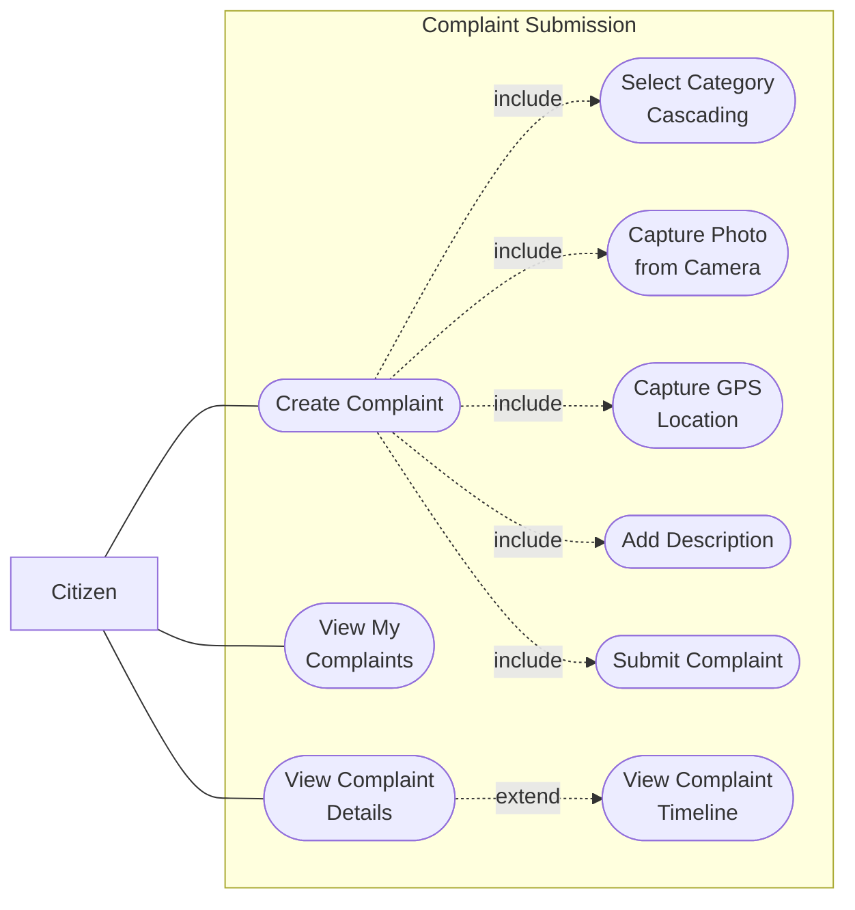
```mermaid
flowchart LR
    C["Citizen"]

    subgraph system ["Complaint Submission"]
        UC1(["Create Complaint"])
        UC2(["Select Category\nCascading"])
        UC3(["Capture Photo\nfrom Camera"])
        UC4(["Capture GPS\nLocation"])
        UC5(["Add Description"])
        UC6(["Submit Complaint"])
        UC7(["View My\nComplaints"])
        UC8(["View Complaint\nDetails"])
        UC9(["View Complaint\nTimeline"])
    end

    C --- UC1
    C --- UC7
    C --- UC8

    UC1 -.->|"include"| UC2
    UC1 -.->|"include"| UC3
    UC1 -.->|"include"| UC4
    UC1 -.->|"include"| UC5
    UC1 -.->|"include"| UC6
    UC8 -.->|"extend"| UC9
```

**Figure 5.3 – Use Case Diagram: Complaint Submission**

تمثل العلاقات include الخطوات الإلزامية ضمن عملية إنشاء الشكوى. عرض الجدول الزمني يمتد اختيارياً من عرض تفاصيل الشكوى.

---

## 5.4 UC Group 3: Smart Verification

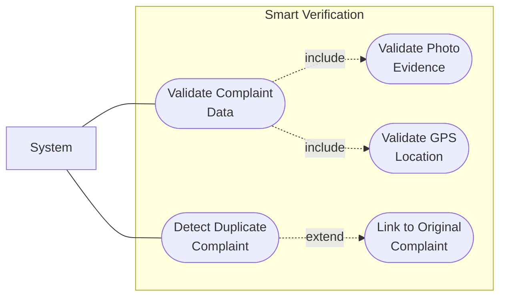
```mermaid
flowchart LR
    SYS["System"]

    subgraph system ["Smart Verification"]
        UC1(["Validate Complaint\nData"])
        UC2(["Validate Photo\nEvidence"])
        UC3(["Validate GPS\nLocation"])
        UC4(["Detect Duplicate\nComplaint"])
        UC5(["Link to Original\nComplaint"])
    end

    SYS --- UC1
    SYS --- UC4

    UC1 -.->|"include"| UC2
    UC1 -.->|"include"| UC3
    UC4 -.->|"extend"| UC5
```

**Figure 5.4 – Use Case Diagram: Smart Verification**

Validation يتحقق من صحة البيانات والصور والموقع. Duplicate Detection يفحص التكرار ويربط بالشكوى الأصلية عند وجودها.

---

## 5.5 UC Group 4: Routing and Transfer

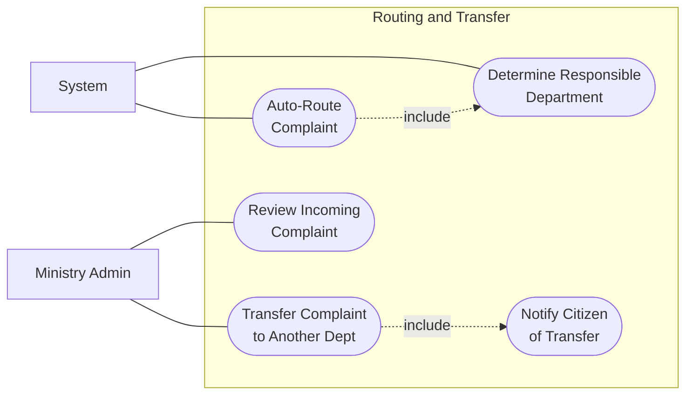
```mermaid
flowchart LR
    SYS["System"]
    MA["Ministry Admin"]

    subgraph system ["Routing and Transfer"]
        UC1(["Determine Responsible\nDepartment"])
        UC2(["Auto-Route\nComplaint"])
        UC3(["Review Incoming\nComplaint"])
        UC4(["Transfer Complaint\nto Another Dept"])
        UC5(["Notify Citizen\nof Transfer"])
    end

    SYS --- UC1
    SYS --- UC2
    MA --- UC3
    MA --- UC4

    UC2 -.->|"include"| UC1
    UC4 -.->|"include"| UC5
```

**Figure 5.5 – Use Case Diagram: Routing and Transfer**

---

## 5.6 UC Group 5: Field Operations

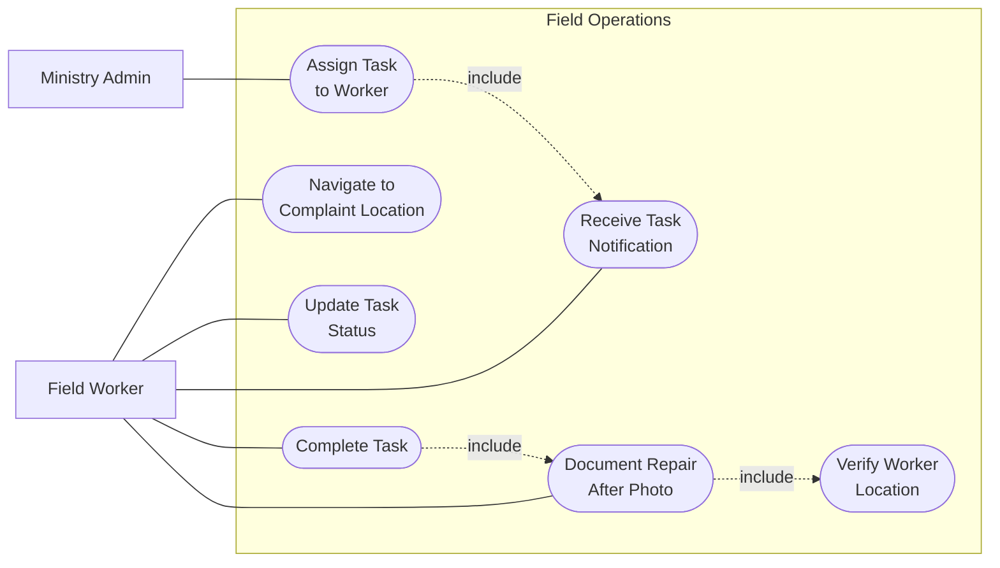
```mermaid
flowchart LR
    FW["Field Worker"]
    MA["Ministry Admin"]

    subgraph system ["Field Operations"]
        UC1(["Assign Task\nto Worker"])
        UC2(["Receive Task\nNotification"])
        UC3(["Navigate to\nComplaint Location"])
        UC4(["Verify Worker\nLocation"])
        UC5(["Document Repair\nAfter Photo"])
        UC6(["Update Task\nStatus"])
        UC7(["Complete Task"])
    end

    MA --- UC1
    FW --- UC2
    FW --- UC3
    FW --- UC5
    FW --- UC6
    FW --- UC7

    UC1 -.->|"include"| UC2
    UC5 -.->|"include"| UC4
    UC7 -.->|"include"| UC5
```

**Figure 5.6 – Use Case Diagram: Field Operations**

التحقق من موقع الموظف include إلزامي عند توثيق الإصلاح لضمان نزاهة البيانات (NFR-02).

---

## 5.7 UC Group 6: Notifications

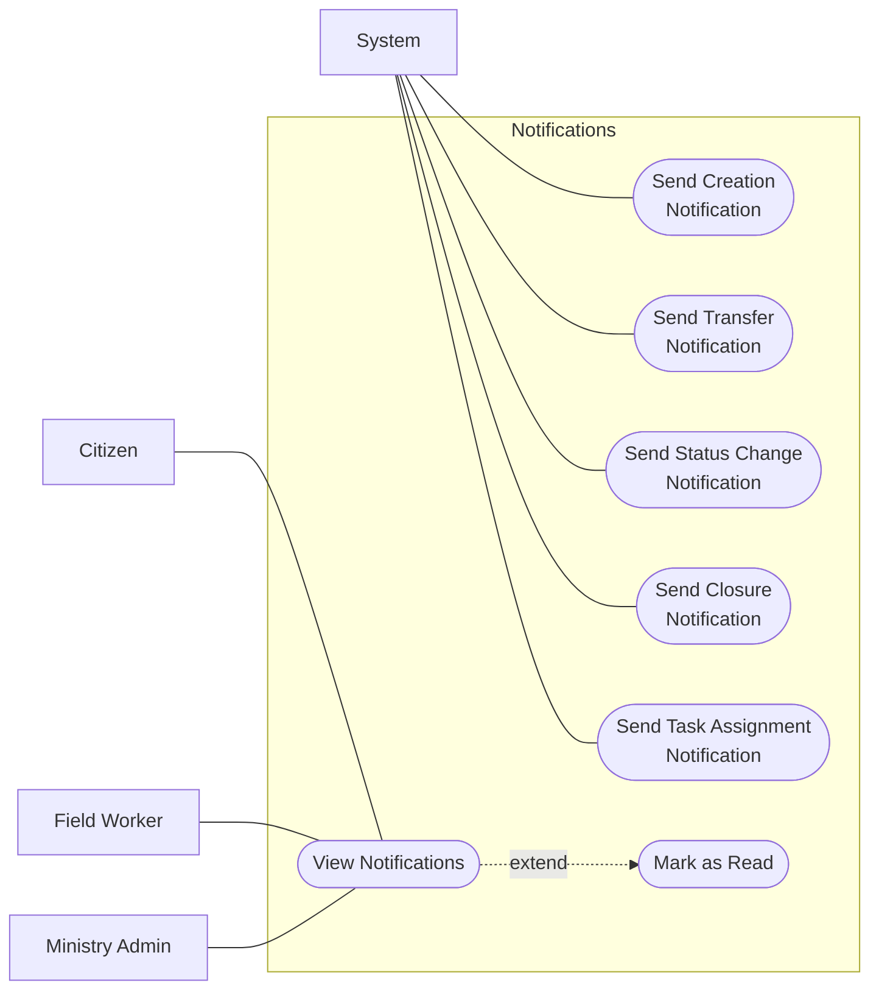
```mermaid
flowchart LR
    SYS["System"]
    C["Citizen"]
    FW["Field Worker"]
    MA["Ministry Admin"]

    subgraph system ["Notifications"]
        UC1(["Send Creation\nNotification"])
        UC2(["Send Transfer\nNotification"])
        UC3(["Send Status Change\nNotification"])
        UC4(["Send Closure\nNotification"])
        UC5(["Send Task Assignment\nNotification"])
        UC6(["View Notifications"])
        UC7(["Mark as Read"])
    end

    SYS --- UC1
    SYS --- UC2
    SYS --- UC3
    SYS --- UC4
    SYS --- UC5
    C --- UC6
    FW --- UC6
    MA --- UC6
    UC6 -.->|"extend"| UC7
```

**Figure 5.7 – Use Case Diagram: Notifications**

---

## 5.8 UC Group 7: Map and Transparency

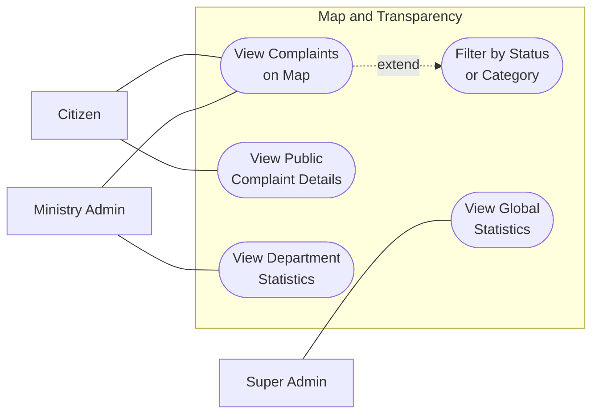
```mermaid
flowchart LR
    C["Citizen"]
    MA["Ministry Admin"]
    SA["Super Admin"]

    subgraph system ["Map and Transparency"]
        UC1(["View Complaints\non Map"])
        UC2(["Filter by Status\nor Category"])
        UC3(["View Public\nComplaint Details"])
        UC4(["View Department\nStatistics"])
        UC5(["View Global\nStatistics"])
    end

    C --- UC1
    C --- UC3
    MA --- UC1
    MA --- UC4
    SA --- UC5

    UC1 -.->|"extend"| UC2
```

**Figure 5.8 – Use Case Diagram: Map and Transparency**

عرض التفاصيل العامة للشكوى يُخفي بيانات المواطن الحساسة.

---

## 5.9 UC Group 8: Development Projects

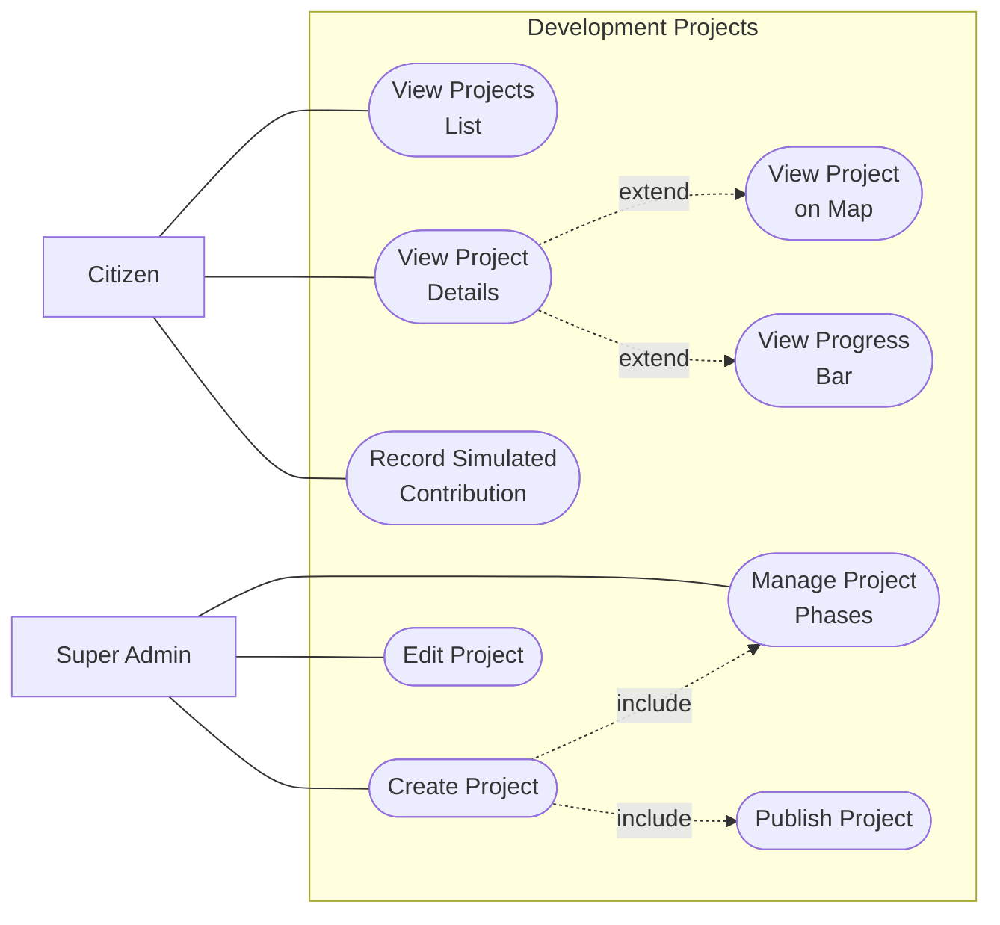
```mermaid
flowchart LR
    C["Citizen"]
    SA["Super Admin"]

    subgraph system ["Development Projects"]
        UC1(["View Projects\nList"])
        UC2(["View Project\nDetails"])
        UC3(["View Project\non Map"])
        UC4(["View Progress\nBar"])
        UC5(["Record Simulated\nContribution"])
        UC6(["Create Project"])
        UC7(["Edit Project"])
        UC8(["Manage Project\nPhases"])
        UC9(["Publish Project"])
    end

    C --- UC1
    C --- UC2
    C --- UC5
    SA --- UC6
    SA --- UC7
    SA --- UC8

    UC2 -.->|"extend"| UC3
    UC2 -.->|"extend"| UC4
    UC6 -.->|"include"| UC8
    UC6 -.->|"include"| UC9
```

**Figure 5.9 – Use Case Diagram: Development Projects**

المساهمات هي محاكاة أكاديمية ولا تتضمن مدفوعات مالية حقيقية.

---

## 5.10 UC Group 9: Central Administration

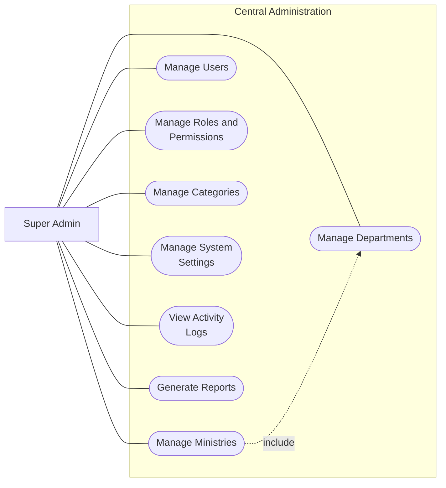
```mermaid
flowchart LR
    SA["Super Admin"]

    subgraph system ["Central Administration"]
        UC1(["Manage Ministries"])
        UC2(["Manage Departments"])
        UC3(["Manage Users"])
        UC4(["Manage Roles and\nPermissions"])
        UC5(["Manage Categories"])
        UC6(["Manage System\nSettings"])
        UC7(["View Activity\nLogs"])
        UC8(["Generate Reports"])
    end

    SA --- UC1
    SA --- UC2
    SA --- UC3
    SA --- UC4
    SA --- UC5
    SA --- UC6
    SA --- UC7
    SA --- UC8

    UC1 -.->|"include"| UC2
```

**Figure 5.10 – Use Case Diagram: Central Administration**

إدارة الأقسام include مرتبطة بإدارة الوزارات لأن كل قسم تابع لوزارة.

---
---

# 6. ERD and Database Design — تصميم قاعدة البيانات

## 6.1 Entity Relationship Diagram

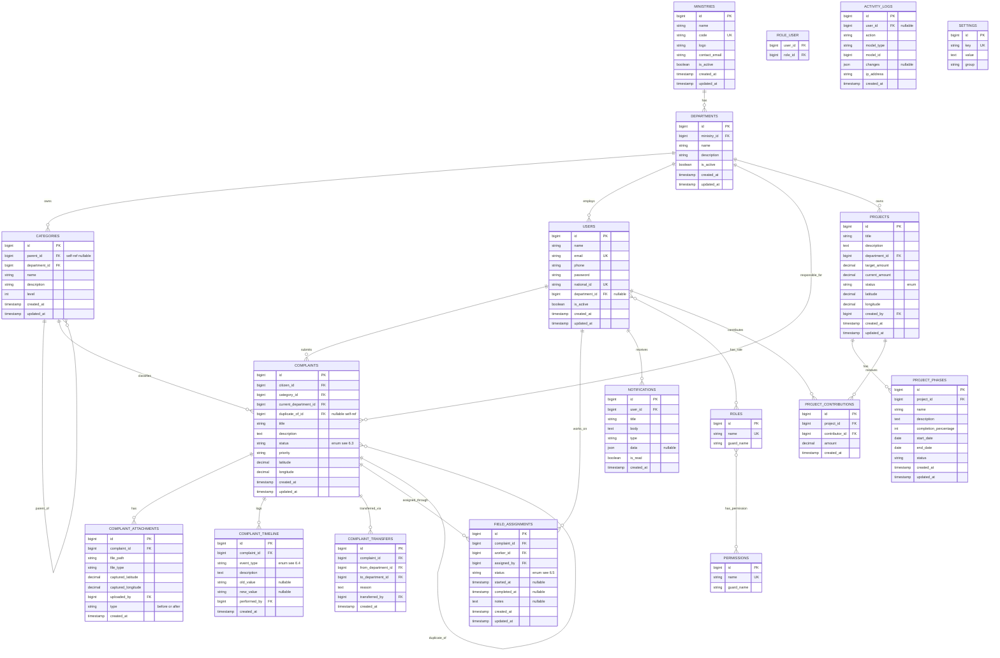
```mermaid
erDiagram
    MINISTRIES {
        bigint id PK
        string name
        string code UK
        string logo
        string contact_email
        boolean is_active
        timestamp created_at
        timestamp updated_at
    }

    DEPARTMENTS {
        bigint id PK
        bigint ministry_id FK
        string name
        string description
        boolean is_active
        timestamp created_at
        timestamp updated_at
    }

    CATEGORIES {
        bigint id PK
        bigint parent_id FK "self-ref nullable"
        bigint department_id FK
        string name
        string description
        int level
        timestamp created_at
        timestamp updated_at
    }

    USERS {
        bigint id PK
        string name
        string email UK
        string phone
        string password
        string national_id UK
        bigint department_id FK "nullable"
        boolean is_active
        timestamp created_at
        timestamp updated_at
    }

    ROLES {
        bigint id PK
        string name UK
        string guard_name
    }

    PERMISSIONS {
        bigint id PK
        string name UK
        string guard_name
    }

    ROLE_USER {
        bigint user_id FK
        bigint role_id FK
    }

    COMPLAINTS {
        bigint id PK
        bigint citizen_id FK
        bigint category_id FK
        bigint current_department_id FK
        bigint duplicate_of_id FK "nullable self-ref"
        string title
        text description
        string status "enum see 6.3"
        string priority
        decimal latitude
        decimal longitude
        timestamp created_at
        timestamp updated_at
    }

    COMPLAINT_ATTACHMENTS {
        bigint id PK
        bigint complaint_id FK
        string file_path
        string file_type
        decimal captured_latitude
        decimal captured_longitude
        bigint uploaded_by FK
        string type "before or after"
        timestamp created_at
    }

    COMPLAINT_TIMELINE {
        bigint id PK
        bigint complaint_id FK
        string event_type "enum see 6.4"
        text description
        string old_value "nullable"
        string new_value "nullable"
        bigint performed_by FK
        timestamp created_at
    }

    COMPLAINT_TRANSFERS {
        bigint id PK
        bigint complaint_id FK
        bigint from_department_id FK
        bigint to_department_id FK
        text reason
        bigint transferred_by FK
        timestamp created_at
    }

    FIELD_ASSIGNMENTS {
        bigint id PK
        bigint complaint_id FK
        bigint worker_id FK
        bigint assigned_by FK
        string status "enum see 6.5"
        timestamp started_at "nullable"
        timestamp completed_at "nullable"
        text notes "nullable"
        timestamp created_at
        timestamp updated_at
    }

    NOTIFICATIONS {
        bigint id PK
        bigint user_id FK
        string title
        text body
        string type
        json data "nullable"
        boolean is_read
        timestamp created_at
    }

    PROJECTS {
        bigint id PK
        string title
        text description
        bigint department_id FK
        decimal target_amount
        decimal current_amount
        string status "enum"
        decimal latitude
        decimal longitude
        bigint created_by FK
        timestamp created_at
        timestamp updated_at
    }

    PROJECT_PHASES {
        bigint id PK
        bigint project_id FK
        string name
        text description
        int completion_percentage
        date start_date
        date end_date
        string status
        timestamp created_at
        timestamp updated_at
    }

    PROJECT_CONTRIBUTIONS {
        bigint id PK
        bigint project_id FK
        bigint contributor_id FK
        decimal amount
        timestamp created_at
    }

    ACTIVITY_LOGS {
        bigint id PK
        bigint user_id FK "nullable"
        string action
        string model_type
        bigint model_id
        json changes "nullable"
        string ip_address
        timestamp created_at
    }

    SETTINGS {
        bigint id PK
        string key UK
        text value
        string group
    }

    MINISTRIES ||--o{ DEPARTMENTS : "has"
    DEPARTMENTS ||--o{ CATEGORIES : "owns"
    CATEGORIES ||--o{ CATEGORIES : "parent_of"
    DEPARTMENTS ||--o{ USERS : "employs"
    DEPARTMENTS ||--o{ COMPLAINTS : "responsible_for"
    USERS ||--o{ COMPLAINTS : "submits"
    CATEGORIES ||--o{ COMPLAINTS : "classifies"
    COMPLAINTS ||--o{ COMPLAINT_ATTACHMENTS : "has"
    COMPLAINTS ||--o{ COMPLAINT_TIMELINE : "logs"
    COMPLAINTS ||--o{ COMPLAINT_TRANSFERS : "transferred_via"
    COMPLAINTS ||--o{ FIELD_ASSIGNMENTS : "assigned_through"
    COMPLAINTS ||--o{ COMPLAINTS : "duplicate_of"
    USERS ||--o{ FIELD_ASSIGNMENTS : "works_on"
    USERS ||--o{ NOTIFICATIONS : "receives"
    USERS }o--o{ ROLES : "has_role"
    ROLES }o--o{ PERMISSIONS : "has_permission"
    DEPARTMENTS ||--o{ PROJECTS : "owns"
    PROJECTS ||--o{ PROJECT_PHASES : "has"
    PROJECTS ||--o{ PROJECT_CONTRIBUTIONS : "receives"
    USERS ||--o{ PROJECT_CONTRIBUTIONS : "contributes"
```

**Figure 6.1 – Entity Relationship Diagram (ERD)**

يعرض هذا المخطط جميع جداول النظام (17 جدول) مع العلاقات والحقول الأساسية و Primary Keys و Foreign Keys و Cardinality.

---

## 6.2 Database Tables Summary

### Organizational Hierarchy — الهيكل التنظيمي (منفصل عن تصنيف الشكاوى)

| Table | Purpose | Key Relationships |
|---|---|---|
| `ministries` | الوزارات الحكومية | 1:M departments |
| `departments` | الأقسام داخل الوزارة | M:1 ministries, 1:M categories users complaints projects |

### Complaint Taxonomy — تصنيف الشكاوى (منفصل عن الهيكل التنظيمي)

| Table | Purpose | Key Relationships |
|---|---|---|
| `categories` | التصنيفات المتسلسلة الشجرية | Self-ref parent_id, M:1 departments |

### Identity and Access — المستخدمون والصلاحيات

| Table | Purpose | Key Relationships |
|---|---|---|
| `users` | جميع المستخدمين | M:1 departments nullable, M:M roles |
| `roles` | الأدوار | M:M users permissions |
| `permissions` | الصلاحيات الفردية | M:M roles |
| `role_user` | جدول وسيط أدوار المستخدمين | FK users roles |

### Complaints Core — نظام الشكاوى

| Table | Purpose | Key Relationships |
|---|---|---|
| `complaints` | الكيان المركزي للشكاوى | FK users categories departments self |
| `complaint_attachments` | الصور والمرفقات مع GPS metadata | M:1 complaints |
| `complaint_timeline` | سجل أحداث الشكوى Event Log | M:1 complaints |
| `complaint_transfers` | تاريخ التحويلات بين الجهات | M:1 complaints departments |

### Field Operations — العمليات الميدانية

| Table | Purpose | Key Relationships |
|---|---|---|
| `field_assignments` | إسناد المهام 1:M تاريخياً | M:1 complaints users |

### Notifications — الإشعارات

| Table | Purpose | Key Relationships |
|---|---|---|
| `notifications` | إشعارات Push لجميع المستخدمين | M:1 users |

### Development Projects — المشاريع التنموية (منفصلة عن الشكاوى)

| Table | Purpose | Key Relationships |
|---|---|---|
| `projects` | المشاريع التنموية | M:1 departments FK users |
| `project_phases` | مراحل التنفيذ ونسب الإنجاز | M:1 projects |
| `project_contributions` | المساهمات المحاكاة | M:1 projects users |

### System — النظام

| Table | Purpose | Key Relationships |
|---|---|---|
| `activity_logs` | سجل تدقيق عام Audit Trail | FK users |
| `settings` | إعدادات النظام | Standalone |

## 6.3 Complaint Status Values

| Status | Arabic | Description |
|---|---|---|
| `new` | جديدة | شكوى جديدة لم تُراجع بعد |
| `under_review` | قيد المراجعة | المشرف يراجعها |
| `assigned` | تم الإسناد | أُسندت لموظف ميداني |
| `in_progress` | قيد التنفيذ | الموظف يعمل عليها |
| `resolved` | تم الحل | الإصلاح موثّق بانتظار التأكيد |
| `closed` | مغلقة | مغلقة نهائياً |
| `rejected` | مرفوضة | بيانات غير صالحة |
| `reopened` | أُعيد فتحها | إعادة فتح بسبب استمرار المشكلة |

التحويل Transfer ليس حالة بل حدث يُسجّل في complaint_transfers و complaint_timeline.

## 6.4 Timeline Event Types

| Event Type | Description |
|---|---|
| `created` | الشكوى أُنشئت |
| `verified` | تم التحقق من الشكوى |
| `assigned` | أُسندت لموظف ميداني |
| `transferred` | حُوّلت إلى جهة أخرى |
| `status_changed` | تغيّرت الحالة |
| `evidence_uploaded` | رُفع دليل بصري |
| `resolved` | تم الحل |
| `closed` | أُغلقت |
| `reopened` | أُعيد فتحها |
| `rejected` | رُفضت |

## 6.5 Field Assignment Status Values

| Status | Description |
|---|---|
| `pending` | في الانتظار — لم يقبل الموظف بعد |
| `accepted` | مقبولة — الموظف في الطريق |
| `in_progress` | قيد التنفيذ |
| `completed` | مكتملة — تم التوثيق |
| `failed` | فشلت — تحتاج إعادة إسناد |

العلاقة بين Complaint و FieldAssignment هي 1:M تاريخياً (يمكن إعادة الإسناد) مع قاعدة أعمال: مهمة نشطة واحدة فقط في الوقت نفسه.

التحقق من موقع الموظف يتم عبر GeoLocationService في وقت التشغيل ولا يُخزّن كحقول مشتقة في قاعدة البيانات.

---
---

# 7. Class Diagram — مخطط الكلاسات

## 7.1 Complete Class Diagram

```mermaid
classDiagram
    direction TB

    class User {
        -int id
        -String name
        -String email
        -String phone
        -String password
        -String nationalId
        -int departmentId
        -boolean isActive
        +authenticate(credentials) bool
        +updateProfile(data) void
        +hasRole(roleName) bool
        +getNotifications() List
    }

    class Role {
        -int id
        -String name
        -String guardName
        +getPermissions() List
    }

    class Permission {
        -int id
        -String name
        -String guardName
    }

    class Ministry {
        -int id
        -String name
        -String code
        -String logo
        -String contactEmail
        -boolean isActive
        +getDepartments() List
        +getStatistics() Object
    }

    class Department {
        -int id
        -int ministryId
        -String name
        -String description
        -boolean isActive
        +getComplaints() List
        +getWorkers() List
        +getCategories() List
    }

    class Category {
        -int id
        -int parentId
        -int departmentId
        -String name
        -int level
        +getSubCategories() List
        +getParent() Category
    }

    class Complaint {
        -int id
        -int citizenId
        -int categoryId
        -int currentDepartmentId
        -int duplicateOfId
        -String title
        -String description
        -String status
        -String priority
        -float latitude
        -float longitude
        +submit() void
        +updateStatus(status) void
        +markAsDuplicate(originalId) void
        +close() void
        +reopen() void
        +getTimeline() List
        +getAttachments() List
    }

    class Attachment {
        -int id
        -int complaintId
        -String filePath
        -String fileType
        -float capturedLatitude
        -float capturedLongitude
        -int uploadedBy
        -String type
        +upload(file) void
        +validateType() bool
    }

    class Transfer {
        -int id
        -int complaintId
        -int fromDepartmentId
        -int toDepartmentId
        -String reason
        -int transferredBy
        +execute() void
        +getHistory() List
    }

    class FieldAssignment {
        -int id
        -int complaintId
        -int workerId
        -int assignedBy
        -String status
        -DateTime startedAt
        -DateTime completedAt
        -String notes
        +assign() void
        +accept() void
        +start() void
        +complete() void
        +fail(reason) void
    }

    class Notification {
        -int id
        -int userId
        -String title
        -String body
        -String type
        -Object data
        -boolean isRead
        +markRead() void
        +markAllRead() void
    }

    class Project {
        -int id
        -String title
        -String description
        -int departmentId
        -float targetAmount
        -float currentAmount
        -String status
        -float latitude
        -float longitude
        +publish() void
        +updateProgress() void
        +getPhases() List
        +getTotalContributions() float
    }

    class ProjectPhase {
        -int id
        -int projectId
        -String name
        -int completionPercentage
        -Date startDate
        -Date endDate
        +updateCompletion(pct) void
    }

    class Contribution {
        -int id
        -int projectId
        -int contributorId
        -float amount
        +record() void
    }

    class AuthService {
        <<service>>
        +register(data) User
        +login(credentials) Token
        +logout(token) void
        +validateToken(token) bool
    }

    class ComplaintService {
        <<service>>
        +createComplaint(data) Complaint
        +updateStatus(id status) void
        +closeComplaint(id) void
        +reopenComplaint(id) void
    }

    class ValidationService {
        <<service>>
        +validateData(complaint) Result
        +validateEvidence(attachment) Result
        +validateLocation(lat lng) Result
    }

    class DuplicateDetectionService {
        <<service>>
        +checkDuplicate(complaint) Result
        +findSimilar(location category timeWindow) List
        +linkDuplicate(complaintId originalId) void
    }

    class RoutingService {
        <<service>>
        +determineResponsibleDept(complaint) Department
        +autoRoute(complaint) void
    }

    class TransferService {
        <<service>>
        +transferComplaint(complaintId toDeptId reason) void
        +validateTransfer(from to) bool
    }

    class GeoLocationService {
        <<service>>
        +verifyWorkerLocation(workerLat workerLng complaintLat complaintLng) bool
        +calculateDistance(lat1 lng1 lat2 lng2) float
        +isWithinRange(distance maxRange) bool
    }

    class NotificationService {
        <<service>>
        +sendPush(userId title body data) void
        +notifyComplaintUpdate(complaint eventType) void
        +notifyTaskAssignment(assignment) void
    }

    class FileUploadService {
        <<service>>
        +upload(file path) String
        +validateFileType(file allowedTypes) bool
        +validateFileSize(file maxSize) bool
    }

    class ReportingService {
        <<service>>
        +getDepartmentStats(deptId) Object
        +getGlobalStats() Object
        +generateReport(filters) Report
    }

    class FieldWorkService {
        <<service>>
        +assignTask(complaintId workerId) FieldAssignment
        +verifyWorkerAtLocation(assignmentId) bool
        +completeTask(assignmentId evidence) void
    }

    class ProjectService {
        <<service>>
        +createProject(data) Project
        +publishProject(id) void
        +updatePhase(phaseId completion) void
        +recordContribution(projectId userId amount) Contribution
    }

    User "M" -- "M" Role : has
    Role "M" -- "M" Permission : grants
    Ministry "1" *-- "M" Department : contains
    Department "1" o-- "M" Category : organizes
    Department "1" o-- "M" User : employs
    Category "1" o-- "M" Category : parent
    User "1" -- "M" Complaint : submits
    Category "1" -- "M" Complaint : classifies
    Department "1" -- "M" Complaint : responsible
    Complaint "1" *-- "M" Attachment : has
    Complaint "1" *-- "M" Transfer : transferred_via
    Complaint "1" -- "M" FieldAssignment : assigned_through
    User "1" -- "M" Notification : receives
    User "1" -- "M" FieldAssignment : works_on
    Department "1" -- "M" Project : owns
    Project "1" *-- "M" ProjectPhase : has_phases
    Project "1" -- "M" Contribution : receives
    User "1" -- "M" Contribution : contributes
    ComplaintService ..> ValidationService : uses
    ComplaintService ..> DuplicateDetectionService : uses
    ComplaintService ..> RoutingService : uses
    ComplaintService ..> NotificationService : uses
    TransferService ..> NotificationService : uses
    FieldWorkService ..> GeoLocationService : uses
    FieldWorkService ..> NotificationService : uses
    ProjectService ..> NotificationService : uses
    ComplaintService ..> FileUploadService : uses
```

**Figure 7.1 – Class Diagram**

يعرض هذا المخطط جميع كلاسات النظام مقسمة إلى نوعين:
- **Model Classes** (12 كلاس): تمثل الكيانات ذات المسؤولية المنطقية المستقلة.
- **Service Classes** (12 كلاس): تمثل منطق الأعمال ولا تقابل جداول في قاعدة البيانات.

العلاقات: Association, Composition, Aggregation, و Dependency بين الخدمات.

---
---

# 8. Activity Diagrams — مخططات النشاط

## ACT-01: Create Complaint — إنشاء شكوى

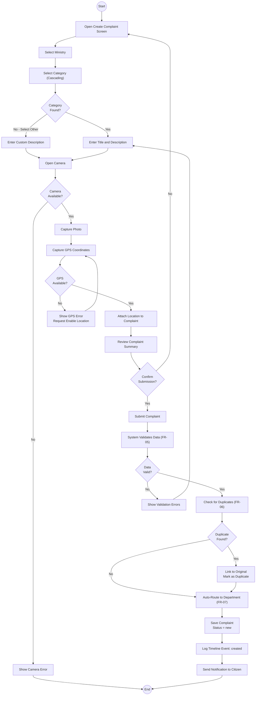
```mermaid
flowchart TD
    S((Start)) --> A1["Open Create Complaint Screen"]
    A1 --> A2["Select Ministry"]
    A2 --> A3["Select Category (Cascading)"]
    A3 --> D1{"Category\nFound?"}
    D1 -->|"Yes"| A4["Enter Title and Description"]
    D1 -->|"No - Select Other"| A4B["Enter Custom Description"]
    A4B --> A5
    A4 --> A5["Open Camera"]
    A5 --> D2{"Camera\nAvailable?"}
    D2 -->|"Yes"| A6["Capture Photo"]
    D2 -->|"No"| ERR1["Show Camera Error"]
    ERR1 --> E((End))
    A6 --> A7["Capture GPS Coordinates"]
    A7 --> D3{"GPS\nAvailable?"}
    D3 -->|"Yes"| A8["Attach Location to Complaint"]
    D3 -->|"No"| ERR2["Show GPS Error\nRequest Enable Location"]
    ERR2 --> A7
    A8 --> A9["Review Complaint Summary"]
    A9 --> D4{"Confirm\nSubmission?"}
    D4 -->|"Yes"| A10["Submit Complaint"]
    D4 -->|"No"| A1
    A10 --> A11["System Validates Data (FR-05)"]
    A11 --> D5{"Data\nValid?"}
    D5 -->|"Yes"| A12["Check for Duplicates (FR-06)"]
    D5 -->|"No"| ERR3["Show Validation Errors"]
    ERR3 --> A4
    A12 --> D6{"Duplicate\nFound?"}
    D6 -->|"Yes"| A13["Link to Original\nMark as Duplicate"]
    D6 -->|"No"| A14["Auto-Route to Department (FR-07)"]
    A13 --> A14
    A14 --> A15["Save Complaint\nStatus = new"]
    A15 --> A16["Log Timeline Event: created"]
    A16 --> A17["Send Notification to Citizen"]
    A17 --> E
```

**Figure 8.1 – Activity Diagram: Create Complaint (ACT-01)**

يغطي المسار الكامل من فتح الشاشة حتى حفظ الشكوى، مع جميع المسارات البديلة (كاميرا غير متاحة، GPS غير متاح، بيانات غير صالحة، شكوى مكررة).

---

## ACT-02: Validate Complaint — التحقق من الشكوى

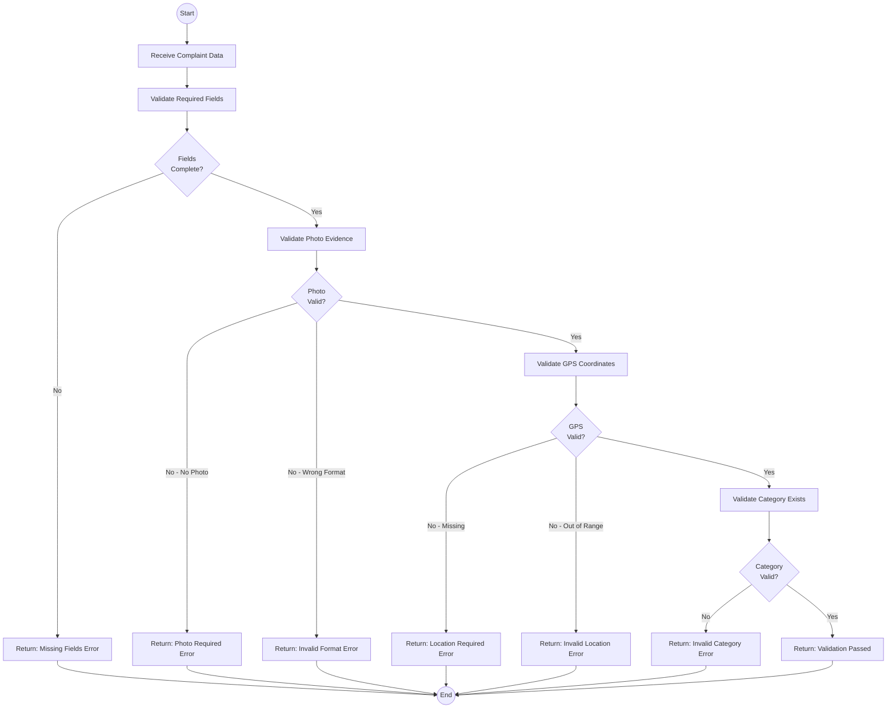
```mermaid
flowchart TD
    S((Start)) --> A1["Receive Complaint Data"]
    A1 --> A2["Validate Required Fields"]
    A2 --> D1{"Fields\nComplete?"}
    D1 -->|"No"| R1["Return: Missing Fields Error"]
    R1 --> E((End))
    D1 -->|"Yes"| A3["Validate Photo Evidence"]
    A3 --> D2{"Photo\nValid?"}
    D2 -->|"No - No Photo"| R2["Return: Photo Required Error"]
    R2 --> E
    D2 -->|"No - Wrong Format"| R3["Return: Invalid Format Error"]
    R3 --> E
    D2 -->|"Yes"| A4["Validate GPS Coordinates"]
    A4 --> D3{"GPS\nValid?"}
    D3 -->|"No - Missing"| R4["Return: Location Required Error"]
    R4 --> E
    D3 -->|"No - Out of Range"| R5["Return: Invalid Location Error"]
    R5 --> E
    D3 -->|"Yes"| A5["Validate Category Exists"]
    A5 --> D4{"Category\nValid?"}
    D4 -->|"No"| R6["Return: Invalid Category Error"]
    R6 --> E
    D4 -->|"Yes"| R7["Return: Validation Passed"]
    R7 --> E
```

**Figure 8.2 – Activity Diagram: Validate Complaint (ACT-02)**

يوضح سلسلة عمليات التحقق المتتابعة. كل فشل يُرجع خطأ محدداً دون متابعة التحقق.

---

## ACT-03: Detect Duplicate Complaint — كشف التكرار

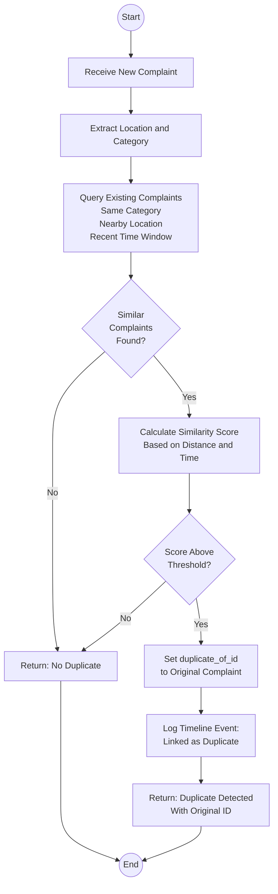
```mermaid
flowchart TD
    S((Start)) --> A1["Receive New Complaint"]
    A1 --> A2["Extract Location and Category"]
    A2 --> A3["Query Existing Complaints\nSame Category\nNearby Location\nRecent Time Window"]
    A3 --> D1{"Similar\nComplaints\nFound?"}
    D1 -->|"No"| R1["Return: No Duplicate"]
    R1 --> E((End))
    D1 -->|"Yes"| A4["Calculate Similarity Score\nBased on Distance and Time"]
    A4 --> D2{"Score Above\nThreshold?"}
    D2 -->|"No"| R1
    D2 -->|"Yes"| A5["Set duplicate_of_id\nto Original Complaint"]
    A5 --> A6["Log Timeline Event:\nLinked as Duplicate"]
    A6 --> R2["Return: Duplicate Detected\nWith Original ID"]
    R2 --> E
```

**Figure 8.3 – Activity Diagram: Detect Duplicate Complaint (ACT-03)**

يعتمد الكشف على قواعد منطقية (الموقع + التصنيف + النافذة الزمنية) وليس على AI/ML.

---

## ACT-04: Auto-Route Complaint — التوجيه التلقائي

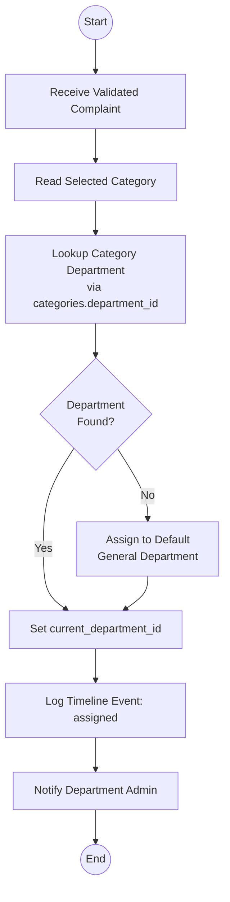
```mermaid
flowchart TD
    S((Start)) --> A1["Receive Validated Complaint"]
    A1 --> A2["Read Selected Category"]
    A2 --> A3["Lookup Category Department\nvia categories.department_id"]
    A3 --> D1{"Department\nFound?"}
    D1 -->|"Yes"| A4["Set current_department_id"]
    D1 -->|"No"| A5["Assign to Default\nGeneral Department"]
    A5 --> A4
    A4 --> A6["Log Timeline Event: assigned"]
    A6 --> A7["Notify Department Admin"]
    A7 --> E((End))
```

**Figure 8.4 – Activity Diagram: Auto-Route Complaint (ACT-04)**

التوجيه يعتمد على ربط التصنيف بالقسم المسؤول عبر categories.department_id.

---

## ACT-05: Review and Transfer Complaint — مراجعة وتحويل الشكوى

```mermaid
flowchart TD
    S((Start)) --> A1["Ministry Admin Opens\nComplaint Details"]
    A1 --> A2["Review Complaint Data\nPhotos and Location"]
    A2 --> D1{"Complaint\nBelongs to\nThis Dept?"}
    D1 -->|"Yes - Valid"| A3["Accept Complaint\nKeep Under Review"]
    D1 -->|"Yes - Invalid Data"| A4["Reject Complaint\nStatus = rejected"]
    D1 -->|"No - Wrong Dept"| A5["Initiate Transfer"]
    A3 --> A6["Proceed to Task Assignment"]
    A6 --> E((End))
    A4 --> A7["Log Timeline Event: rejected"]
    A7 --> A8["Notify Citizen of Rejection\nWith Reason"]
    A8 --> E
    A5 --> A9["Select Target Department"]
    A9 --> A10["Enter Transfer Reason"]
    A10 --> A11["Save Transfer Record\nin complaint_transfers"]
    A11 --> A12["Update current_department_id"]
    A12 --> A13["Log Timeline Event: transferred"]
    A13 --> A14["Notify Citizen of Transfer"]
    A14 --> A15["Notify Target Department"]
    A15 --> E
```

**Figure 8.5 – Activity Diagram: Review and Transfer Complaint (ACT-05)**

ثلاثة مسارات: قبول (متابعة)، رفض (إغلاق مع سبب)، تحويل (نقل المسؤولية مع إشعار).

---

## ACT-06: Assign Field Task — إسناد المهمة الميدانية

```mermaid
flowchart TD
    S((Start)) --> A1["Ministry Admin Opens\nAccepted Complaint"]
    A1 --> A2["View Available Field Workers\nin Department"]
    A2 --> D1{"Workers\nAvailable?"}
    D1 -->|"No"| A3["Show No Workers Message"]
    A3 --> E((End))
    D1 -->|"Yes"| A4["Select Field Worker"]
    A4 --> A5["Create Field Assignment\nStatus = pending"]
    A5 --> A6["Update Complaint\nStatus = assigned"]
    A6 --> A7["Log Timeline Event: assigned"]
    A7 --> A8["Send Task Notification\nto Field Worker"]
    A8 --> E
```

**Figure 8.6 – Activity Diagram: Assign Field Task (ACT-06)**

---

## ACT-07: Execute Field Task — تنفيذ المهمة الميدانية

```mermaid
flowchart TD
    S((Start)) --> A1["Field Worker Receives\nTask Notification"]
    A1 --> A2["Accept Task\nAssignment Status = accepted"]
    A2 --> A3["Navigate to\nComplaint Location"]
    A3 --> A4["Arrive at Location"]
    A4 --> A5["System Captures\nWorker GPS"]
    A5 --> A6["GeoLocationService\nCalculates Distance"]
    A6 --> D1{"Worker Within\nAcceptable Range?"}
    D1 -->|"No"| ERR1["Show Location\nMismatch Error"]
    ERR1 --> A3
    D1 -->|"Yes"| A7["Update Assignment\nStatus = in_progress"]
    A7 --> A8["Perform Repair Work"]
    A8 --> A9["Open Camera for\nAfter Photo"]
    A9 --> A10["Capture After Photo\nWith GPS Metadata"]
    A10 --> A11["Upload Evidence\nType = after"]
    A11 --> A12["Log Timeline Event:\nevidence_uploaded"]
    A12 --> A13["Add Completion Notes"]
    A13 --> A14["Complete Task\nAssignment Status = completed"]
    A14 --> A15["Update Complaint\nStatus = resolved"]
    A15 --> A16["Log Timeline Event: resolved"]
    A16 --> A17["Notify Citizen\nof Resolution"]
    A17 --> E((End))
```

**Figure 8.7 – Activity Diagram: Execute Field Task (ACT-07)**

يتضمن التحقق من موقع الموظف عبر GeoLocationService (FR-12). إذا لم يكن الموظف ضمن النطاق المقبول، لا يمكنه توثيق الإصلاح.

---

## ACT-08: Close Complaint — إغلاق الشكوى

```mermaid
flowchart TD
    S((Start)) --> A1["Complaint Status = resolved"]
    A1 --> A2["Ministry Admin Reviews\nRepair Evidence"]
    A2 --> D1{"Evidence\nSatisfactory?"}
    D1 -->|"Yes"| A3["Update Complaint\nStatus = closed"]
    D1 -->|"No"| A4["Reopen - Create New\nField Assignment"]
    A4 --> E((End))
    A3 --> A5["Log Timeline Event: closed"]
    A5 --> A6["Notify Citizen\nof Closure"]
    A6 --> E
```

**Figure 8.8 – Activity Diagram: Close Complaint (ACT-08)**

---

## ACT-09: Create Development Project — إنشاء مشروع تنموي

```mermaid
flowchart TD
    S((Start)) --> A1["Super Admin Opens\nCreate Project Form"]
    A1 --> A2["Enter Project Details\nTitle Description Budget"]
    A2 --> A3["Select Responsible Department"]
    A3 --> A4["Set Project Location\nLatitude Longitude"]
    A4 --> A5["Define Project Phases\nWith Milestones"]
    A5 --> D1{"All Data\nComplete?"}
    D1 -->|"No"| ERR["Show Validation Errors"]
    ERR --> A2
    D1 -->|"Yes"| A6["Save Project\nStatus = draft"]
    A6 --> A7["Review and Publish\nStatus = published"]
    A7 --> E((End))
```

**Figure 8.9 – Activity Diagram: Create Development Project (ACT-09)**

---

## ACT-10: Update Project Progress — تحديث مراحل المشروع

```mermaid
flowchart TD
    S((Start)) --> A1["Super Admin Opens\nProject Details"]
    A1 --> A2["Select Phase to Update"]
    A2 --> A3["Update Completion\nPercentage"]
    A3 --> D1{"Phase\nCompleted 100%?"}
    D1 -->|"Yes"| A4["Mark Phase Complete\nMove to Next Phase"]
    D1 -->|"No"| A5["Save Progress"]
    A4 --> A5
    A5 --> A6["Recalculate Overall\nProject Progress"]
    A6 --> D2{"All Phases\nComplete?"}
    D2 -->|"Yes"| A7["Update Project\nStatus = completed"]
    D2 -->|"No"| A8["Keep Project Active"]
    A7 --> E((End))
    A8 --> E
```

**Figure 8.10 – Activity Diagram: Update Project Progress (ACT-10)**

---

## ACT-11: Record Simulated Contribution — تسجيل مساهمة محاكاة

```mermaid
flowchart TD
    S((Start)) --> A1["Citizen Views\nProject Details"]
    A1 --> A2["Click Support Project"]
    A2 --> A3["Enter Simulated\nContribution Amount"]
    A3 --> D1{"Amount\nValid?"}
    D1 -->|"No"| ERR["Show Invalid Amount"]
    ERR --> A3
    D1 -->|"Yes"| A4["Save Contribution Record"]
    A4 --> A5["Update Project\ncurrent_amount"]
    A5 --> A6["Recalculate Progress Bar"]
    A6 --> D2{"Target Amount\nReached?"}
    D2 -->|"Yes"| A7["Update Project\nStatus = completed"]
    D2 -->|"No"| A8["Keep Project Active"]
    A7 --> A9["Show Thank You Message"]
    A8 --> A9
    A9 --> E((End))
```

**Figure 8.11 – Activity Diagram: Record Simulated Contribution (ACT-11)**

هذه محاكاة أكاديمية — لا توجد مدفوعات مالية حقيقية.

---
---

# 9. Sequence Diagrams — مخططات التتابع

## SEQ-01: Create Complaint — إنشاء شكوى

```mermaid
sequenceDiagram
    actor C as Citizen
    participant App as Mobile App
    participant Cam as Camera/GPS
    participant API as API Controller
    participant CS as ComplaintService
    participant VS as ValidationService
    participant DDS as DuplicateDetectionService
    participant RS as RoutingService
    participant FS as FileUploadService
    participant NS as NotificationService
    participant DB as Database

    C->>App: Open Create Complaint
    App->>App: Load Categories (Cascading)
    C->>App: Select Category
    C->>App: Enter Title and Description
    C->>App: Tap Capture Photo
    App->>Cam: Open Camera
    Cam-->>App: Photo + GPS Coordinates
    C->>App: Submit Complaint

    App->>API: POST /api/complaints (data + photo)
    API->>FS: upload(photo)
    FS-->>API: file_path
    API->>CS: createComplaint(data)
    CS->>VS: validateData(complaint)
    VS-->>CS: validation result

    alt Validation Failed
        CS-->>API: 422 Validation Errors
        API-->>App: Show Errors
    else Validation Passed
        CS->>DDS: checkDuplicate(complaint)
        alt Duplicate Found
            DDS-->>CS: original_complaint_id
            CS->>DB: SET duplicate_of_id
        else No Duplicate
            DDS-->>CS: no duplicate
        end
        CS->>RS: autoRoute(complaint)
        RS->>DB: Lookup category department
        RS-->>CS: department_id
        CS->>DB: INSERT complaint
        CS->>DB: INSERT complaint_timeline (created)
        CS->>DB: INSERT complaint_attachment
        CS->>NS: notifyComplaintUpdate(complaint, created)
        NS->>DB: INSERT notification
        CS-->>API: complaint object
        API-->>App: 201 Created
        App-->>C: Show Success
    end
```

**Figure 9.1 – Sequence Diagram: Create Complaint (SEQ-01)**

يشمل هذا المخطط عملية التقاط الصور وGPS كجزء داخلي من إنشاء الشكوى.

---

## SEQ-02: Validate Complaint — التحقق من الشكوى

```mermaid
sequenceDiagram
    participant CS as ComplaintService
    participant VS as ValidationService
    participant GLS as GeoLocationService
    participant DB as Database

    CS->>VS: validateData(complaint)
    VS->>VS: Check required fields
    alt Missing Fields
        VS-->>CS: Error: Missing Fields
    else Fields Complete
        VS->>VS: Validate photo format and size
        alt Photo Invalid
            VS-->>CS: Error: Invalid Photo
        else Photo Valid
            VS->>GLS: validateLocation(lat, lng)
            GLS->>GLS: Check coordinates range
            alt Location Invalid
                GLS-->>VS: Error: Invalid Location
                VS-->>CS: Error: Invalid Location
            else Location Valid
                VS->>DB: Check category exists
                DB-->>VS: category found
                VS-->>CS: Validation Passed
            end
        end
    end
```

**Figure 9.2 – Sequence Diagram: Validate Complaint (SEQ-02)**

---

## SEQ-03: Detect Duplicate — كشف التكرار

```mermaid
sequenceDiagram
    participant CS as ComplaintService
    participant DDS as DuplicateDetectionService
    participant DB as Database

    CS->>DDS: checkDuplicate(complaint)
    DDS->>DB: SELECT complaints WHERE\ncategory_id = X\nAND location nearby\nAND created_at recent
    DB-->>DDS: similar_complaints[]
    alt No Similar Found
        DDS-->>CS: Result: No Duplicate
    else Similar Found
        DDS->>DDS: Calculate similarity score
        alt Score Below Threshold
            DDS-->>CS: Result: No Duplicate
        else Score Above Threshold
            DDS->>DB: UPDATE complaint\nSET duplicate_of_id
            DDS->>DB: INSERT complaint_timeline\nevent = linked_as_duplicate
            DDS-->>CS: Result: Duplicate of #ID
        end
    end
```

**Figure 9.3 – Sequence Diagram: Detect Duplicate (SEQ-03)**

---

## SEQ-04: Auto-Route Complaint — التوجيه التلقائي

```mermaid
sequenceDiagram
    participant CS as ComplaintService
    participant RS as RoutingService
    participant NS as NotificationService
    participant DB as Database

    CS->>RS: autoRoute(complaint)
    RS->>DB: SELECT department_id\nFROM categories\nWHERE id = category_id
    DB-->>RS: department_id
    alt Department Found
        RS->>DB: UPDATE complaint\nSET current_department_id
        RS->>DB: INSERT complaint_timeline\nevent = assigned
    else No Department
        RS->>DB: Assign to default department
    end
    RS->>NS: notifyComplaintUpdate(complaint, routed)
    NS->>DB: INSERT notification\nfor department admin
    RS-->>CS: routing complete
```

**Figure 9.4 – Sequence Diagram: Auto-Route Complaint (SEQ-04)**

---

## SEQ-05: Transfer Complaint — تحويل الشكوى

```mermaid
sequenceDiagram
    actor MA as Ministry Admin
    participant Dash as Web Dashboard
    participant API as API Controller
    participant TS as TransferService
    participant NS as NotificationService
    participant DB as Database

    MA->>Dash: Select Transfer Complaint
    MA->>Dash: Choose Target Department
    MA->>Dash: Enter Transfer Reason
    Dash->>API: POST /api/complaints/{id}/transfer

    API->>TS: transferComplaint(id, toDeptId, reason)
    TS->>DB: INSERT complaint_transfer record
    TS->>DB: UPDATE complaint\nSET current_department_id = toDeptId
    TS->>DB: INSERT complaint_timeline\nevent = transferred
    TS->>NS: notifyComplaintUpdate(complaint, transferred)
    NS->>DB: INSERT notification for citizen
    NS->>DB: INSERT notification for target dept
    TS-->>API: transfer complete
    API-->>Dash: 200 OK
    Dash-->>MA: Show Transfer Success
```

**Figure 9.5 – Sequence Diagram: Transfer Complaint (SEQ-05)**

---

## SEQ-06: Assign Field Task — إسناد المهمة

```mermaid
sequenceDiagram
    actor MA as Ministry Admin
    participant Dash as Web Dashboard
    participant API as API Controller
    participant FWS as FieldWorkService
    participant NS as NotificationService
    participant DB as Database

    MA->>Dash: Open Complaint Details
    Dash->>API: GET /api/departments/{id}/workers
    API->>DB: SELECT available workers
    DB-->>API: workers list
    API-->>Dash: Show Workers

    MA->>Dash: Select Worker and Assign
    Dash->>API: POST /api/field-assignments

    API->>FWS: assignTask(complaintId, workerId)
    FWS->>DB: INSERT field_assignment\nstatus = pending
    FWS->>DB: UPDATE complaint\nstatus = assigned
    FWS->>DB: INSERT complaint_timeline\nevent = assigned
    FWS->>NS: notifyTaskAssignment(assignment)
    NS->>DB: INSERT notification for worker
    FWS-->>API: assignment created
    API-->>Dash: 201 Created
    Dash-->>MA: Show Assignment Success
```

**Figure 9.6 – Sequence Diagram: Assign Field Task (SEQ-06)**

---

## SEQ-07: Execute Field Task — تنفيذ المهمة الميدانية

```mermaid
sequenceDiagram
    actor FW as Field Worker
    participant App as Mobile App
    participant GPS as GPS Service
    participant API as API Controller
    participant FWS as FieldWorkService
    participant GLS as GeoLocationService
    participant FS as FileUploadService
    participant NS as NotificationService
    participant DB as Database

    FW->>App: View Task Details
    FW->>App: Accept Task
    App->>API: PATCH /api/field-assignments/{id}\nstatus = accepted
    API->>DB: UPDATE field_assignment

    FW->>App: Navigate to Location
    FW->>App: Arrived - Start Task
    App->>GPS: Get Current Location
    GPS-->>App: worker coordinates

    App->>API: POST /api/field-assignments/{id}/verify-location
    API->>FWS: verifyWorkerAtLocation(assignmentId)
    FWS->>GLS: verifyWorkerLocation(workerLat, workerLng, complaintLat, complaintLng)
    GLS->>GLS: calculateDistance()
    alt Distance Too Far
        GLS-->>FWS: false
        FWS-->>API: Location Mismatch
        API-->>App: Error: Not at location
    else Within Range
        GLS-->>FWS: true
        FWS->>DB: UPDATE assignment\nstatus = in_progress
        FWS-->>API: Location Verified
        API-->>App: Proceed

        FW->>App: Capture After Photo
        App->>API: POST /api/complaints/{id}/attachments
        API->>FS: upload(photo)
        FS-->>API: file_path
        API->>DB: INSERT complaint_attachment\ntype = after
        API->>DB: INSERT complaint_timeline\nevent = evidence_uploaded

        FW->>App: Complete Task
        App->>API: PATCH /api/field-assignments/{id}\nstatus = completed
        API->>FWS: completeTask(assignmentId)
        FWS->>DB: UPDATE assignment status and completed_at
        FWS->>DB: UPDATE complaint\nstatus = resolved
        FWS->>DB: INSERT complaint_timeline\nevent = resolved
        FWS->>NS: notifyComplaintUpdate(complaint, resolved)
        NS->>DB: INSERT notification for citizen
        FWS-->>API: task complete
        API-->>App: Success
    end
```

**Figure 9.7 – Sequence Diagram: Execute Field Task (SEQ-07)**

أطول مخطط تتابع في النظام — يغطي قبول المهمة، التحقق من الموقع عبر GeoLocationService، رفع الأدلة، وإغلاق المهمة.

---

## SEQ-08: Close Complaint — إغلاق الشكوى

```mermaid
sequenceDiagram
    actor MA as Ministry Admin
    participant Dash as Web Dashboard
    participant API as API Controller
    participant CS as ComplaintService
    participant NS as NotificationService
    participant DB as Database

    MA->>Dash: Review Resolved Complaint
    MA->>Dash: Confirm Closure
    Dash->>API: PATCH /api/complaints/{id}\nstatus = closed

    API->>CS: closeComplaint(id)
    CS->>DB: UPDATE complaint\nstatus = closed
    CS->>DB: INSERT complaint_timeline\nevent = closed
    CS->>NS: notifyComplaintUpdate(complaint, closed)
    NS->>DB: INSERT notification for citizen
    CS-->>API: complaint closed
    API-->>Dash: 200 OK
    Dash-->>MA: Show Closure Confirmation
```

**Figure 9.8 – Sequence Diagram: Close Complaint (SEQ-08)**

---

## SEQ-09: Create Development Project — إنشاء مشروع تنموي

```mermaid
sequenceDiagram
    actor SA as Super Admin
    participant Dash as Web Dashboard
    participant API as API Controller
    participant PS as ProjectService
    participant DB as Database

    SA->>Dash: Open Create Project Form
    SA->>Dash: Fill Project Details
    SA->>Dash: Define Phases
    SA->>Dash: Submit

    Dash->>API: POST /api/projects
    API->>PS: createProject(data)
    PS->>DB: INSERT project\nstatus = draft
    loop Each Phase
        PS->>DB: INSERT project_phase
    end
    PS-->>API: project created
    API-->>Dash: 201 Created

    SA->>Dash: Publish Project
    Dash->>API: PATCH /api/projects/{id}\nstatus = published
    API->>PS: publishProject(id)
    PS->>DB: UPDATE project status
    PS-->>API: published
    API-->>Dash: 200 OK
```

**Figure 9.9 – Sequence Diagram: Create Development Project (SEQ-09)**

---

## SEQ-10: Record Simulated Contribution — تسجيل مساهمة

```mermaid
sequenceDiagram
    actor C as Citizen
    participant App as Mobile App
    participant API as API Controller
    participant PS as ProjectService
    participant NS as NotificationService
    participant DB as Database

    C->>App: View Project Details
    C->>App: Tap Support Project
    C->>App: Enter Amount
    App->>API: POST /api/projects/{id}/contributions

    API->>PS: recordContribution(projectId, userId, amount)
    PS->>DB: INSERT project_contribution
    PS->>DB: UPDATE project\ncurrent_amount += amount
    PS->>DB: Recalculate progress
    alt Target Reached
        PS->>DB: UPDATE project\nstatus = completed
    end
    PS->>NS: sendPush(userId, contribution recorded)
    NS->>DB: INSERT notification
    PS-->>API: contribution recorded
    API-->>App: 200 OK
    App-->>C: Show Thank You
```

**Figure 9.10 – Sequence Diagram: Record Simulated Contribution (SEQ-10)**

---

## SEQ-11: Login (Concise) — تسجيل الدخول

```mermaid
sequenceDiagram
    actor U as User
    participant App as App/Dashboard
    participant API as API Controller
    participant AS as AuthService
    participant DB as Database

    U->>App: Enter Credentials
    App->>API: POST /api/login
    API->>AS: login(credentials)
    AS->>DB: SELECT user WHERE email
    DB-->>AS: user record
    alt Invalid Credentials
        AS-->>API: 401 Unauthorized
        API-->>App: Show Error
    else Valid
        AS->>AS: Generate Token
        AS-->>API: token + user data
        API-->>App: 200 OK + token
        App-->>U: Navigate to Home
    end
```

**Figure 9.11 – Sequence Diagram: Login (Concise)**

---

## SEQ-12: View Complaints on Map (Concise) — عرض الشكاوى على الخريطة

```mermaid
sequenceDiagram
    actor U as User
    participant App as App/Dashboard
    participant API as API Controller
    participant DB as Database

    U->>App: Open Map View
    App->>API: GET /api/complaints/map\nwith filters
    API->>DB: SELECT id lat lng status\nFROM complaints
    DB-->>API: complaints list
    API-->>App: GeoJSON data
    App->>App: Render pins on map\nRed=new Yellow=in_progress Green=closed
    App-->>U: Display Interactive Map
```

**Figure 9.12 – Sequence Diagram: View Complaints on Map (Concise)**

---

## SEQ-13: View Complaint Details (Concise) — عرض تفاصيل شكوى

```mermaid
sequenceDiagram
    actor U as User
    participant App as App/Dashboard
    participant API as API Controller
    participant DB as Database

    U->>App: Select Complaint
    App->>API: GET /api/complaints/{id}
    API->>DB: SELECT complaint with relations
    DB-->>API: complaint + attachments + timeline + transfers
    API-->>App: complaint details
    App-->>U: Display Details + Timeline + Photos + Map
```

**Figure 9.13 – Sequence Diagram: View Complaint Details (Concise)**

---
---

# 10. Traceability Matrix — مصفوفة التتبع

تربط هذه المصفوفة كل متطلب وظيفي بجميع مستويات التصميم، مما يضمن إمكانية تتبع أي متطلب من التحليل حتى قاعدة البيانات.

| FR | Business Function | Use Case | Activity | Sequence | Class(es) | DB Entity |
|---|---|---|---|---|---|---|
| FR-01 | Government Admin | UC: Register | — | — | User, AuthService | users |
| FR-02 | Government Admin | UC: Login | — | SEQ-11 | User, AuthService | users |
| FR-03 | Complaint Mgmt | UC: Create Complaint | ACT-01 | SEQ-01 | Complaint, Category, ComplaintService | complaints, categories |
| FR-04 | Complaint Mgmt | UC: Capture Evidence | ACT-01 | SEQ-01 | Attachment, FileUploadService, GeoLocationService | complaint_attachments |
| FR-05 | Verification | UC: Validate Complaint | ACT-02 | SEQ-02 | ValidationService, GeoLocationService | complaints |
| FR-06 | Verification | UC: Detect Duplicates | ACT-03 | SEQ-03 | DuplicateDetectionService | complaints |
| FR-07 | Routing | UC: Route Complaint | ACT-04 | SEQ-04 | RoutingService, Department | complaints, departments, categories |
| FR-08 | Routing | UC: Transfer Complaint | ACT-05 | SEQ-05 | TransferService, Transfer | complaints, complaint_transfers, complaint_timeline |
| FR-09 | Transparency | UC: Track Complaint | — | SEQ-13 | Complaint | complaints, complaint_timeline |
| FR-10 | Field Operations | UC: Assign Task | ACT-06 | SEQ-06 | FieldWorkService, FieldAssignment | field_assignments |
| FR-11 | Field Operations | UC: Execute Task | ACT-07 | SEQ-07 | FieldAssignment, Attachment, GeoLocationService | field_assignments, complaint_attachments |
| FR-12 | Field Operations | UC: Verify Location | ACT-07 | SEQ-07 | GeoLocationService | — runtime only |
| FR-13 | Complaint Mgmt | UC: Close Complaint | ACT-08 | SEQ-08 | ComplaintService | complaints, complaint_timeline |
| FR-14 | Notifications | UC: Send Notification | — | multiple | NotificationService | notifications |
| FR-15 | GIS | UC: View Map | — | SEQ-12 | Complaint, GeoLocationService | complaints |
| FR-16 | Dev Projects | UC: Create Project | ACT-09 | SEQ-09 | Project, ProjectService | projects |
| FR-17 | Dev Projects | UC: Track Progress | ACT-10 | — | ProjectPhase, ProjectService | project_phases |
| FR-18 | Dev Projects | UC: Contribute | ACT-11 | SEQ-10 | Contribution, ProjectService | project_contributions, projects |
| FR-19 | Government Admin | UC: Manage Ministries | — | — | Ministry, Department | ministries, departments |
| FR-20 | Government Admin | UC: Manage Users | — | — | User, Role | users, roles, role_user |
| FR-21 | Government Admin | UC: Manage Categories | — | — | Category | categories |
| FR-22 | Transparency | UC: View Statistics | — | — | ReportingService | complaints, projects |

**`—`** = لا يحتاج مخطط مستقل لهذا النوع. العملية بسيطة أو مغطاة داخل مخطط آخر.

**Traceability ≠ Forced Diagram Coverage**: ليس كل FR يحتاج كل نوع من المخططات. العمليات البسيطة (Register, Login, View) لا تستحق Activity Diagram مستقل.

---

---

# 11. Modeling Decisions and Assumptions — القرارات التصميمية والافتراضات

## 11.1 Design Decisions — قرارات تصميمية

| Decision | Adopted Design | Rejected Alternative | Rejection Reason |
|---|---|---|---|
| Duplicate Detection | `complaints.duplicate_of_id` self-referencing FK | Separate `complaint_relations` table with types (duplicate/related/merged) | Excessive complexity for current scope. Can be upgraded later if needed |
| Transfer Status | Event in `complaint_transfers` + `complaint_timeline` | `transferred` as a lifecycle status in complaint status enum | Transfer is a momentary operation not a stable state |
| Complaint Timeline | Comprehensive Event Log with 10 event types | Simple status change log (old_status to new_status only) | Event Log is more comprehensive and serves audit and transparency |
| Org Structure vs Taxonomy | Two separate hierarchies: `departments` (organizational) and `categories` (complaint classification) | Single merged hierarchy | Fundamentally different concepts. Ministry to Department is organizational. Category to Subcategory is topical classification |
| Projects vs Complaints | Completely separate modules with no direct FK relationship | Linking projects to complaints | No functional relationship exists between them in the analysis |
| Field Assignment Cardinality | 1:M (allows reassignment history) with business rule of one active assignment at a time | 1:1 strict | Preserves history of failed or reassigned tasks |
| GPS Verification Storage | Computed at runtime by GeoLocationService. No derived columns stored in DB | Store worker_latitude, worker_longitude, distance, verification_result in field_assignments | Avoids storing derived data. Distance and verification are computed on demand |
| Category Ownership | Each category belongs to exactly one department via `categories.department_id` | Categories shared across multiple departments | Simpler and clearer for current scope. Each department owns its classification tree |

## 11.2 Assumptions — افتراضات

| Assumption | Justification |
|---|---|
| Evidence is captured exclusively from the device camera, not selected from gallery | Ensures authentic GPS coordinates at the moment of documentation. Explicitly stated in the project analysis |
| Contributions to projects are an academic simulation | The system does not process real financial transactions or integrate with payment gateways |
| Duplicate detection relies on logical rules not AI/ML | Comparison of geographic proximity + category match + time window. No trained models |
| One active field assignment per complaint at a time | `field_assignments` stores history (1:M) but only one can be active (pending/accepted/in_progress) |
| The system operates in a single language in the first phase | Multi-language support is out of scope |
| External services are referenced generically | Mapping Service not Google Maps specifically. Push Notification Service not Firebase specifically. Decisions are deferred to implementation |

## 11.3 Naming Conventions — اتفاقيات التسمية

| Element | Convention | Example |
|---|---|---|
| Database Tables | snake_case plural | complaint_attachments |
| Database Columns | snake_case | current_department_id |
| Model Classes | PascalCase singular | FieldAssignment |
| Service Classes | PascalCase + Service | DuplicateDetectionService |
| API Endpoints | kebab-case | /api/field-assignments |
| Enums | snake_case | under_review |
| Use Cases | Title Case | Create Complaint |
| Activity Diagrams | ACT-XX | ACT-07 |
| Sequence Diagrams | SEQ-XX | SEQ-07 |

---
---

# Document Summary — ملخص الوثيقة

| Element | Count |
|---|---|
| Sections | 12 |
| System Context Diagram | 1 |
| State Diagrams | 2 |
| Business Function Diagram | 1 |
| Use Case Diagrams | 1 main + 9 detailed = 10 |
| Entity Relationship Diagram | 1 (17 tables) |
| Class Diagram | 1 (12 Model + 12 Service = 24 classes) |
| Activity Diagrams | 11 |
| Sequence Diagrams | 10 core + 3 concise = 13 |
| Traceability Matrix | 1 (22 FRs) |
| Consistency Matrix | 1 |
| **Total Diagrams** | **~40** |

---

