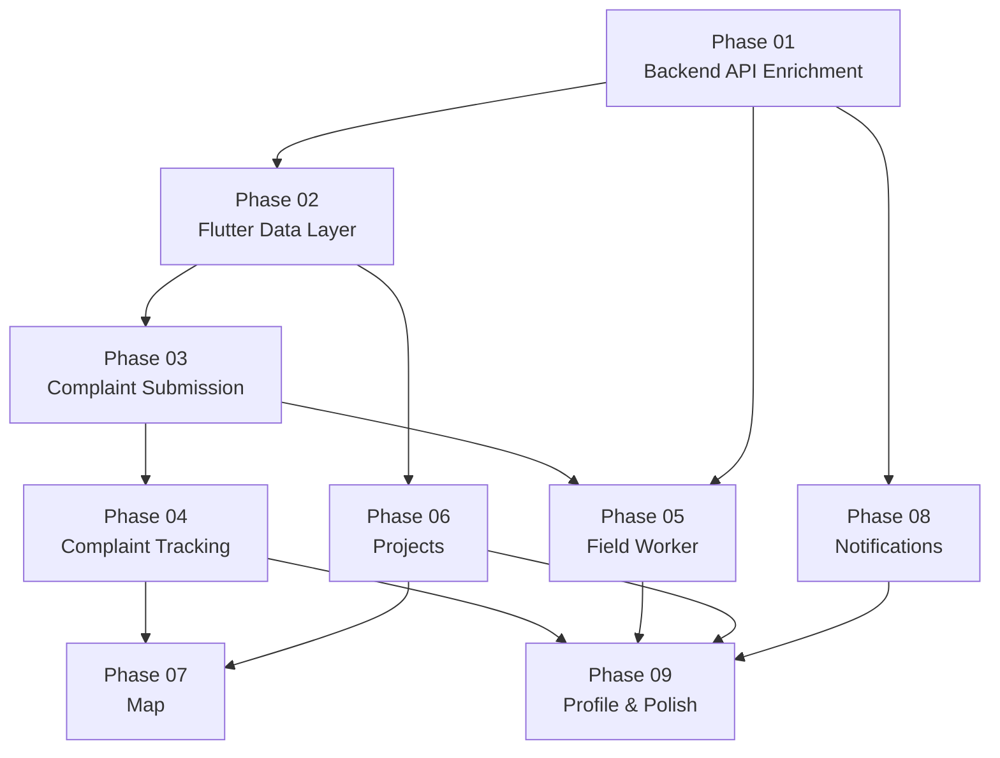

# تقرير التحليل الشامل لمنصة بادر — وخطة التنفيذ المرحلية

---

## 1. Project Understanding — فهم المشروع

### 1.1 الوثيقة المرجعية
تم تحليل وثيقة [system_analysis_and_design.md](file:///E:/final%20project/project/docs/system_analysis_and_design.md) كاملة (2099 سطر، ~40 مخططاً).

### 1.2 ملخص النظام
| العنصر | القيمة |
|:---|:---|
| **الأدوار (Actors)** | Citizen, Field Worker, Ministry Admin, Super Admin |
| **القنوات** | Mobile App (Citizen + Field Worker), Web Dashboard (Ministry Admin + Super Admin) |
| **المتطلبات الوظيفية** | 22 FR (FR-01 → FR-22) |
| **المتطلبات غير الوظيفية** | 5 NFR (NFR-01 → NFR-05) |
| **جداول قاعدة البيانات** | 17 جدول (+ Jetstream tables) |
| **Service Classes** | 12 خدمة في Class Diagram |
| **حالات الشكوى** | 8: `new`, `under_review`, `assigned`, `in_progress`, `resolved`, `closed`, `rejected`, `reopened` |
| **حالات المهمة الميدانية** | 5: `pending`, `accepted`, `in_progress`, `completed`, `failed` |
| **حالات المشروع** | 5: `draft`, `published`, `active`, `completed`, `suspended` |

---

## 2. Backend Current Status — حالة الـ Backend

### 2.1 ما تم تنفيذه بالكامل ✅

| المكوّن | التفاصيل |
|:---|:---|
| **Migrations** | 28 migration — كل الـ 17 جدول من ERD مطبقة + جداول Jetstream/Sanctum |
| **Models** | 17 model كامل مع العلاقات والـ casts (+ Team/Membership من Jetstream) |
| **Services** | 11 خدمة: `AuthService`, `ComplaintService`, `ValidationService`, `DuplicateDetectionService`, `RoutingService`, `TransferService`, `FieldWorkService`, `FileUploadService`, `GeoLocationService`, `NotificationService`, `ProjectService` |
| **Query Services** | `ComplaintQueryService`, `StatisticsQueryService` |
| **API Controllers (V1)** | `AuthController`, `ComplaintController`, `FieldAssignmentController`, `ProjectController`, `TransferController` |
| **Web Controllers** | Admin: 6 controllers, Ministry: 4 controllers, Public: 1 controller |
| **Form Requests** | Auth, Complaint (Store/Filter/UpdateStatus), FieldWork, Project |
| **Policies** | `ComplaintPolicy`, `FieldAssignmentPolicy`, `ProjectPolicy` |
| **Resources** | 8: User, Complaint, ComplaintAttachment, ComplaintTimeline, ComplaintTransfer, FieldAssignment, Project, ProjectContribution |
| **Middleware** | `EnsureSuperAdmin`, `EnsureMinistryAdmin` |
| **Seeders** | 7: Database, Ministry/Department, Category, Role/Permission, User, Complaint, Project |
| **Tests** | 72 test (Feature/Api: Auth, Complaint, FieldAndTransfer, Project, EndToEndLifecycle + Jetstream tests) |
| **Web Views** | Blade views: welcome, admin/*, ministry/*, public/*, layouts |
| **Routes** | `api.php` (15 endpoints), `web.php` (public + admin + ministry routes) |

### 2.2 ما تم تنفيذه جزئياً ⚠️

| المكوّن | الحالة | الناقص |
|:---|:---|:---|
| **Complaint Status Mapping** | يدعم 7 من 8 حالات | `reopened` مفقود من `getStatusArabicAttribute` وأيضاً من `UpdateComplaintStatusRequest` validation rule |
| **NotificationService** | موجود ويُنشئ records في DB | لا يرسل Push Notifications فعلية (يسجل في DB فقط — وهذا مقبول حالياً) |

### 2.3 ما يخالف وثيقة التحليل ⚡

| التعارض | الوثيقة | الكود |
|:---|:---|:---|
| **حالة `reopened`** | موجودة في Complaint Lifecycle (Section 6.3) | مفقودة من `UpdateComplaintStatusRequest` (الـ `in` rule لا تتضمنها) ومن `Complaint::getStatusArabicAttribute` |
| **حالة Field Assignment `accepted`** | موجودة في Section 6.5 | الـ API لا يوفر endpoint واضح لقبول المهمة (`accepted`). `start` ينقل من `pending` إلى `in_progress` مباشرة (قد تكون مدمجة) |
| **Attachment type** | الوثيقة تحدد `before` / `after` | الكود يستخدم `initial_evidence` في `ComplaintService` — وهو أوسع لكنه غير مطابق حرفياً |

### 2.4 الخلاصة: Backend مكتمل بنسبة ~95%
الـ Backend جاهز ومُختَبر. التعارضات الثلاثة أعلاه ثانوية ولا تعيق التنفيذ.

---

## 3. Flutter Mobile Current Status — حالة تطبيق Flutter

### 3.1 ما تم تنفيذه ✅

| الميزة | الملفات | الحالة |
|:---|:---|:---|
| **Onboarding** | `features/onboarding/` (8 ملفات) | ✅ مكتمل — Clean Architecture كامل |
| **Authentication** | `features/auth/` (12 ملف) | ✅ مكتمل — Login, Register, Logout, Session Restore |
| **Home Page** | `features/home/presentation/pages/home_page.dart` | ✅ صفحة مبدئية بعد Login |
| **Core Networking** | `core/network/` (3 ملفات) | ✅ ApiClient (Dio + interceptors), ApiEndpoints, ApiExceptions |
| **Secure Storage** | `core/storage/secure_storage_service.dart` | ✅ حفظ واسترجاع التوكن |
| **Routing** | `core/router/app_router.dart` | ✅ GoRouter + auth guards + refreshListenable |
| **Theme** | `core/theme/app_theme.dart` | ✅ أساسي |
| **Constants** | `core/constants/` (2 ملفين) | ✅ AppColors, AppAssets |

### 3.2 ما هو مفقود تماماً ❌

| الميزة (من الوثيقة) | FR المرتبط | الحالة |
|:---|:---|:---|
| **تقديم شكوى** (Create Complaint) | FR-03, FR-04, FR-05 | ❌ غير موجود |
| **التقاط صورة من الكاميرا** | FR-04 | ❌ غير موجود |
| **التقاط GPS** | FR-04, FR-12 | ❌ غير موجود |
| **التصنيف المتسلسل** (Cascading Categories) | FR-03 | ❌ غير موجود |
| **عرض شكاوى المواطن** (My Complaints List) | FR-09 | ❌ غير موجود |
| **تفاصيل الشكوى والخط الزمني** | FR-09 | ❌ غير موجود |
| **الإشعارات** (Notifications) | FR-14 | ❌ غير موجود |
| **الخريطة التفاعلية** | FR-15 | ❌ غير موجود |
| **عرض المشاريع التنموية** | FR-16, FR-17 | ❌ غير موجود |
| **تسجيل مساهمة** | FR-18 | ❌ غير موجود |
| **المهام الميدانية** (Field Worker Tasks) | FR-10, FR-11, FR-12 | ❌ غير موجود |
| **تنفيذ المهمة مع التحقق الجغرافي** | FR-11, FR-12 | ❌ غير موجود |
| **الملف الشخصي** (Profile) | UC: Manage Profile | ❌ غير موجود |
| **إعادة تعيين كلمة المرور** | UC: Reset Password | ❌ غير موجود |

### 3.3 Dependencies مطلوبة ولم تُضاف بعد

| الحزمة | الغرض |
|:---|:---|
| `image_picker` | التقاط الصور من الكاميرا (إلزامي حسب الوثيقة — كاميرا فقط) |
| `geolocator` + `geocoding` | GPS coordinates + permissions |
| `google_maps_flutter` أو `flutter_map` | عرض الخريطة التفاعلية |
| `cached_network_image` | تحميل وتخزين الصور |
| `path_provider` | مسارات الملفات المحلية |
| `firebase_messaging` (اختياري) | Push Notifications |
| `intl` | تنسيق التاريخ والأرقام |
| `permission_handler` | إدارة أذونات الكاميرا والموقع |
| `url_launcher` (اختياري) | فتح روابط خارجية |

---

## 4. Backend ↔ Flutter Integration Status

### 4.1 مصفوفة التكامل: Requirement → Backend API → Flutter

| FR | الوصف | Backend API | Flutter |
|:---|:---|:---|:---|
| FR-01 | Register | ✅ `POST /auth/register` | ✅ RegisterPage |
| FR-02 | Login/Session | ✅ `POST /auth/login`, `GET /auth/me` | ✅ LoginPage + AuthNotifier |
| FR-03 | Create Complaint | ✅ `POST /complaints` | ❌ **مفقود** |
| FR-04 | Capture Evidence + GPS | ✅ يقبل attachments + lat/lng | ❌ **مفقود** |
| FR-05 | Validate Complaint | ✅ ValidationService | ❌ **مفقود** (client-side) |
| FR-06 | Detect Duplicates | ✅ DuplicateDetectionService | N/A (server-side) |
| FR-07 | Auto-Route | ✅ RoutingService | N/A (server-side) |
| FR-08 | Transfer Complaint | ✅ `POST /complaints/{id}/transfer` | N/A (Web only) |
| FR-09 | Track Complaint | ✅ `GET /complaints`, `GET /complaints/{id}` | ❌ **مفقود** |
| FR-10 | Assign Task | ✅ `POST /complaints/{id}/assign` | N/A (Web only) |
| FR-11 | Execute Field Task | ✅ `POST /field-assignments/{id}/start`, `/complete` | ❌ **مفقود** |
| FR-12 | Verify Location | ✅ GeoLocationService | ❌ **مفقود** |
| FR-13 | Close Complaint | ✅ `PATCH /complaints/{id}/status` | N/A (Web only) |
| FR-14 | Notifications | ⚠️ DB records only (no Push) | ❌ **مفقود** |
| FR-15 | Map View | ⚠️ No dedicated `/complaints/map` endpoint | ❌ **مفقود** |
| FR-16 | View Projects | ✅ `GET /projects`, `GET /projects/{id}` | ❌ **مفقود** |
| FR-17 | Track Progress | ✅ Project phases in response | ❌ **مفقود** |
| FR-18 | Contribute to Project | ✅ `POST /projects/{id}/contribute` | ❌ **مفقود** |
| FR-19 | Manage Ministries | ✅ Web admin routes | N/A (Web only) |
| FR-20 | Manage Users | ✅ Web admin routes | N/A (Web only) |
| FR-21 | Manage Categories | ✅ Web admin routes | N/A (Web only) |
| FR-22 | View Statistics | ✅ StatisticsQueryService | N/A (Web only) |

### 4.2 Missing API Endpoints (يحتاج إضافة في Backend)

| Endpoint المطلوب | الغرض | الأولوية |
|:---|:---|:---|
| `GET /api/v1/categories?ministry_id=X` | التصنيفات المتسلسلة للموبايل | 🔴 عالية |
| `GET /api/v1/ministries` | قائمة الوزارات للاختيار | 🔴 عالية |
| `GET /api/v1/notifications` | إشعارات المستخدم | 🟡 متوسطة |
| `PATCH /api/v1/notifications/{id}/read` | تأشير إشعار كمقروء | 🟡 متوسطة |
| `GET /api/v1/complaints/map` | بيانات الشكاوى للخريطة (lat, lng, status) | 🟡 متوسطة |
| `PATCH /api/v1/field-assignments/{id}/accept` | قبول المهمة (حالة `accepted`) | 🟡 متوسطة |
| `POST /api/v1/field-assignments/{id}/verify-location` | التحقق من موقع العامل | 🟡 متوسطة |

---

## 5. Missing / Partial / Conflicting Items

### 5.1 تعارضات بين الوثيقة والكود

| # | النوع | التفاصيل |
|:---|:---|:---|
| C-01 | **Missing Status** | `reopened` غير موجود في `UpdateComplaintStatusRequest` ولا في `Complaint::getStatusArabicAttribute` |
| C-02 | **Missing Status** | `assigned` غير موجود في `UpdateComplaintStatusRequest` (الحالة تُعيَّن داخلياً من `FieldWorkService` فقط) |
| C-03 | **Attachment Type** | الوثيقة تحدد `before`/`after`، الكود يستخدم `initial_evidence` |
| C-04 | **Field Assignment Flow** | الوثيقة تحدد `pending → accepted → in_progress → completed/failed`. الكود يقفز من `pending` إلى `in_progress` عبر `start` |

### 5.2 ميزات مفقودة في Flutter (مرتبة حسب الأولوية)

| الأولوية | الميزة |
|:---|:---|
| 🔴 P1 | Complaint Submission (Camera + GPS + Categories) |
| 🔴 P1 | My Complaints List & Details (Tracking) |
| 🔴 P2 | Field Worker Tasks List & Execution |
| 🟡 P3 | Projects Browsing & Contribution |
| 🟡 P3 | Interactive Map View |
| 🟡 P4 | Notifications |
| 🟢 P5 | User Profile |

---

## 6. Recommended Execution Phases — خطة التنفيذ المرحلية

> [!IMPORTANT]
> كل مرحلة مستقلة ويمكن اختبارها بمعزل عن المراحل التالية. لا تبدأ مرحلة قبل إتمام المراحل التي تعتمد عليها.

---

### Phase 01: Backend API Enrichment — إثراء الـ Backend API
**الهدف:** إضافة الـ Endpoints الناقصة التي يحتاجها تطبيق الموبايل.

**الملفات المتأثرة (Backend):**
- `routes/api.php` — إضافة routes جديدة
- إنشاء `MinistryController.php` في `Api/V1/`
- إنشاء `CategoryController.php` في `Api/V1/`
- إنشاء `NotificationController.php` في `Api/V1/`
- إنشاء `MinistryResource.php`, `CategoryResource.php`, `DepartmentResource.php`
- تعديل `FieldAssignmentController.php` لإضافة `accept` و `verify-location`
- تعديل `UpdateComplaintStatusRequest.php` لإضافة `reopened` و `assigned`
- تعديل `Complaint.php` model لإضافة `reopened` في `getStatusArabicAttribute`

**المتطلبات السابقة:** لا شيء
**Dependencies:** لا شيء جديد

**Acceptance Criteria:**
- [ ] `GET /api/v1/ministries` يعيد قائمة الوزارات النشطة
- [ ] `GET /api/v1/categories?ministry_id=X` يعيد التصنيفات المتسلسلة
- [ ] `GET /api/v1/notifications` يعيد إشعارات المستخدم
- [ ] `PATCH /api/v1/notifications/{id}/read` يؤشر إشعاراً كمقروء
- [ ] `PATCH /api/v1/field-assignments/{id}/accept` يقبل مهمة
- [ ] حالة `reopened` مدعومة في تحديث الشكوى

**التحقق:** `php artisan test` — كل الاختبارات القديمة تمر + اختبارات جديدة للـ endpoints المضافة

---

### Phase 02: Flutter Core Models & Data Layer — طبقة البيانات للموبايل
**الهدف:** بناء الـ Models والـ Data Sources للكيانات الرئيسية (Complaint, Ministry, Category, Project, Notification).

**الملفات المتأثرة (Flutter):**
- `features/complaints/domain/entities/` — ComplaintEntity, AttachmentEntity, TimelineEntity
- `features/complaints/domain/repositories/` — ComplaintRepository interface
- `features/complaints/data/models/` — ComplaintModel, AttachmentModel, TimelineModel
- `features/complaints/data/datasources/` — ComplaintRemoteDataSource
- `features/complaints/data/repositories/` — ComplaintRepositoryImpl
- نفس البنية لـ `features/projects/` و `features/notifications/`
- `core/network/api_endpoints.dart` — إضافة endpoints جديدة

**المتطلبات السابقة:** Phase 01 (الـ APIs يجب أن تكون جاهزة)
**Dependencies:** لا حزم جديدة

**Acceptance Criteria:**
- [ ] كل الـ Models تطابق JSON responses من الـ Backend حرفياً
- [ ] Unit tests لكل Model (fromJson/toJson)
- [ ] Repository interfaces معرّفة لكل feature

**التحقق:** `flutter test` — اختبارات الـ models

---

### Phase 03: Complaint Submission — تقديم الشكاوى (الميزة الأهم)
**الهدف:** تمكين المواطن من تقديم شكوى مع الكاميرا والـ GPS والتصنيف المتسلسل.

**الملفات المتأثرة (Flutter):**
- `features/complaints/application/` — ComplaintNotifier, providers
- `features/complaints/presentation/pages/` — CreateComplaintPage, MyComplaintsPage
- `features/complaints/presentation/widgets/` — CategorySelector, CameraCapture, LocationCapture
- `core/services/` — CameraService, LocationService
- `core/router/app_router.dart` — إضافة routes جديدة
- `pubspec.yaml` — إضافة `image_picker`, `geolocator`, `permission_handler`
- `AndroidManifest.xml` — أذونات الكاميرا والموقع

**المتطلبات السابقة:** Phase 02
**Dependencies:** `image_picker`, `geolocator`, `permission_handler`

**Acceptance Criteria:**
- [ ] فتح الكاميرا والتقاط صورة (من الكاميرا فقط — لا Gallery)
- [ ] التقاط GPS تلقائي
- [ ] اختيار الوزارة → التصنيف الرئيسي → التصنيف الفرعي (متسلسل)
- [ ] إدخال العنوان والوصف
- [ ] إرسال الشكوى والحصول على تأكيد
- [ ] عرض رسالة خطأ واضحة عند فشل أي خطوة
- [ ] يعمل على الجهاز الحقيقي عبر Hotspot

**التحقق:** اختبار يدوي على جهاز حقيقي — تقديم شكوى كاملة والتحقق من ظهورها في Web Dashboard

---

### Phase 04: Complaint Tracking — تتبع الشكاوى
**الهدف:** عرض قائمة شكاوى المواطن وتفاصيل كل شكوى مع الخط الزمني.

**الملفات المتأثرة (Flutter):**
- `features/complaints/presentation/pages/` — ComplaintDetailsPage, ComplaintTimelinePage
- `features/complaints/presentation/widgets/` — ComplaintCard, TimelineWidget, StatusBadge, AttachmentViewer
- `features/home/presentation/pages/home_page.dart` — تعديل للربط مع الشكاوى

**المتطلبات السابقة:** Phase 03
**Dependencies:** `cached_network_image`, `intl`

**Acceptance Criteria:**
- [ ] عرض قائمة "شكاواي" مع pagination
- [ ] عرض تفاصيل الشكوى (العنوان، الوصف، الحالة، الصور)
- [ ] عرض الخط الزمني التدقيقي للشكوى
- [ ] عرض حالة الشكوى بألوان مميزة

**التحقق:** تقديم شكوى من Phase 03، تغيير حالتها من Web Dashboard، التحقق من ظهور التحديث في التطبيق

---

### Phase 05: Field Worker — المهام الميدانية
**الهدف:** تمكين الموظف الميداني من استعراض مهامه وقبولها وتنفيذها مع التحقق الجغرافي.

**الملفات المتأثرة (Flutter):**
- `features/field_work/` — بنية Clean Architecture كاملة
- `features/field_work/domain/entities/` — FieldAssignmentEntity
- `features/field_work/data/` — FieldAssignmentModel, RemoteDataSource, RepositoryImpl
- `features/field_work/application/` — FieldWorkNotifier, providers
- `features/field_work/presentation/pages/` — TasksListPage, TaskDetailsPage, TaskExecutionPage
- `features/field_work/presentation/widgets/` — TaskCard, LocationVerifier, AfterPhotoCapture
- `core/router/app_router.dart` — routes حسب الدور (role-based)

**المتطلبات السابقة:** Phase 01 (accept + verify-location APIs), Phase 02, Phase 03 (Camera/GPS services)
**Dependencies:** نفس Phase 03 (مشتركة)

**Acceptance Criteria:**
- [x] عرض قائمة المهام المسندة للموظف الميداني
- [x] قبول المهمة (pending → accepted)
- [x] الانتقال إلى الموقع وبدء التنفيذ (مع التحقق الجغرافي)
- [x] التقاط صورة "ما بعد الإصلاح" مع GPS
- [x] إتمام المهمة مع ملاحظات
- [x] رفض الأذن إذا كان الموظف بعيداً عن الموقع

**التحقق:** إسناد مهمة من Web Dashboard → قبولها وتنفيذها من التطبيق → التحقق من تحديث حالة الشكوى

---

### Phase 06: Development Projects — المشاريع التنموية
**الهدف:** عرض المشاريع التنموية وتمكين المواطن من تسجيل مساهمة محاكاة.

**الملفات المتأثرة (Flutter):**
- `features/projects/` — بنية Clean Architecture كاملة
- `features/projects/presentation/pages/` — ProjectsListPage, ProjectDetailsPage
- `features/projects/presentation/widgets/` — ProjectCard, ProgressBar, ContributionDialog, PhasesList

**المتطلبات السابقة:** Phase 02
**Dependencies:** `intl` (تنسيق المبالغ)

**Acceptance Criteria:**
- [ ] عرض قائمة المشاريع المنشورة
- [ ] عرض تفاصيل المشروع (المراحل، نسبة الإنجاز، شريط التقدم)
- [ ] تسجيل مساهمة محاكاة (إدخال مبلغ + تأكيد)
- [ ] تحديث شريط التقدم بعد المساهمة

**التحقق:** إنشاء مشروع من Web Admin → استعراضه والمساهمة من التطبيق → التحقق من تحديث المبلغ

---

### Phase 07: Interactive Map — الخريطة التفاعلية
**الهدف:** عرض الشكاوى والمشاريع على خريطة تفاعلية بدبابيس ملونة حسب الحالة.

**الملفات المتأثرة (Flutter):**
- `features/map/` — بنية Clean Architecture
- `features/map/presentation/pages/` — MapPage
- `features/map/presentation/widgets/` — ComplaintPin, StatusFilter
- `pubspec.yaml` — إضافة `google_maps_flutter` أو `flutter_map`

**المتطلبات السابقة:** Phase 04 (بيانات الشكاوى), Phase 06 (بيانات المشاريع)
**Dependencies:** `google_maps_flutter` أو `flutter_map` + `latlong2`

**Acceptance Criteria:**
- [ ] عرض خريطة مع دبابيس ملونة (أحمر=جديد، أصفر=قيد التنفيذ، أخضر=مغلق)
- [ ] فلترة حسب الحالة أو التصنيف
- [ ] الضغط على دبوس يعرض ملخص الشكوى

**التحقق:** وجود شكاوى بحالات مختلفة → ظهورها بألوان صحيحة على الخريطة

---

### Phase 08: Notifications — الإشعارات
**الهدف:** عرض إشعارات المستخدم وتأشيرها كمقروءة.

**الملفات المتأثرة (Flutter):**
- `features/notifications/` — بنية Clean Architecture
- `features/notifications/presentation/pages/` — NotificationsPage
- `features/notifications/presentation/widgets/` — NotificationCard, UnreadBadge

**المتطلبات السابقة:** Phase 01 (notifications API)
**Dependencies:** لا شيء جديد (أو `firebase_messaging` لاحقاً)

**Acceptance Criteria:**
- [ ] عرض قائمة الإشعارات مع تمييز غير المقروءة
- [ ] تأشير إشعار كمقروء بالضغط عليه
- [ ] أيقونة عداد الإشعارات غير المقروءة في الـ AppBar

**التحقق:** تنفيذ عملية تولّد إشعاراً (تقديم شكوى / تغيير حالة) → التحقق من ظهوره

---

### Phase 09: User Profile & Polish — الملف الشخصي والتحسينات
**الهدف:** إدارة الملف الشخصي، تحسين التجربة العامة، ومعالجة الحالات الحدية.

**الملفات المتأثرة (Flutter):**
- `features/profile/` — بنية Clean Architecture
- `features/profile/presentation/pages/` — ProfilePage, EditProfilePage
- تحسينات على: Home Page, Navigation, Error Handling, Loading States
- Pull-to-refresh لجميع القوائم
- Empty states لجميع الشاشات
- Offline handling

**المتطلبات السابقة:** كل المراحل السابقة
**Dependencies:** لا شيء جديد

**Acceptance Criteria:**
- [ ] عرض الملف الشخصي (الاسم، البريد، الهاتف، الدور)
- [ ] التنقل السلس بين كل أقسام التطبيق
- [ ] حالات فارغة جميلة لكل القوائم
- [ ] معالجة أخطاء الشبكة بشكل واضح

---

## 7. Dependencies & Execution Order — ترتيب الاعتماديات



**المسار الحرج (Critical Path):**
```
Phase 01 → Phase 02 → Phase 03 → Phase 04 → Phase 09
```

**مراحل يمكن تنفيذها بالتوازي:**
- Phase 05 و Phase 06 بعد Phase 02
- Phase 07 و Phase 08 بعد اكتمال ما يعتمدان عليه

---

## 8. Final Acceptance Roadmap — خارطة القبول النهائية

| المرحلة | الهدف | الاختبار | المخرج |
|:---|:---|:---|:---|
| Phase 01 | Backend APIs مكتملة | `php artisan test` — 0 failures | كل endpoints المطلوبة تعمل |
| Phase 02 | Data Layer جاهز | `flutter test` — models tests | كل Models تطابق Backend |
| Phase 03 | مواطن يقدم شكوى | اختبار يدوي على جهاز حقيقي | شكوى كاملة بصورة وموقع |
| Phase 04 | مواطن يتتبع شكواه | اختبار يدوي | قائمة + تفاصيل + timeline |
| Phase 05 | موظف ميداني ينفذ مهمة | اختبار يدوي End-to-End | مهمة كاملة بتحقق جغرافي |
| Phase 06 | مشاريع ومساهمات | اختبار يدوي | مساهمة محاكاة ناجحة |
| Phase 07 | خريطة تفاعلية | اختبار يدوي | دبابيس ملونة صحيحة |
| Phase 08 | إشعارات | اختبار يدوي | إشعار يظهر ويُقرأ |
| Phase 09 | تجربة متكاملة | اختبار شامل End-to-End | تطبيق جاهز للعرض |

> [!CAUTION]
> **هذا التقرير للتحليل فقط. لم يتم تعديل أي ملف. التنفيذ ينتظر موافقتك.**

> [!IMPORTANT]
> **القرارات المطلوبة منك قبل البدء:**
> 1. هل توافق على ترتيب المراحل أم تريد تغيير الأولوية؟
> 2. هل تريد البدء بـ Phase 01 (Backend) أم تفضل البدء بمرحلة أخرى؟
> 3. بخصوص الخريطة: هل تفضل `google_maps_flutter` (يحتاج API Key) أم `flutter_map` (مجاني، OpenStreetMap)؟
> 4. التعارضات الثلاثة المذكورة في القسم 5.1 — هل تريد إصلاحها لتطابق الوثيقة أم تبقى كما هي؟
